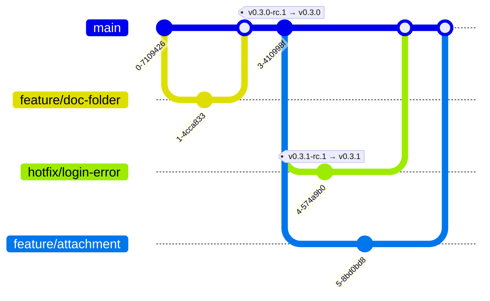
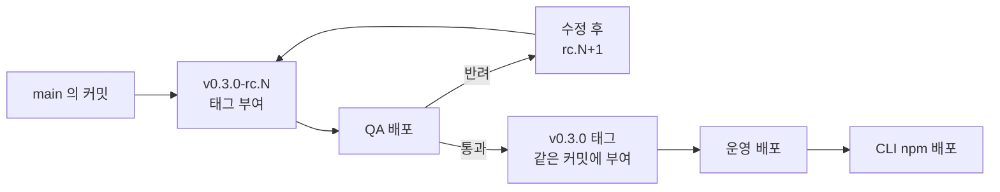

# gentask

## 개발 워크플로우

**브랜치는 `main` 하나만 계속 유지합니다.** `feature/*`와 `hotfix/*`는 머지한 뒤 삭제하며, 통합 브랜치와 릴리스 브랜치를 두지 않습니다. QA와 운영에 배포한 지점은 태그가 고정합니다.



`hotfix/login-error`가 `main`의 최신 커밋이 아니라 **`v0.3.0` 태그에서 갈라지는 것**에 주의합니다. 그 시점의 `main`에는 아직 릴리스하지 않은 `feature/attachment`가 들어와 있습니다.

한 릴리스가 지나는 단계는 다음과 같습니다.



### 환경

| 환경 | 위치 | 데이터베이스 | 배포 권한 |
| :--- | :--- | :--- | :--- |
| 로컬 | 작업자 머신 | 로컬 PostgreSQL 컨테이너 (작업자별) | 각자 |
| 테스트 | 작업자 머신 | Testcontainers 일회용 | 빌드가 생성하고 폐기 |
| QA | 사내 IP 대역 | qa 전용 DB | 저장소 담당자 |
| 운영 | `gentask.xyz` | 운영 DB | 저장소 담당자 |

상시 가동하는 공유 개발 서버를 두지 않습니다. 로컬 백킹 서비스는 `compose.yaml`의 컨테이너로 구동하며 작업자마다 독립적입니다.

### 개발

1. `main`에서 `feature/*`를 분기합니다.
2. 로컬 컨테이너를 기동하고 구현합니다.
3. 품질 검증 명령을 통과시킵니다.
4. PR을 열어 검토를 받습니다. `main`에 직접 푸시하지 않습니다.
5. `main`에 머지합니다.

**모든 PR은 그 자체로 릴리스 가능해야 합니다.** `main`이 곧 릴리스 후보이므로 미완성 기능을 머지하지 않습니다. 큰 기능을 나누어 반영해야 하면 피처 플래그로 비활성화한 상태로 머지합니다.

### 릴리스

1. 릴리스 대상 커밋에 `vX.Y.Z-rc.N` 태그를 부여합니다.
2. 해당 커밋을 QA에 배포하고 확인합니다. 반려되면 수정 후 `rc.N+1`로 되돌아갑니다.
3. **같은 커밋에** `vX.Y.Z` 태그를 부여합니다.
4. 운영에 배포합니다.
5. CLI를 npm에 배포합니다. **서버 배포 이후에 수행합니다.**

QA와 운영은 같은 커밋에서 생성한 산출물을 배포합니다. RC 태그가 검증 대상을 고정하므로, QA가 진행되는 동안 `main`에 다른 PR이 머지되어도 영향을 받지 않습니다.

태그는 SemVer 프리릴리스 표기를 따릅니다. `rc-0.3.0` 형태를 사용하지 않습니다.

```
v0.3.0-rc.1    QA 배포
v0.3.0-rc.2    반려 후 재배포
v0.3.0         운영 배포
```

### 핫픽스

1. 운영 태그에서 `hotfix/*`를 분기합니다.
2. 장애를 재현하는 테스트를 실패 상태로 작성하고 수정하여 통과시킵니다.
3. `hotfix/*`의 커밋에 `vX.Y.Z+1-rc.1` 태그를 부여하고 QA에 배포합니다.
4. 통과 후 같은 커밋에 `vX.Y.Z+1` 태그를 부여하고 운영에 배포합니다.
5. PR을 열어 `main`에 머지합니다.

**태그는 `main`이 아니라 `hotfix/*`의 커밋에 부여합니다.** `main`의 HEAD에는 아직 릴리스하지 않은 커밋이 있으므로, 그 지점을 배포하면 핫픽스와 무관한 변경이 함께 나갑니다.

**핫픽스도 QA를 거칩니다. 예외를 두지 않습니다.** QA 환경은 하나이므로 진행 중이던 RC를 밀어냅니다. 운영 장애가 우선하므로 이는 정상 동작이며, 확인이 끝나면 원래 RC를 다시 배포합니다.

### 마이그레이션

- 번호를 예약하지 않고 머지 직전에 마지막 번호의 다음 번호로 변경합니다. 나중에 머지하는 쪽이 올립니다.
- PR 하나에 마이그레이션 하나를 담습니다.
- 브랜치 전환으로 Flyway 체크섬이 어긋나면 로컬 데이터베이스를 재생성합니다.
- **QA와 운영에 배포된 마이그레이션은 불변입니다.** 되돌릴 사항은 전진 마이그레이션으로 추가합니다.
- 스키마 변경은 expand/contract로 작성하여 롤백 가능성을 유지합니다. 컬럼 추가와 제거를 한 배포에 함께 넣지 않습니다.
- jOOQ가 마이그레이션 SQL을 인메모리 H2로 재생하므로 정규식 연산자와 트리거를 사용하지 않습니다.

### CLI

CLI는 상태를 보유하지 않으며 `baseUrl`이 지정한 서버를 참조합니다. 우선순위는 `GENTASK_BASE_URL` · 저장된 설정 · 기본값(운영) 순입니다.

백로그의 원본은 운영 트래커입니다. 로컬 컨테이너는 애플리케이션 개발에만 사용하고 백로그와 문서 플랫폼은 운영을 참조합니다.

QA 단계에서는 npm 레지스트리에 배포하지 않고 `npm pack`으로 생성한 tarball을 전역 설치하여 검증합니다. tarball은 담당자가 생성하여 공유합니다.

```bash
cd clients/apps/cli && npm pack
npm i -g ./gentask-<version>.tgz
```

npm 레지스트리 배포는 운영 배포 이후에 수행합니다.
