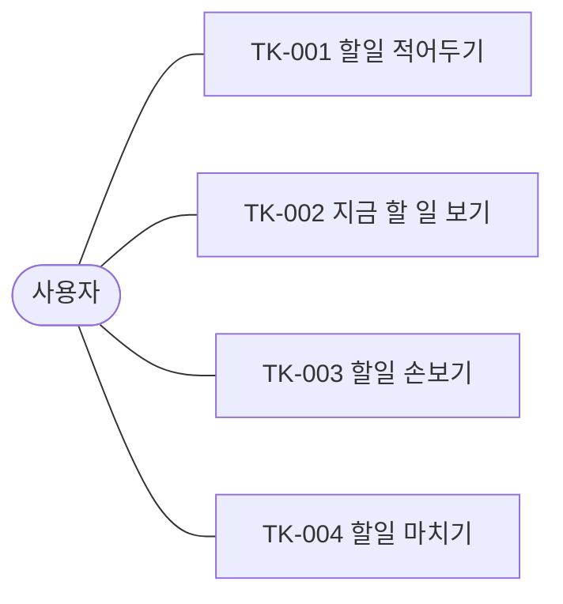

# 할일 목록 유스케이스 모델

이 문서는 시스템의 경계를 정의합니다. 왜 만드는지, 누가 쓰는지, 무엇을 하고 무엇을 하지 않는지를 이 문서만 갖습니다. 서술과 슬라이스는 각 유스케이스 문서가 갖습니다.

## 배경

개인용 할일 목록입니다. 기능 범위는 Microsoft To Do 를 기준점으로 삼고 그 안에서 고릅니다. 요구사항을 새로 발명하지 않기 위해서입니다. 이 저장소의 목적은 제품 자체보다 일반적인 요구사항을 가진 웹 애플리케이션을 한 번 끝까지 만들면서 참조 아키텍처를 축적하는 데 있으므로, 요구사항은 널리 알려진 제품에서 빌려 오고 판단은 구조에 씁니다.

## 액터

| 액터 | 구분 | 설명 |
| :--- | :--- | :--- |
| 사용자 | 주 액터 | 자신의 할일을 적고, 보고, 손보고, 마치는 역할 |

지원 액터는 없습니다. 미리 알림을 시스템이 바깥에 맡기면 그때 생깁니다.

### 후보 액터

| 후보 | 구상 | 올리지 않은 이유 | 올리는 조건 |
| :--- | :--- | :--- | :--- |
| 로컬 에이전트 | MCP 나 에이전트 스킬을 통해 판단에 따라 할일을 등록한다 | 사용자의 할일을 대신 적는다는 점에서 TK-001 의 또 다른 주 액터이지만, 상호작용 방식(대화 없이 API 로 넣음)과 실패 처리가 달라서 흐름을 같이 쓸 수 있는지 아직 모른다 | 백엔드가 생겨 API 경계가 정해진 뒤 TK-001 의 주 액터로 추가하거나 별도 유스케이스로 연다 |

## 유스케이스

사용자 목표 단위입니다. CRUD나 화면이 아닙니다.

| ID | 유스케이스 | 목표 |
| :--- | :--- | :--- |
| TK-001 | [할일 적어두기](<작업/TK-001(할일 적어두기).md>) | 떠오른 일을 목록에 남겨, 기억에 의존하지 않는다 |
| TK-002 | [지금 할 일 보기](<작업/TK-002(지금 할 일 보기).md>) | 지금 손댈 일을 고른다 |
| TK-003 | [할일 손보기](<작업/TK-003(할일 손보기).md>) | 적힌 할일을 지금 아는 것과 같게 만든다 |
| TK-004 | [할일 마치기](<작업/TK-004(할일 마치기).md>) | 끝낸 일을 목록이 끝난 일로 갖게 한다 |

오늘·중요·기한·끝난 일 보기는 TK-002의 대체 흐름입니다. 제목·메모·마감일·중요·오늘 담기·포기는 TK-003의 대체 흐름입니다.

### 올릴 예정

범위 안이지만 아직 서술서나 흐름으로 올리지 않은 것입니다. 착수할 때 아래 자리에 말번으로 추가합니다.

| 기능 | 올릴 자리 | 미룬 이유 |
| :--- | :--- | :--- |
| 목록과 그룹 | 새 유스케이스(할일을 묶어 두기) 하나와 TK-002 의 대체 흐름(묶음으로 보기) | 묶음 없이도 네 유스케이스가 성립하므로 그쪽을 먼저 닫는다 |
| 파일 첨부 | TK-001 과 TK-003 의 대체 흐름(파일을 붙인다) | 저장소가 필요해 백엔드가 생긴 뒤 올린다 |

## 범위 밖

Microsoft To Do 에 있지만 이 모델에 올리지 않은 것입니다. 의도한 생략이며, 조건이 충족되면 유스케이스나 대체 흐름으로 올립니다.

| 기능 | 올리지 않은 이유 | 올리는 조건 |
| :--- | :--- | :--- |
| 공유와 할당 | 액터가 한 명이다 | 두 번째 사용자 액터가 생길 때 |
| 단계 (하위 작업) | 할일 하나가 더 쪼개지는 구조이며, 현재 흐름 어디에도 필요하지 않다 | TK-003 에서 쪼개고 싶은 요구가 확인될 때 |
| 제안 (오늘 할 일 추천) | 시스템이 먼저 고르는 기능이며 TK-002 의 목표는 사용자가 고르는 것이다 | 로컬 에이전트 액터가 올라오면 그쪽 유스케이스로 검토한다 |
| 메일 연동, 플래그 지정 | 외부 시스템이 지원 액터로 들어온다 | 올리지 않는다 |
| 계정과 기기 간 동기화 | 로그인은 하위 기능이며 단일 사용자 로컬 환경에서는 필요하지 않다 | 백엔드가 생기고 둘 이상의 기기에서 쓸 때 |
| 검색 | 하위 기능이다 | 목록이 길어지면 TK-002 의 대체 흐름으로 연다 |

작성 규칙은 [작성지침](작성지침.md)을 따릅니다.
