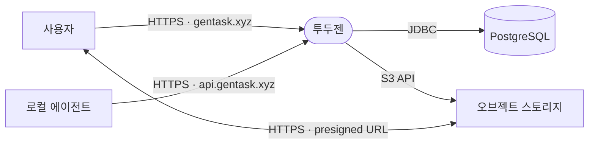

# 3. 컨텍스트와 범위 (Context and Scope)

투두젠의 시스템 경계와 외부 통신 인터페이스를 정의한다. 시스템 내부 구조는 [5. 빌딩 블록 뷰](./05-building-block-view.md)에서 다룬다.

## 3.1 외부 인터페이스 및 통신 대상

- **사용자**: 웹 브라우저를 통해 작업 및 계정 관리 기능을 수행하며, 쿠키 세션 기반으로 인증한다.
- **로컬 에이전트**: API 토큰을 사용하여 작업을 등록한다. 현재 인증 인터페이스만 지원하며 세부 연동 구현은 예정 상태이다.
- **PostgreSQL**: 작업 및 계정 데이터 원본을 영속화한다. 데이터베이스 스키마는 Flyway 마이그레이션을 통해 관리한다.
  - *접점 코드*: `server/.../infrastructure`
- **오브젝트 스토리지**: 첨부 파일 및 프로필 이미지 바이너리를 보관한다. 개발 환경은 로컬 컨테이너의 MinIO, 배포 환경은 Cloudflare R2를 사용하며 표준 S3 API만을 사용한다.
  - *접점 코드*: `server/.../shared/storage`

## 3.2 통신 채널 및 프로토콜

- **`gentask.xyz`**: 서버 렌더링 HTML 및 작업·계정 JSON 데이터 전송. HttpOnly 쿠키 세션을 통해 인증한다.
- **`api.gentask.xyz`**: 작업 JSON 데이터 전송. Bearer 토큰을 통해 인증한다.
- **`S3 API`**: 파일 크기 조회, 메타데이터 관리, 삭제 및 Presigned URL 서명 발급. 스토리지 자격 증명을 통해 인증한다.
- **`presigned URL`**: 첨부 파일 바이너리 스트림 전송. URL에 서명된 한시적 접근 권한을 사용한다.

## 3.3 컨텍스트 원칙

- **대용량 파일 전송 분리 (Direct-to-Storage)**: 첨부 파일 바이너리는 투두젠 애플리케이션 서버를 경유하지 않는다. 클라이언트와 오브젝트 스토리지가 Presigned URL을 통해 직접 데이터를 송수신하며, 투두젠 서버는 저장 경로 결정 및 한시적 접근 권한 서명만을 담당한다.
- **출처 분리 기반 인증 구조**: 웹 화면과 REST API가 동일한 출처(`gentask.xyz`)를 공유함으로써 브라우저의 세션 쿠키를 활용한다. 출처를 공유할 수 없는 외부 독립 클라이언트(로컬 에이전트 등)는 전용 엔드포인트(`api.gentask.xyz`)와 Bearer 토큰 인증 체계로 격리한다.
