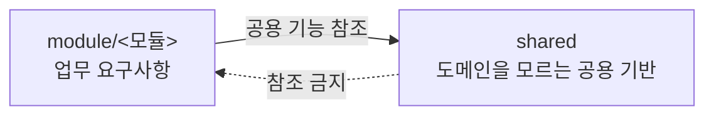

# 5. 빌딩 블록 뷰 (Building Block View)

시스템의 정적 분해 구조를 정의합니다. 레벨 1은 시스템을 구성하는 최상위 컴포넌트와 컴포넌트 간 통신 원칙을 다루며, 레벨 2는 각 컴포넌트 내부의 코드 배치 규격과 의존성 참조 규칙을 정의합니다.

본 절은 구조가 어떠한가를 정의합니다. 계층과 모듈이 무엇을 담고 무엇을 참조할 수 있는지가 대상이며, **새로 쓰는 코드를 어디에 둘 것인가**의 판정 절차와 승격 기준은 [8. 횡단 관심사](./08-crosscutting-concepts.md)의 코드 스타일 가이드가 갖습니다. 자동화 검증이 가능한 규칙은 빌드 및 린트 단계에서 강제하며 그 설정 또한 같은 절이 다룹니다.

## 5.1 레벨 1 — 전체 시스템 화이트박스

- **`web`** (`web/src`): 사용자 인터페이스 및 상호작용 처리. 빌드 시점에 정적 산출물을 생성하며, 런타임 렌더링과 상태 관리는 브라우저에서 수행합니다.
- **`server`** (`server/src/main/java`): 비즈니스 규칙 처리 및 데이터 영속화. HTTP API를 통해 리소스를 제공하고 파일 저장 위치 및 권한을 관리합니다.

### 컴포넌트 간 통신 원칙

- `web`과 `server` 컴포넌트는 컴파일 및 런타임 단계에서 상호 직접적인 코드 의존성을 갖지 않습니다.
- 두 컴포넌트의 유일한 연결점은 **빌드 시점의 정적 타입 생성**입니다. `server`의 OpenAPI 명세로부터 `web`의 인터페이스 타입을 생성하며, 런타임 데이터 통신은 브라우저의 HTTP 요청을 통해 이루어집니다.

## 5.2 레벨 2 — web

웹 프론트엔드는 [Feature-Sliced Design (FSD v2.1)](https://fsd.how/) 아키텍처 방법론을 따릅니다. FSD 표준에서 명시하지 않는 Angular 프레임워크 관련 세부 사항은 본 절의 규격을 적용합니다.

```text
web/src/
├── app/            프로바이더 · 라우트 · 전역 스타일 · 셸
├── pages/          라우트 단위 화면
├── features/       2곳 이상에서 재사용되는 사용자 인터랙션 및 UI (조건부 생성)
├── entities/       2곳 이상에서 재사용되는 도메인 모델 및 규칙 (조건부 생성)
├── shared/         UI 킷 · API 클라이언트 · 유틸리티 · 설정
├── main.ts
├── main.server.ts
└── index.html
```

`main.ts`, `main.server.ts`, `index.html`은 Angular 애플리케이션 진입점 파일이며 FSD 계층 분류에서 제외합니다. 해당 파일들은 Steiger 린트 설정(`steiger.config.ts`)의 `ignores` 목록에 등록하여 관리합니다.

### 5.2.1 계층

| 계층 | 담는 것 | 생성 조건 |
| :--- | :--- | :--- |
| **`app`** | 프로바이더 등록, 라우트 설정, 전역 스타일, 셸 | 필수 |
| **`pages`** | 라우트 단위 화면 및 해당 화면 전용 로직 | 필수 |
| **`features`** | 복수 화면에서 재사용되는 사용자 동작 및 UI | 2곳 이상의 사용처 확인 시 |
| **`entities`** | 복수 화면에서 재사용되는 도메인 모델 및 비즈니스 규칙 | 2곳 이상의 사용처 확인 시 |
| **`shared`** | UI 킷, 유틸리티, API 클라이언트, 전역 설정 | 필수 |

계층 구성은 고정이며, 계층 내부의 슬라이스 목록은 기능 요구사항에 따라 변동되므로 본 명세에는 개별 슬라이스를 전수 나열하지 않습니다. 현재 구성된 슬라이스 목록은 `web/src/` 디렉터리 구조를 참조합니다.

`features` 및 `entities` 계층은 프로젝트 초기에 빈 디렉터리로 사전 생성하지 않으며, 최초 슬라이스의 생성 조건을 충족하는 시점에 디렉터리를 생성합니다.

**`widgets` 계층의 생성을 금지합니다.** 화면 전용 조합 컴포넌트의 계층 분류 판단 비용을 최소화하고 구조를 단순하게 유지하기 위해 위젯 계층을 사용하지 않습니다. [FSD 계층 문서](https://feature-sliced.design/docs/reference/layers)는 계층을 전부 쓸 필요가 없다고 명시하며, 다시 쓰이지 않는 화면 단위 조합은 위젯이 아니라 그 화면에 두도록 정합니다. 재사용되지 않는 화면 단위 컴포넌트 조합은 `pages/<화면>/` 내부에서 직접 구성합니다.

`processes` 계층은 [FSD v2.1 명세](https://feature-sliced.design/docs/reference/layers)에서 폐기(deprecated)되었으므로 사용을 금지합니다.

### 5.2.2 슬라이스와 세그먼트

`app`과 `shared` 계층은 하위 슬라이스를 두지 않고 세그먼트로 직접 구성합니다. `pages`, `features`, `entities` 계층은 슬라이스 디렉터리를 먼저 두고 그 하위에 세그먼트를 구성합니다.

| 세그먼트 | 담는 것 |
| :--- | :--- |
| **`ui/`** | 컴포넌트, 템플릿, 스타일 |
| **`model/`** | 상태 관리, 유효성 검증, 도메인 로직, 타입 정의 |
| **`api/`** | 백엔드 API 요청 함수 및 데이터 페칭 정의 |
| **`lib/`** | 해당 슬라이스 내부 전용 유틸리티 및 헬퍼 함수 |
| **`config/`** | 설정값, 상수 정의 |

`app` 계층은 Angular CLI 기본 평면 파일 구조(예: `app.config.ts`, `app.routes.ts`)를 유지합니다. **동일한 관심사의 파일이 3개 이상으로 증가할 경우 목적을 명시하는 하위 디렉터리(예: `app/layout/`)로 승격**하며, 해당 목적에 전속되는 상태 서비스도 함께 이동하여 계층 루트와의 역류 참조를 방지합니다.

`app/ui/` 디렉터리 생성을 금지합니다. Steiger 린트 규칙(`no-ui-in-app`)에 의해 빌드가 차단됩니다. 전역 레이아웃 컴포넌트가 필요한 경우 `app/layout/` 등 목적을 명시하는 명칭을 사용합니다.

**셸 컴포넌트는 도메인 세부 지식을 직접 보유하지 않습니다.** `app` 계층에서 하위 계층 컴포넌트를 조립(Composition)하기 위해 임포트하는 것은 허용되나, 레이아웃 셸 컴포넌트 자체는 도메인 세부 사항 대신 표현 계약(인터페이스/프로퍼티)만을 전달받아 렌더링합니다.

### 5.2.3 참조 규칙

의존성 임포트는 상위 계층에서 **하위 계층으로만 단방향으로** 허용됩니다.

```text
app → pages → features → entities → shared
```

동일 계층 내 슬라이스 간의 상호 참조는 금지합니다. 둘 이상의 슬라이스가 함께 필요한 경우 상위 계층에서 각각 임포트하여 조합합니다. 슬라이스 내부 세그먼트 간의 참조는 자유로우며, 슬라이스 구조가 없는 `app` 및 `shared` 계층 내부에서는 세그먼트 간 상호 참조가 허용됩니다.

슬라이스 외부에서는 **슬라이스 루트의 `index.ts` (공개 API)를 통해서만** 요소를 참조해야 합니다. 슬라이스 내부 파일 경로를 직접 임포트하는 것은 캡슐화 위반으로 금지합니다.

`index.ts`에는 외부에서 실제로 사용하는 식별자만 선별하여 export합니다. `shared` 계층은 슬라이스가 없으므로 최상위 통합 배럴 파일 대신 **세그먼트 단위로 공개 API(`shared/<세그먼트>/index.ts`)를 정의**합니다.

동일 계층의 두 슬라이스가 동일한 코드를 필요로 하는 경우 아래 순서에 따라 해소합니다.

| 순서 | 전략 | 적용 상황 |
| :--- | :--- | :--- |
| 1 | **슬라이스 병합** | 두 슬라이스가 항상 함께 변경되는 경우 |
| 2 | **하위 계층으로 이동** | 공유 대상이 도메인 로직이면 `entities`, 인프라 로직이면 `shared`로 승격 |
| 3 | **상위 계층에서 조합** | 상위 계층(예: `pages`)에서 두 슬라이스를 각각 임포트하여 조율 |
| 4 | **공개 API 경유 참조** | 상위 1~3 전략을 적용할 수 없는 예외적 상황 |

4번 전략을 적용할 경우, 상위 전략(1~3)을 적용할 수 없는 사유를 코드 주석 또는 아키텍처 결정 기록(ADR)으로 명시해야 합니다. 슬라이스 간 교차 참조(`@x`) 표기는 예외적 상황에 한해 제한적으로 허용합니다.

## 5.3 레벨 2 — server

백엔드 서버 애플리케이션의 루트 패키지는 `dev.goraebap.refarch`이며, 하위 구조를 업무 모듈(`module/`)과 공용 기반(`shared/`)으로 분할합니다.

```text
dev.goraebap.refarch
├── ServerApplication.java
├── module/              업무 모듈
│   └── <모듈>/
└── shared/              도메인을 모르는 공용 기반
    └── <세그먼트>/
```

업무 모듈과 공용 기반을 `module` 및 `shared` 그룹 패키지로 격리하여 패키지 경로만으로 모듈 여부와 참조 규칙을 판정합니다. `ServerApplication`은 Spring Boot 애플리케이션 진입점이며 그룹 패키지에 속하지 않습니다.

### 5.3.1 모듈의 정의와 참조 방향

모듈은 **애그리거트 소유 단위**로 분할합니다. 동일한 애그리거트를 조작하는 복수의 유스케이스는 해당 애그리거트를 소유한 단일 모듈 내에 배치합니다.

하나의 모듈은 하나 이상의 애그리거트를 소유할 수 있습니다(예시: 하나의 모듈에서 주요 업무 애그리거트와 관련 파일 첨부 애그리거트를 함께 소유하는 구성). 개별 모듈 및 소유 애그리거트 목록은 `module/` 디렉터리 경로를 참조하며, 본 명세에는 전수 목록을 나열하지 않습니다.



실선은 허용된 참조 방향, 점선은 금지된 참조 방향입니다. **`shared`는 `module/<모듈>/`을 일체 참조할 수 없습니다.** 공용 인프라에 도메인 지식이 유입되는 것을 방지하고 도메인 변경이 공용 코드로 전파되는 것을 차단하기 위함입니다.

업무 모듈 간 참조는 단방향으로 제한합니다. 모듈 간 순환 참조(양방향 의존)는 금지하며, 하류 모듈이 상류 모듈에 변경을 통지하거나 조율해야 하는 경우 이벤트 발행 등 결합도 완화 기법을 아키텍처 결정 기록(ADR)으로 정의한 후 적용합니다.

### 5.3.2 모듈 내부 구조

```text
module/<모듈>/
├── Xxx.java             모듈 루트 — 타 모듈에 공개하는 인터페이스 및 DTO
├── application/         유스케이스 및 애플리케이션 서비스
├── domain/              애그리거트, 값 객체, 도메인 규칙
└── infrastructure/      포트 구현체 및 외부 어댑터
```

| 위치 | 담는 것 |
| :--- | :--- |
| **모듈 루트** | 타 모듈에 공개하는 인터페이스 및 공개 언어(DTO·열거) |
| **`application`** | 웹 컨트롤러, 유스케이스 서비스, 요청·응답 DTO, 조회 포트, 모듈 에러 코드 |
| **`domain`** | 애그리거트 루트, 엔티티, 값 객체(VO), 도메인 서비스, 저장소(Repository) 인터페이스 |
| **`infrastructure`** | 저장소 구현체, 조회 포트 구현체, 타 모듈 연동 어댑터(ACL), 모듈 전용 빈 설정 |

**모듈 루트에 직접 놓인 요소만 타 모듈에 공개되며, 하위 패키지는 모듈 내부 전용입니다.** 별도의 공개 패키지를 두지 않고 루트 자체를 소통 창구로 삼습니다. 타 모듈에 노출할 것이 없는 독립 모듈은 루트에 파일을 두지 않습니다.

공개 요소는 성격에 따라 두 방향으로 나뉩니다.

| 방향 | 뜻 | 구현 주체 |
| :--- | :--- | :--- |
| **in** | 이 모듈이 제공하는 능력. 타 모듈이 호출합니다 | 이 모듈의 `application` |
| **out** | 이 모듈이 상대에게 요구하는 판정. 타 모듈이 구현합니다 | 상대 모듈 |

**`out` 은 세 조건을 모두 충족할 때만 만듭니다.** 이 모듈이 자기 불변식 검증을 위해 그 정보를 요구하고, 스스로 판정할 수 없으며, **호출 인자로 전달받을 수 없어야 합니다.** 세 번째가 남용을 막는 관문입니다 — "파라미터로 전달하면 되지 않는가"에 답할 수 없으면 만들지 않습니다. 호출자가 언제나 자기 도메인 규칙으로 먼저 판정한 뒤 부르고 그 모듈에 직접 진입점이 없다면 `out` 은 필요하지 않습니다.

`~Spi` 로 이름 짓지 않습니다([결정-0009](./decisions/0009-backend-layered-structure.md)). Java 에서 SPI 는 구현이 복수이고 구현자를 사전에 알 수 없으며 런타임에 발견되는 확장 지점을 뜻하는데, 여기의 구현은 단일하고 구현자가 컴파일 시점에 확정되므로 교체 가능하다는 오해를 부릅니다. `in` · `out` 이 이미 더 정확한 구분 축입니다.

공개 요소가 주고받는 타입은 내부 엔티티가 아니라 별도로 정의합니다. 내부 모델의 변경이 타 모듈로 번지지 않게 하기 위함이며, 도메인 계층은 이 타입을 참조하지 않습니다 — 도메인이 창구를 거꾸로 참조하게 되기 때문입니다.

### 5.3.3 shared 세그먼트

`shared` 계층은 업무 모듈 구조를 갖지 않고 세그먼트 디렉터리로 직접 구성합니다. 세그먼트는 범용 기술 인프라 요건에 따라 확장되며, 아래 표는 대표적인 세그먼트 구성 예시입니다.

| 세그먼트 (예시) | 담는 것 |
| :--- | :--- |
| **`config/`** | 특정 모듈에 종속되지 않는 전역 Spring 빈 설정 |
| **`domain/`** | 도메인 공통 마커 인터페이스 및 기본 타입 (예: `ValueObject`) |
| **`error/`** | 공통 에러 계약 (예: `ErrorCode`, `BusinessException`, `DomainRuleViolation`, 공통 오류 코드) |
| **`storage/`** | 오브젝트 스토리지 연동 포트, S3 호환 구현체 및 접속 설정 |
| **`web/`** | HTTP 공통 웹 어댑터 (예: 전역 예외 핸들러, 요청 추적 식별자 필터) |

**`shared` 세그먼트의 진입 조건은 2개 이상의 모듈에서 실제로 사용하고 있으며, 도메인 비즈니스 로직에 종속되지 않는 범용 기술 요소일 것입니다.** 단일 모듈에서만 사용하는 유틸리티나 설정은 해당 모듈 내부에 유지하며, 사전 승격하지 않습니다.

**에러 계약(`shared/error/`)은 진입 조건(2개 이상 모듈 사용)의 예외로 규정합니다.** 모든 모듈이 `shared/error/`의 공통 에러 인터페이스 및 예외 타입을 구현·참조하여 시스템 전반에서 일관된 API 오류 응답 형식을 유지합니다.

### 5.3.4 참조 규칙

| 참조 주체 | 참조 대상 | 허용 여부 | 판정 근거 |
| :--- | :--- | :--- | :--- |
| **컨트롤러** | 서비스 | 허용 | 웹 요청을 유스케이스로 전달하는 정규 경로 |
| **컨트롤러** | 도메인 · 저장소 · 조회 포트 | **금지** | 유스케이스 계층 우회 접근 방지 |
| **서비스** | 동일 모듈 도메인 | 허용 | 비즈니스 로직 수행을 위한 도메인 모델 조작 |
| **서비스** | 조회 포트 · ACL 포트 | 허용 | 유스케이스 수행에 필요한 포트 인터페이스 참조 |
| **서비스** | 인프라 구현체 | **금지** | 의존성 역전 원칙(DIP) 준수 및 구현체 직접 결합 방지 |
| **서비스** | 타 모듈 루트 | 허용 | 모듈 간 공식 공개 계약 참조 |
| **서비스** | 타 모듈의 하위 패키지 | **금지** | 모듈 내부 캡슐화 보장 및 결합도 격리 |
| **도메인** | application · infrastructure | **금지** | 도메인 계층의 상위 계층 의존 금지 |
| **도메인** | 프레임워크 · 영속성 라이브러리 | **금지** | 순수 Java 객체(POJO) 유지 및 단위 테스트 독립성 보장 |
| **도메인** | `shared/error` | 허용 | 프레임워크에 독립적인 공통 에러 인터페이스 참조 |
| **인프라** | 동일 모듈 포트 · 도메인 | 허용 | 포트 인터페이스 구현 및 도메인 데이터 영속화 |
| **인프라** | 타 모듈 루트 | 허용 | 타 모듈 연동 어댑터(ACL) 구현 |
| **`shared`** | 모듈 (`module/<모듈>/`) | **금지** | 공용 기반의 도메인 모듈 참조 금지 (단방향 의존) |

**도메인 계층의 프레임워크 및 라이브러리 독립성 보장**: 도메인 객체(`domain/`)는 Spring, JPA, HTTP 등 특정 프레임워크나 외부 인프라 라이브러리에 대한 의존성을 갖지 않는 순수 Java 객체(POJO)로 작성합니다. 이를 통해 Spring 애플리케이션 컨텍스트 기동 없이 순수 단위 테스트를 신속하게 수행할 수 있는 구조를 보장합니다.

**애그리거트 간 참조 원칙**: 애그리거트 간 직접적인 객체 참조를 금지하며, **식별자(ID)를 통해서만 참조**합니다.

**도메인 공통 요소의 승격**: 복수 애그리거트에 걸친 도메인 비즈니스 규칙은 도메인 서비스로 정의하여 `domain/` 계층 루트에 배치합니다. 단일 애그리거트 전용 값 객체(VO)는 해당 애그리거트 패키지 내부에 두고, **2개 이상의 애그리거트에서 공통으로 참조되는 시점에 `domain/` 계층 루트로 승격**합니다.

**트랜잭션 및 조율 범위**: 복수 애그리거트 간의 상태 변경 조율은 `application` 계층의 애플리케이션 서비스가 담당하며, 데이터베이스 트랜잭션은 단일 애그리거트 경계를 기본 단위로 처리합니다.
