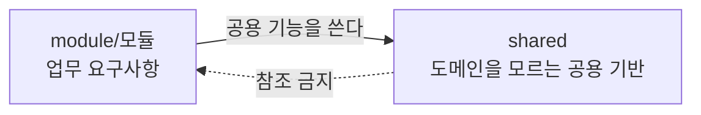

# 5. 빌딩 블록 뷰 (Building Block View)

시스템의 정적 분해를 정의합니다. 레벨 1 은 시스템을 구성하는 컴포넌트와 그 사이의 통신 원칙을, 레벨 2 는 각 컴포넌트 내부의 코드 배치와 참조 규칙을 다룹니다.

배치 규칙의 목적은 **일의성**입니다. 같은 성격의 코드를 둘 수 있는 자리가 여럿이면 배치 기준이 갈라지고 구조가 유지되지 않습니다. 이 절의 판정을 최우선 기준으로 두며, 기계가 판정할 수 있는 것은 빌드 단계에서 강제합니다. 강제 수단의 목록과 설정은 [8. 횡단 관심사](./08-crosscutting-concepts.md)가 소유합니다.

## 5.1 레벨 1 — 전체 시스템 화이트박스

- **web** (`web/src`): 사용자 인터페이스 및 상호작용 처리. 빌드 시점에 정적 산출물을 생성하며, 런타임 렌더링과 상태 관리는 브라우저에서 이루어집니다.
- **server** (`server/src/main/java`): 비즈니스 규칙 처리 및 데이터 영속화. HTTP API를 통해 리소스를 제공하고 파일 저장 위치 및 권한을 관리합니다.

### 컴포넌트 간 통신 원칙
- `web`과 `server` 컴포넌트는 컴파일 및 런타임 단계에서 상호 직접적인 코드 의존성을 갖지 않습니다.
- 두 컴포넌트의 유일한 연결점은 **빌드 시점의 정적 타입 생성**입니다. `server`의 OpenAPI 명세로부터 `web`의 인터페이스 타입을 생성하며, 런타임 데이터 통신은 브라우저의 HTTP 요청을 통해 이루어집니다.

## 5.2 레벨 2 — web

[FSD v2.1](https://fsd.how/) 을 따릅니다. FSD 가 정의하지 않는 Angular 관련 사항은 이 절이 직접 정의합니다.

```text
web/src/
├── app/            프로바이더 · 라우트 · 전역 스타일 · 셸
├── pages/          라우트 단위 화면
├── entities/       여러 화면이 쓰는 도메인 모델
├── shared/         UI 킷 · API 클라이언트 · 유틸리티 · 설정
├── main.ts
├── main.server.ts
└── index.html
```

`main.ts` · `main.server.ts` · `index.html` 은 프레임워크 진입점이며 어느 계층에도 속하지 않습니다. `steiger.config.ts` 의 `ignores` 에 등재해 의도를 설정에 남깁니다.

### 5.2.1 계층

| 계층 | 담는 것 | 생성 조건 | 현재 |
| :--- | :--- | :--- | :--- |
| **app** | 프로바이더 등록, 라우트 설정, 전역 스타일, 셸 | 필수 | 있음 |
| **pages** | 라우트 단위 화면과 그 화면 전용 로직 전부 | 필수 | `account` · `login` · `signup` · `task-list` |
| **features** | 여러 화면이 쓰는 사용자 동작과 그 UI | 2곳 이상 사용이 확인된 뒤 | 없음 |
| **entities** | 여러 화면이 쓰는 도메인 모델과 규칙 | 2곳 이상 사용이 확인된 뒤 | `task` · `user` |
| **shared** | UI 킷, 유틸리티, API 클라이언트, 설정 | 필수 | `ui` · `api` · `lib` · `config` |

`features` 와 `entities` 는 빈 폴더로 미리 만들지 않고 첫 슬라이스가 생기는 시점에 함께 만듭니다.

**`widgets` 계층의 생성을 금지합니다.** `pages` 와 `features` 사이에 계층을 하나 더 두면 "화면 전용 조합이 아직 재사용되지 않았는데 어디에 두는가"라는 판정이 매번 발생하며, 1인 규모에서 그 판정 비용이 계층의 이득을 넘습니다. [FSD 의 계층 문서](https://feature-sliced.design/docs/reference/layers)는 계층을 전부 쓸 필요가 없다고 명시하며, 한 UI 덩어리가 그 화면의 주된 내용을 이루고 다시 쓰이지 않으면 위젯이 아니라 화면 안에 두라고 정합니다. 이 저장소의 화면들이 그 조건에 해당합니다.

`processes` 계층은 FSD v2.1 에서 폐기되었으므로 사용을 금지합니다.

### 5.2.2 슬라이스와 세그먼트

`app` 과 `shared` 는 슬라이스를 갖지 않고 세그먼트로 직접 구성합니다. `pages` · `features` · `entities` 는 슬라이스를 먼저 두고 그 안에 세그먼트를 둡니다.

| 세그먼트 | 담는 것 |
| :--- | :--- |
| **`ui/`** | 컴포넌트, 템플릿, 스타일 |
| **`model/`** | 상태, 검증, 도메인 로직, 타입 |
| **`api/`** | 서버 요청 함수와 조회 정의 |
| **`lib/`** | 이 슬라이스 내부 전용 유틸리티 |
| **`config/`** | 설정값, 상수 |

`app` 계층은 Angular CLI 가 생성한 평면 파일 구조(`app.config.ts` · `app.routes.ts`)를 유지합니다. FSD 는 `app` 계층의 세그먼트 이름을 표준화하지 않으며 소규모에서 단일 파일로 접는 것을 허용합니다. **같은 성격의 파일이 셋 이상이 되면 목적을 드러내는 폴더로 승격**하며, 그때 그 목적에만 속하는 상태 서비스도 함께 옮깁니다. 컴포넌트만 옮기고 서비스를 루트에 남기면 폴더를 나갔다 들어오는 참조가 생깁니다.

`app/ui/` 를 만드는 것을 금지합니다. Steiger 의 `no-ui-in-app` 이 차단하여 빌드가 실패합니다. 전역 레이아웃이 필요하면 `app/layout/` 처럼 목적을 드러내는 이름을 씁니다.

**셸은 도메인 어휘를 직접 알지 않습니다.** `app` 이 하위 계층을 임포트하는 것 자체는 허용되지만, 그 앎은 조립 지점이 갖고 레이아웃 컴포넌트는 표현 계약만 받습니다. 셸이 도메인 값과 그 값의 아이콘·링크를 직접 들면 도메인이 늘 때마다 셸을 고쳐야 합니다.

### 5.2.3 배치 판정

새 코드는 **위에서부터 순서대로** 판정하고 먼저 해당하는 항목에서 멈춥니다.

```text
1. 애플리케이션 전역 설정인가?           → app/
2. 비즈니스 로직이 없는 인프라인가?       → shared/<세그먼트>/
3. 한 화면에서만 쓰는가?                 → pages/<화면>/
4. 여러 화면이 이미 쓰는 사용자 동작인가?  → features/<동작명>/
5. 여러 화면이 이미 쓰는 도메인 모델인가?  → entities/<도메인명>/
6. 확신이 없는 경우                      → pages/<화면>/
```

**6번이 기본값입니다.** 판정이 갈리면 항상 `pages` 에 둡니다. 화면 간 코드 중복은 허용되며 중복 자체는 추출의 근거가 아닙니다. 가설적 재사용을 근거로 하위 계층에 두는 것을 금지합니다. 잘못 둔 코드를 `pages` 로 되돌리는 비용이 `pages` 에 있던 코드를 승격하는 비용보다 큽니다.

4번과 5번의 "이미 쓰는"은 **현재 두 곳 이상에서 실제로 호출되고 있음**을 뜻합니다. 앞으로 그럴 것 같다는 판단은 조건을 만족하지 않습니다.

2번의 인프라에는 UI 킷, 범용 유틸, HTTP 클라이언트, 그리고 **도메인을 모르는 요청 수단**이 해당합니다. 엔드포인트를 받아 보내고 받는 얇은 껍데기와 생성된 응답 타입이 그것입니다. 어느 도메인의 무엇을 가져오는지 아는 조회는 `entities/<도메인>/api/` 입니다.

`shared` 로 고정된 항목은 사용처 개수를 세지 않습니다 — UI 킷(`shared/ui/`), HTTP 클라이언트와 생성 타입(`shared/api/`), 날짜·숫자 포맷과 기기 판정(`shared/lib/`), 라우트 상수(`shared/config/`)입니다.

### 5.2.4 참조 규칙

임포트는 자신보다 **하위 계층으로만** 향합니다.

```text
app → pages → features → entities → shared
```

동일 계층의 슬라이스끼리는 참조하지 않습니다. 둘이 함께 필요하면 상위 계층이 각각 임포트해 조합합니다. 슬라이스 내부에서는 세그먼트 간 자유롭게 참조하며, 슬라이스가 없는 `app` 과 `shared` 는 계층 내부 세그먼트 간 참조가 허용됩니다.

슬라이스 외부에서는 **`index.ts` 를 통해서만** 접근합니다. 내부 파일을 직접 임포트하는 것은 공개 API 우회이므로 금지합니다.

`index.ts` 에는 외부가 실제로 사용하는 것만 내보냅니다. `shared` 는 슬라이스가 없으므로 최상위 배럴 하나 대신 **세그먼트별로 공개 API 를 정의**합니다. 임포트문에서 어느 성격의 코드를 쓰는지 드러납니다.

동일 계층 두 슬라이스가 같은 코드를 필요로 하면 아래 순서로 해소합니다.

| 순서 | 전략 | 적용 상황 |
| :--- | :--- | :--- |
| 1 | **슬라이스 병합** | 둘이 항상 함께 변경되는 경우. 경계 설정 자체가 틀린 것입니다 |
| 2 | **하위 계층으로 이동** | 공유 대상이 도메인 로직이면 `entities`, 인프라면 `shared` |
| 3 | **상위 계층에서 조합** | 부모가 두 슬라이스를 각각 임포트해 연결합니다 |
| 4 | **공개 API 경유 참조** | 앞의 셋이 불가능한 경우에 한합니다 |

4번을 쓰면 앞의 세 전략이 왜 적용되지 않는지를 주석이나 결정 기록으로 남겨야 합니다. `entities` 계층의 `@x` 표기는 경계 병합이 진정으로 불가능할 때의 최후 수단이며 권장 패턴이 아닙니다.

계층 간 임포트는 항상 `@/*` 별칭을 씁니다. 상대 경로는 같은 슬라이스 내부에서만 허용합니다. `baseUrl` 지정은 TypeScript 6 에서 `TS5101` 오류로 빌드를 실패시키므로 금지합니다.

`providedIn: 'root'` 서비스는 `shared` 와 `app` 에서만 선언합니다. `pages` 슬라이스가 전역 싱글턴을 만들면 서비스 수명이 화면 수명과 어긋나 화면을 떠나도 상태가 남습니다. 화면 범위의 서비스는 라우트 정의의 `providers` 배열에 등록합니다.

### 5.2.5 승격과 강등

같은 코드가 **두 번째 화면에서 실제로 필요해진 시점**에 승격합니다. 사용자 동작이면 `features`, 도메인 모델이면 `entities` 입니다. 코드를 옮기고 세그먼트를 재배치한 뒤 `index.ts` 에 외부가 쓸 것만 내보내고 호출부를 공개 API 경로로 바꿉니다. 이 절차의 비용이 승격을 늦추는 근거가 됩니다.

강등은 Steiger 의 `insignificant-slice` 가 지적하면 수행합니다. 한 화면에서만 쓰이는 슬라이스는 그 화면 안으로 되돌립니다. **강등을 규칙 위반으로 취급하지 않습니다.** 재사용 예측이 빗나가는 것은 정상이며 되돌리는 것이 방치보다 낫습니다.

## 5.3 레벨 2 — server

패키지 루트는 `dev.goraebap.refarch` 이며 그 아래를 업무 모듈과 공용 기반으로 나눕니다.

```text
dev.goraebap.refarch
├── ServerApplication.java
├── module/              업무 모듈
│   ├── task/
│   └── user/
└── shared/              도메인을 모르는 공용 기반
    ├── config/
    ├── domain/
    ├── error/
    ├── storage/
    └── web/
```

**`module` 과 `shared` 를 그룹 패키지로 둡니다.** 루트 직계에 업무 모듈과 공용 기반을 나란히 두면 "이 패키지가 모듈인가"를 가리는 규칙이 따로 필요해지고, 모듈이 아닌 것마다 제외 목록을 유지하게 됩니다. 그룹 패키지가 있으면 그 판정이 경로 한 마디로 끝납니다. `ServerApplication` 은 프레임워크 진입점이며 어느 그룹에도 속하지 않습니다.

### 5.3.1 모듈의 정의와 참조 방향

모듈은 **애그리거트 소유**를 기준으로 나눕니다. 요구사항 묶음이 기준이 아닙니다. 하나의 애그리거트를 변경하는 유스케이스가 여럿이면 그 유스케이스들은 모두 그 애그리거트를 소유한 모듈에 속합니다.

| 모듈 | 소유 애그리거트 |
| :--- | :--- |
| **`task`** | task · file |
| **`user`** | user · account · session · apitoken |



실선은 허용된 방향이고 점선은 금지된 방향입니다. **`shared` 는 어떤 모듈도 참조하지 않습니다.** 공용 기반에 도메인 지식이 유입되면 재사용성이 사라지고 도메인 변경이 공용 코드로 전파됩니다. 참조하는 순간 그것은 공용 기반이 아니라 또 하나의 모듈입니다.

모듈 간 참조는 단방향으로 유지합니다. 양방향이 필요해지면 경계를 다시 논의하며, 하류가 상류에 무언가를 요구해야 하면 이벤트 발행 같은 역전 수단을 결정 기록으로 남기고 도입합니다.

### 5.3.2 모듈 내부 구조

```text
module/<모듈>/
├── contract/            다른 모듈이 참조하는 유일한 창구
├── application/         유스케이스
├── domain/              애그리거트와 값 객체
└── infrastructure/      포트 구현
```

| 패키지 | 담는 것 |
| :--- | :--- |
| **`contract`** | 다른 모듈에 공개하는 인터페이스와 그 반환 타입 |
| **`application`** | 컨트롤러, 서비스, 요청·응답 DTO, 조회 포트, 에러 코드 |
| **`domain`** | 애그리거트, 값 객체, 저장소 인터페이스 |
| **`infrastructure`** | 저장소 구현, 조회 어댑터, 타 모듈 ACL 어댑터, 빈 조립 |

**`contract` 에 놓인 것만 공개이고 나머지는 전부 모듈 내부입니다.** 공개가 필요해지면 파일을 `contract` 로 옮기며, 그 물리적 행위 자체가 의도적인 공개 선언입니다. 공개할 것이 없는 모듈은 `contract` 를 만들지 않습니다 — 현재 두 모듈 모두 해당하며 모듈 간 참조가 없습니다.

### 5.3.3 하위 패키지 승격

새 모듈은 각 계층 아래에 파일을 직접 배치하고 하위 패키지를 만들지 않습니다. 승격은 **계층마다 따로 판정**합니다.

| 계층 | 분할 축 | 승격 기준 |
| :--- | :--- | :--- |
| `domain` | 애그리거트 | 애그리거트 **2개 이상** |
| `application` | 피쳐(유스케이스 단위) | 유스케이스 **3개 이상** |

**두 계층의 분할 축이 다르므로 임계도 각자 셉니다.** 애그리거트 수는 `domain` 을 나눌 근거이지 `application` 을 나눌 근거가 아닙니다. 하나의 유스케이스가 복수 애그리거트의 저장소를 참조하는 것이 정상이며, 애그리거트당 서비스 하나를 전제하지 않습니다. 현재 `user/application` 은 유스케이스가 둘이라 평면으로 둡니다.

피쳐 둘 이상이 쓰는 것은 **계층 루트에 평면으로** 둡니다.

```text
task/application/
├── task/          TaskController · TaskService · TaskRequests · TaskViews · TaskQuery
├── file/          TaskFileController · TaskFileService · TaskFileRequests · TaskFileViews
└── TaskErrorCode.java
```

`application/shared/` 나 `common/` 같은 하위 패키지를 만드는 것을 금지합니다. 이름이 내용을 규정하지 못하는 자리는 배치 판정을 요구하지 않으므로 무엇이든 쌓입니다. 계층 루트에 두면 피쳐 폴더와 나란히 놓여 눈에 띕니다. **루트에 파일이 쌓이는 것은 피쳐 경계가 틀렸다는 신호입니다.** 그때는 공용을 옮길 자리를 찾는 대신 피쳐를 합치는 쪽을 먼저 검토합니다.

`infrastructure` 는 피쳐로 나누지 않습니다. 구현체는 자신이 구현하는 포트의 이름을 그대로 가지므로 파일명만으로 짝이 드러납니다. 다만 포트 구현이 아닌 **프레임워크 확장은 목적 폴더로 묶습니다** — `user/infrastructure/web/` 이 인터셉터와 그 등록 설정을 갖는 것이 그 경우입니다.

### 5.3.4 shared 세그먼트

`shared` 는 모듈을 갖지 않고 세그먼트로 직접 구성합니다.

| 세그먼트 | 담는 것 |
| :--- | :--- |
| **`config/`** | 특정 모듈 없이도 의미가 있는 전역 빈 |
| **`domain/`** | 도메인 패턴의 표식. `ValueObject` 하나이며 메서드를 갖지 않습니다 |
| **`error/`** | 에러 계약. `ErrorCode` · `BusinessException` · `DomainRuleViolation` · 공통 에러 코드 |
| **`storage/`** | 오브젝트 스토리지 접근. 포트와 S3 호환 구현, 접속 설정 |
| **`web/`** | 에러 계약을 HTTP 로 옮기는 어댑터. 전역 예외 핸들러와 추적 식별자 필터 |

**입장 조건은 두 모듈 이상이 실제로 쓰고 있고, 도메인 개념이 아닐 것입니다.** 도메인 개념이면 그것을 소유할 모듈이 어딘가 있습니다. 편의 유틸리티의 집합소로 쓰지 않으며, 소비자가 하나일 때 미리 올리지 않습니다. 그 시점에는 어느 부분이 공용이고 어느 부분이 그 모듈의 사정인지 구분할 근거가 없습니다.

에러 계약은 이 조건의 예외입니다. **모든 모듈이 `shared/error` 를 참조하는 것을 전제합니다.** 에러 계약이 모듈마다 다르면 단일 응답 형식이 성립하지 않습니다.

### 5.3.5 참조 규칙

| 참조 주체 | 참조 대상 | 허용 여부 | 근거 |
| :--- | :--- | :--- | :--- |
| **컨트롤러** | 서비스 | 허용 | 컨트롤러의 유일한 진입 경로입니다 |
| **컨트롤러** | 도메인 · 저장소 · 조회 포트 | **금지** | 유스케이스를 우회한 데이터 접근이 발생합니다 |
| **서비스** | 동일 모듈 도메인 | 허용 | 정상 경로입니다 |
| **서비스** | 조회 포트 · ACL 포트 | 허용 | 포트는 이를 사용하는 계층이 선언합니다 |
| **서비스** | 인프라 구현체 | **금지** | 포트를 선언하고 구현은 인프라에 배치합니다 |
| **서비스** | 타 모듈 `contract` | 허용 | 상류 계약이 안정적인 경우입니다 |
| **서비스** | 타 모듈의 `contract` 외 패키지 | **금지** | 경계가 이름만 남습니다 |
| **도메인** | application · infrastructure | **금지** | 도메인은 상위 계층을 참조하지 않습니다 |
| **도메인** | 프레임워크 · 영속성 라이브러리 | **금지** | 도메인 단위 테스트의 전제입니다 |
| **도메인** | `shared/error` | 허용 | 그 타입들은 HTTP 도 프레임워크도 알지 못합니다 |
| **인프라** | 동일 모듈 포트 · 도메인 | 허용 | 포트 구현이 존재 목적입니다 |
| **인프라** | 타 모듈 `contract` | 허용 | ACL 어댑터가 상류와 통신하는 지점입니다 |
| **`shared`** | 모듈 | **금지** | 5.3.1 의 방향입니다 |

**도메인이 프레임워크를 참조하지 않는다는 행이 이 표에서 가장 중요합니다.** 다른 규칙은 어기면 구조가 지저분해지지만, 이 규칙이 깨지면 도메인 단위 테스트가 애플리케이션 컨텍스트를 요구하게 되어 검증 속도와 범위가 함께 무너집니다.

애그리거트 사이는 **식별자로만** 참조합니다. 복수 애그리거트에 걸친 규칙은 도메인 서비스로 추출해 `domain` 직하위에 두고, 복수 애그리거트가 쓰는 값 객체도 `domain` 직하위로 올립니다. 값 객체가 애그리거트 하나에만 속하면 그 패키지 안에 두고, **둘째 애그리거트가 쓰기 시작한 시점에 계층 루트로 올립니다.** 먼저 쓴 쪽 패키지에 남겨 두면 나중에 쓰는 쪽이 애그리거트 패키지를 임포트하게 됩니다.

복수 애그리거트에 걸친 조율과 트랜잭션은 애플리케이션 서비스가 담당합니다. 트랜잭션은 애그리거트 경계를 넘지 않는 것을 기본으로 합니다.
