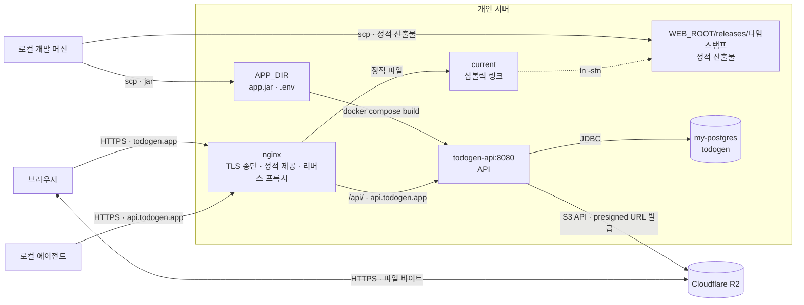

# 7. 배포 뷰 (Deployment View)

투두젠 시스템의 물리적·논리적 인프라 배치 구조와 배포 절차를 정의합니다. 단일 개인 서버 환경에서 API 는 Docker 컨테이너로 구동하고 프론트엔드는 빌드 산출물을 nginx 가 정적으로 제공하며, 공용 서버 인프라 관례를 준수하는 범위 내에서 애플리케이션의 배포 명세를 기술합니다.



## 7.1 인프라 구성 및 배치

시스템을 구성하는 주요 요소의 호스트 내 배치 경로 및 역할은 다음과 같습니다.

- **API 컨테이너** — `$APP_DIR` 아래 `api/`(jar + Dockerfile), `docker-compose.yml`, `.env`
- **프론트엔드 정적 자산** — `$WEB_ROOT` 아래 릴리스별 디렉터리 `releases/<타임스탬프>/` 와 그중 하나를 가리키는 심볼릭 링크 `current`. nginx 컨테이너에 이 디렉터리를 `/srv/todogen/web` 으로 읽기 전용 마운트합니다. `current` 는 **상대 경로 심볼릭 링크**여야 호스트와 컨테이너 양쪽에서 해석됩니다.
- **리버스 프록시** — `~/nginx/nginx.conf` 의 `todogen.app` · `api.todogen.app` 블록. 정적 자산 제공과 API 프록시를 겸하며, API 는 Docker 내부 네트워크(`my-network`)의 컨테이너 이름으로 전달합니다.
- **인증서** — Certbot standalone 으로 발급해 `~/nginx/certs/todogen-app-*.pem` 으로 복사합니다. 갱신은 `~/nginx/renew-certs.sh` 가 관리합니다.
- **데이터베이스** — 서버 공용 `my-postgres` 인스턴스의 `todogen` 데이터베이스(전용 롤 `todogen`).
- **파일 보관소** — Cloudflare R2 버킷 `todogen`. 접속 자격 증명은 서버의 `.env` 만 갖습니다.

프론트엔드는 실행 프로세스를 갖지 않습니다. 서버 렌더링으로 지정된 경로가 없으므로 요청 시점에 HTML 을 생성하는 프로세스가 필요하지 않습니다.

정적 자산의 자리는 홈 디렉터리 아래로 제한됩니다. 서버의 Docker 가 snap 으로 설치되어 있어 홈 밖 경로(`/srv` 등)를 바인드 마운트하면 컨테이너 기동이 `read-only file system` 으로 실패합니다.

## 7.2 도메인 및 라우팅

인바운드 트래픽은 nginx 를 통해 도메인 및 경로 단위로 분기합니다.

- **`todogen.app`**: `/api/` 경로 요청은 `todogen-api:8080`(API 컨테이너)으로 전달하고, 나머지 요청은 정적 자산으로 응답합니다. 화면과 API 가 동일한 출처(Same-Origin)를 공유하므로 세션 쿠키 기반 인증이 유지됩니다(로컬 개발 프록시와 동일한 구조).
- **`api.todogen.app`**: 외부 클라이언트(로컬 에이전트 등)의 요청을 `todogen-api:8080`으로 직접 라우팅합니다. 브라우저 외부 환경에서 Bearer 토큰을 통한 인증 요청을 처리합니다.

정적 응답에는 두 가지 진입점이 있습니다. 프리렌더된 경로는 자기 `index.html` 을 받고, `RenderMode.Client` 로 지정된 나머지 경로는 **`index.csr.html`** 로 떨어집니다. 프리렌더된 `index.html` 은 애플리케이션 셸이 아니라 `<meta http-equiv="refresh">` 리다이렉트 문서이므로, 통상적인 `try_files $uri /index.html` 규칙을 적용하면 모든 경로가 이 문서를 받아 리다이렉트가 반복됩니다.

```nginx
    # todogen.app - HTTP to HTTPS redirect
    server {
        listen 80;
        server_name todogen.app api.todogen.app;
        return 301 https://$host$request_uri;
    }

    # todogen.app - HTTPS. Static frontend; only /api/ goes to the backend.
    # Same origin for page and API, so the session cookie (SameSite=Lax) holds.
    server {
        listen 443 ssl;
        server_name todogen.app;

        ssl_certificate /etc/nginx/certs/todogen-app-fullchain.pem;
        ssl_certificate_key /etc/nginx/certs/todogen-app-privkey.pem;

        # Must match before the static fallback. No trailing slash on proxy_pass:
        # controllers own the /api/v1 prefix.
        location /api/ {
            proxy_pass http://todogen-api:8080;
            proxy_set_header Host $host;
            proxy_set_header X-Real-IP $remote_addr;
            proxy_set_header X-Forwarded-For $proxy_add_x_forwarded_for;
            proxy_set_header X-Forwarded-Proto $scheme;
            proxy_buffering off;
            proxy_http_version 1.1;
        }

        # current is a symlink. Deploy = swap the link, rollback = swap it back.
        root /srv/todogen/web/current;
        index index.html index.csr.html;

        # Hashed filenames only. 404 instead of falling through to the CSR shell.
        location ~* \.(?:js|css|woff2?|ttf|eot|png|jpe?g|gif|svg|ico|webp)$ {
            expires 1y;
            add_header Cache-Control "public, immutable";
            access_log off;
            try_files $uri =404;
        }

        # Prerendered routes serve their own index.html; Client routes fall back to
        # the CSR shell. index.html is a meta-refresh stub, not the app shell.
        location / {
            try_files $uri $uri/ /index.csr.html;
        }
    }
```

## 7.3 배포 절차

애플리케이션 빌드 및 테스트 검증은 로컬 환경에서 완료하고 생성된 산출물만을 서버로 전송합니다. 서버 환경에서의 직접 빌드로 인한 산출물 불일치 가능성을 방지하고 검증된 아티팩트의 동일성을 보장합니다.

프론트엔드와 API 는 갱신 방식이 다릅니다. 프론트엔드는 릴리스 디렉터리를 새로 올린 뒤 심볼릭 링크를 교체하고, API 는 이미지를 다시 빌드해 컨테이너를 교체합니다.

접속 대상과 서버 내 자리는 값이 아니라 변수로 둡니다. 실제 값은 추적되지 않는 `.deploy.env` 가 소유하며, 절차는 그 파일을 읽어 실행합니다.

| 변수 | 무엇 |
| :--- | :--- |
| `DEPLOY_USER` · `DEPLOY_HOST` · `DEPLOY_PORT` | SSH 접속 대상 |
| `WEB_ROOT` | 프론트엔드 릴리스와 `current` 링크가 사는 부모 디렉터리 |
| `APP_DIR` | API 컨테이너 자리(홈 기준 상대 경로) |

```bash
./scripts/deploy.sh            # 두 축을 함께
./scripts/deploy-web.sh        # 프론트엔드만
./scripts/deploy-api.sh        # API 만
./scripts/rollback-web.sh      # 인자 없이 부르면 서버의 릴리스 목록을 보여 준다
```

스크립트는 산출물을 올리기 전에 배포 조건을 판정하고, 하나라도 어긋나면 아무것도 전송하지 않고 중단합니다. 판정 항목과 그 근거는 [결정-0002](./decisions/0002-shared-contributing.md)가 갖습니다.

배포한 커밋 해시는 릴리스 디렉터리의 `RELEASE_SHA` 에 남습니다. 서버에 올라간 산출물이 어느 커밋에서 나왔는지 되짚는 유일한 경로입니다.

프론트엔드 롤백은 `current` 링크를 이전 릴리스 디렉터리로 되돌리는 것으로 끝납니다. nginx 재시작은 필요하지 않습니다. API 는 이 경로가 없습니다. 컨테이너를 교체하는 방식이므로 되돌리려면 이전 커밋에서 다시 배포합니다.

## 7.4 환경 설정 및 운영 제약

- **환경 변수 격리 (`.env`)**: 데이터베이스 자격 증명, `AUTH_SECRET`, R2 API 키 등의 민감 정보는 서버 내부의 `.env` 파일에서만 관리하며 버전 관리 시스템(Git)에 커밋하지 않습니다. 환경 변수 키 이름은 `server/src/main/resources/application.properties`에 정의된 환경 변수 명세와 일치합니다.
- **누락은 기동 실패로 드러납니다**: `application.properties`가 자격증명의 기본값을 갖지 않으므로, `.env`에 키가 빠지면 컨테이너가 뜨지 않습니다. 기본값을 두던 시기에는 주입을 빠뜨려도 로컬 값으로 기동이 성립했고 그 상태가 로그에 드러나지 않았습니다. 배포 전에 `.env`가 해당 키를 모두 갖는지 확인합니다.
- **스토리지 CORS 설정**: Cloudflare R2 버킷의 CORS 정책은 `https://todogen.app` 출처에 대한 `GET`, `PUT` 메서드 허용과 더불어 **`ExposeHeaders`에 `etag`가 반드시 포함되어야 합니다**. 클라이언트 브라우저가 Presigned URL로 직접 파일을 업로드한 후, Uppy 라이브러리가 업로드 정합성을 검증하기 위해 응답의 `ETag` 헤더를 참조합니다. 해당 헤더가 노출되지 않으면 업로드 완료 처리가 중단됩니다. 로컬 개발 환경은 R2 대신 Docker Compose로 구동되는 MinIO(기본 설정)를 사용합니다.

```json
[
  {
    "AllowedOrigins": ["https://todogen.app"],
    "AllowedMethods": ["GET", "PUT"],
    "AllowedHeaders": ["content-type"],
    "ExposeHeaders": ["etag"],
    "MaxAgeSeconds": 3600
  }
]
```
