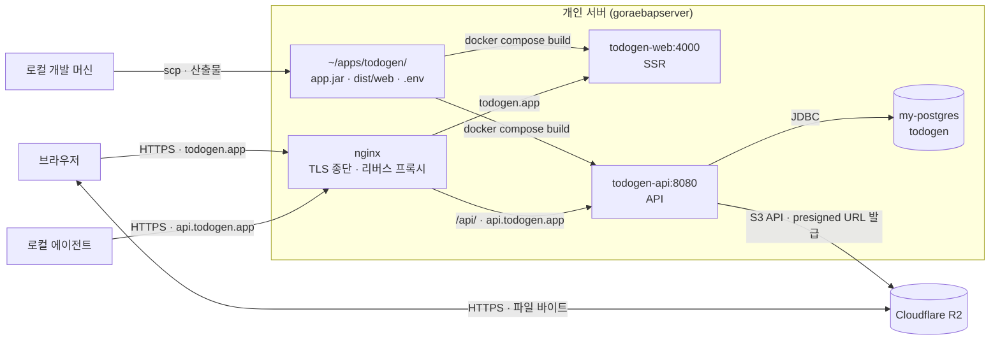

# 7. 배포 뷰 (Deployment View)

투두젠 시스템의 물리적·논리적 인프라 배치 구조와 배포 절차를 정의합니다. 단일 개인 서버(`goraebapserver`) 환경에서 Docker 컨테이너 기반으로 구동하며, 공용 서버 인프라 관례를 준수하는 범위 내에서 애플리케이션의 배포 명세를 기술합니다.



## 7.1 인프라 구성 및 배치

시스템을 구성하는 주요 요소의 호스트 내 배치 경로 및 역할은 다음과 같습니다.

| 구성 요소 | 배치 위치 및 명세 |
| :--- | :--- |
| **앱 컨테이너** | `~/apps/todogen/` — `api/`(jar + Dockerfile), `web/`(dist + Dockerfile), `docker-compose.yml`, `.env` |
| **리버스 프록시** | `~/nginx/nginx.conf` 내 `todogen.app` 및 `api.todogen.app` 서버 블록. Docker 내부 네트워크(`my-network`) 상의 컨테이너 이름으로 프록시합니다. |
| **인증서** | Certbot standalone 방식으로 발급받아 `~/nginx/certs/todogen-app-*.pem` 경로로 복사합니다. 인증서 갱신은 `~/nginx/renew-certs.sh` 스크립트를 통해 관리합니다. |
| **데이터베이스** | 서버 공용 `my-postgres` 인스턴스 내 `todogen` 데이터베이스(전용 롤 `todogen`)를 사용합니다. |
| **파일 보관소** | Cloudflare R2 버킷 `todogen`. 스토리지 접속 정보(자격 증명)는 서버의 `.env` 파일에서만 관리합니다. |

## 7.2 도메인 및 라우팅

인바운드 트래픽은 nginx 리버스 프록시를 통해 도메인 및 경로 단위로 각 컨테이너에 분기 전달됩니다.

- **`todogen.app`**: 기본 웹 요청을 `todogen-web:4000`(SSR 컨테이너)으로 전달하며, `/api/` 경로 요청은 `todogen-api:8080`(API 컨테이너)으로 라우팅합니다. 화면과 API가 동일한 출처(Same-Origin)를 공유하므로 세션 쿠키 기반 인증이 유지됩니다(로컬 개발 프록시와 동일한 구조).
- **`api.todogen.app`**: 외부 클라이언트(로컬 에이전트 등)의 요청을 `todogen-api:8080`으로 직접 라우팅합니다. 브라우저 외부 환경에서 Bearer 토큰을 통한 인증 요청을 처리합니다.

## 7.3 배포 절차

애플리케이션 빌드 및 테스트 검증은 로컬 환경에서 완료하고, 생성된 최종 산출물과 Dockerfile만을 서버로 전송하여 이미지를 빌드 및 구동합니다. 서버 환경에서의 직접 빌드로 인한 산출물 불일치 가능성을 방지하고 검증된 아티팩트의 동일성을 보장합니다.

```bash
# 1. 로컬 빌드
cd server && ./gradlew build          # 테스트 포함. build/libs/app.jar
cd web && npm run check               # 테스트 포함. dist/web

# 2. 산출물 운반 (레포는 나르지 않는다)
scp -P 23022 server/build/libs/app.jar server/Dockerfile  dev-goraebap@220.80.109.248:~/apps/todogen/api/
scp -P 23022 -r web/dist web/Dockerfile                    dev-goraebap@220.80.109.248:~/apps/todogen/web/

# 3. 서버에서 이미지 갱신
ssh -p 23022 dev-goraebap@220.80.109.248 \
  "cd ~/apps/todogen && docker compose build && docker compose up -d"
```

## 7.4 환경 설정 및 운영 제약

- **환경 변수 격리 (`.env`)**: 데이터베이스 자격 증명, `AUTH_SECRET`, R2 API 키 등의 민감 정보는 서버 내부의 `.env` 파일에서만 관리하며 버전 관리 시스템(Git)에 커밋하지 않습니다. 환경 변수 키 이름은 `server/src/main/resources/application.properties`에 정의된 환경 변수 명세와 일치합니다.
- **SSR 호스트 가드 설정**: SSR 컨테이너 구동 시 `NG_ALLOWED_HOSTS=todogen.app` 환경 변수 설정이 필수적입니다. Angular SSR의 SSRF(Server-Side Request Forgery) 방어 정책이 Host 헤더를 허용 목록과 대조하며, 해당 값이 누락될 경우 모든 요청에 대해 HTTP 400 응답을 반환합니다. 이 값은 서버의 `docker-compose.yml` 파일에 명시하여 적용합니다.
- **스토리지 CORS 설정**: Cloudflare R2 버킷의 CORS 정책은 `https://todogen.app` 출처에 대한 `GET`, `PUT` 메서드 허용과 더불어 **`ExposeHeaders`에 `etag`가 반드시 포함되어야 합니다**. 클라이언트 브라우저가 Presigned URL로 직접 파일을 업로드한 후, Uppy 라이브러리가 업로드 정합성을 검증하기 위해 응답의 `ETag` 헤더를 참조합니다. 해당 헤더가 노출되지 않으면 업로드 완료 처리가 중단됩니다. 로컬 개발 환경은 R2 대신 Docker Compose로 구동되는 MinIO(기본 설정)를 사용합니다.

```json
[
  {
    "AllowedOrigins": ["https://todogen.app"],
    "AllowedMethods": ["GET", "PUT"],
    "AllowedHeaders": ["content-type"],
    "ExposeHeaders": ["etag"],
    "MaxAgeSeconds": 3600
  }
]
```
