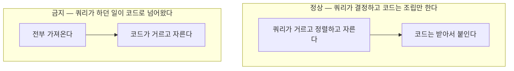

# 05. 조회와 명령

본 문서는 읽기 경로와 쓰기 경로의 분리 기준, 그리고 각 경로에 적용되는 제약을 정의합니다. **다수의 아키텍처 규칙이 두 경로의 비대칭에서 파생됩니다.**

## 1. 두 경로의 차이

| 항목 | 명령 | 조회 |
| :--- | :--- | :--- |
| **목적** | 상태를 바꾸면서 불변식을 검증합니다 | 화면 요구에 맞는 응답 구조를 만듭니다 |
| **애그리거트 경계** | 준수합니다. 트랜잭션이 경계를 넘지 않습니다 | 제약받지 않습니다 |
| **의존 대상** | 도메인 모델 | 화면 요구사항 |
| **접근 수단** | 저장소 (`Repository`) | 조회 포트 (`Query`) |
| **반환** | 도메인 타입 | 화면 DTO |

**두 경로가 같은 도구를 씁니다.** 도구를 나누면 두 기술 사이의 미커밋 변경 가시성, 반영 순서, 조각 재사용 같은 항목이 규칙으로 자라납니다. 경로를 나누되 도구는 하나로 둡니다.

## 2. 경로는 나누고 클래스는 합칩니다

**서비스를 명령과 조회로 나누지 않는 것이 기본입니다.** 하나의 서비스가 저장소와 조회 포트를 함께 참조하고, 컨트롤러는 그 하나만 봅니다.

```java
@Service
@RequiredArgsConstructor
public class TaskService {

    private final TaskRepository tasks;      // 명령 경로
    private final TaskQuery query;           // 조회 경로
    private final Clock clock;

    @Transactional
    public UUID add(String title) { ... }

    @Transactional(readOnly = true)
    public TaskView detail(UUID taskId) { ... }
}
```

클래스를 나누는 구성이 널리 쓰이지만, 그 분리의 목적은 **"명령 서비스가 조회 포트를 주입받지 못한다"를 도구가 판정할 수 있게 만드는 것**입니다. 본 저장소는 그 규칙을 강제하지 않기로 했으므로(4절), 분리를 유지할 근거도 함께 사라집니다. 남는 것은 파일이 길어질 때의 정리이고 그것은 아키텍처 규약이 아닙니다.

### 나누는 시점

> **조회에만 쓰이는 의존이 둘 이상 생기면 나눕니다.**

조회 포트가 하나뿐일 때는 명령 메서드가 보지 않는 필드가 하나뿐이라 부담이 없습니다. 조회 전용 의존이 둘 이상이 되면 그 클래스의 절반은 명령이 쓰지 않는 것이 되고, 그때가 실제로 아프기 시작하는 지점입니다. 자의적인 개수 기준을 두지 않고 필드 참조로 판정합니다.

나눌 때 조회 쪽 클래스의 이름은 `XxxQueryService` 입니다.

## 3. 저장소와 조회 포트의 경계

> **저장소는 도메인 타입만 반환합니다. 화면 어휘의 타입이 필요해지는 순간 그것은 조회 포트입니다.**

`Repository` 는 애그리거트의 컬렉션 추상화이며 화면용 구조를 만드는 자리가 아닙니다. 화면 요구에 맞춘 평면 구조를 반환하기 시작하면 그것은 이미 저장소가 아니라 읽기 계층입니다.

경계를 반환 타입에 두는 이유는 **판정이 기계적이기 때문**입니다. "이 조회가 명령을 위한 것인가 화면을 위한 것인가"는 사람마다 답이 갈리고 같은 `findById` 가 양쪽에 쓰이면 답이 없습니다. 반환 타입은 컴파일러가 보는 값 하나이므로 갈릴 여지가 없고, ArchUnit 이 그대로 검사합니다.

**단순한 조회에서 저장소를 쓰는 것은 위반이 아닙니다.** 애그리거트를 그대로 내보내는 동안은 저장소이고, 표시용 이름·정렬 라벨·집계처럼 도메인에 없는 값이 필요해지는 순간 포트가 갈립니다.

### 검증 재실행은 근거가 아닙니다

조회가 애그리거트를 조립하면 저장된 값이 현재 불변식을 다시 통과해야 하고, 규칙을 강화한 날 옛 데이터를 읽지 못하게 된다 — 그럴듯하지만 근거가 되지 못합니다. **값 객체의 두 경로가 그 문제를 이미 풉니다**([04. 계층](04-layers.md) 3절). 저장소는 검증하지 않는 정규 생성자로 재구성하므로 조회가 애그리거트를 만들어도 검증이 돌지 않습니다.

값 객체가 생성자에서 검증하는 구성이라면 이 논거가 성립하지만, 그 구성은 그것대로 규칙을 강화할 때 읽기를 막습니다.

### 그래서 남는 근거

| 근거 | 내용 |
| :--- | :--- |
| **애그리거트 경계** | 애그리거트는 트랜잭션 경계이고 조회는 그 경계를 넘나들어야 합니다 |
| **응답 형태의 소유권** | 도메인 타입을 그대로 내보내면 값 객체가 JSON 구조를 정합니다 |
| **모델의 오염** | 화면에 필요하다는 이유로 애그리거트에 필드가 붙습니다 |
| **매핑의 겹** | 애그리거트로 받으면 화면 구조로 옮기는 단계가 하나 더 생깁니다 |

**첫째가 가장 큽니다.** 목록에 다른 모듈의 표시명이 필요해지면 애그리거트로 받는 구성에서는 양쪽을 각각 로드해 코드에서 붙이게 되는데, 그것이 5절이 금지하는 형태입니다.

**넷째는 지금 바로 드러납니다.** 조회 포트가 레코드에서 `TaskView` 를 바로 만들면 매핑이 한 번입니다. 애그리거트를 거치면 레코드에서 `Task` 로, 다시 `Task` 에서 `TaskView` 로 두 번이 되고, 중간 단계는 아무것도 보태지 않습니다.

경계가 도메인 타입인 것은 애그리거트에 한정되지 않습니다. 여러 애그리거트를 조합한 결과라도 그것이 **도메인 어휘의 값 객체**라면 저장소가 반환할 수 있습니다. Vaughn Vernon 이 use case optimal query 를 설명하며 두는 단서가 이것입니다 — *"you design a Value Object, not a DTO, because the query is domain specific, not application specific"*([IDDD, ch.14](https://www.oreilly.com/library/view/implementing-domain-driven-design/9780133039900/ch14lev2sec6.html)). 진짜 선은 엔티티인지 아닌지가 아니라 **도메인 어휘인지 화면 어휘인지**입니다.

분리 시점에 대한 일반적 조언도 같은 축입니다. 읽기 모델이 쓰기 모델과 **크게 갈릴 때** 분리하며, 그전에는 하나의 저장소와 하나의 데이터베이스로 둡니다([Microsoft Azure Architecture Center](https://learn.microsoft.com/en-us/azure/architecture/patterns/cqrs)).

## 4. 명령 경로의 규약

**명령 메서드는 `void` 또는 식별자를 반환합니다.** 화면이 필요로 하는 나머지는 조회가 주며, 그 조회는 클라이언트가 따로 부릅니다([07. API 설계](07-api-design.md) 2절).

```java
@PostMapping
public ResponseEntity<Void> add(@Valid @RequestBody CreateTask request) {
    UUID id = tasks.add(request.title());
    return ResponseEntity.created(location(id)).build();
}
```

**명령을 처리하는 메서드는 저장소만 사용합니다.** 조회 포트로 상태를 확인하고 그 결과로 판단하면 애그리거트를 거치지 않게 되어 불변식 검증이 통째로 건너뛰어집니다. 상태를 바꾸거나 불변식을 검증할 근거가 되는 값은 반드시 애그리거트를 통해 얻습니다.

> [!WARNING]
> **이 규칙에는 강제 수단이 없습니다**
>
> 서비스를 나누지 않기로 했으므로 한 클래스가 저장소와 조회 포트를 함께 들고 있고, 도구가 메서드의 성격을 판정할 수단이 없습니다. 검토가 유일한 확인 수단입니다.

같은 질문도 목적이 다르면 경로가 갈립니다.

| 상황 | 경로 | 이유 |
| :--- | :--- | :--- |
| 명령 안에서의 존재·중복 검사 | 저장소 | 불변식 검증의 일부이며 트랜잭션 안에서 정확해야 합니다 |
| 입력 중 실시간 중복 안내 | 조회 포트 | 사용자 편의이며 캐시나 제한이 붙을 수 있습니다 |

## 5. 조회 경로의 규약

**포트가 화면 DTO 를 직접 반환합니다.** 도메인 보강이 필요한 조회에서만 중간 타입을 둡니다. 모든 조회에 두 겹을 강제하면 그것이 새로운 형식이 됩니다.

**포트는 조회 하나당이 아니라 모듈당 하나입니다.** 그 모듈의 조회 메서드를 한 인터페이스에 모으고 어댑터도 하나로 둡니다. 조회를 하나 더 붙이는 비용이 인터페이스 한 줄과 구현 몇 줄로 유지됩니다.

조회는 도메인 애그리거트를 조립하지 않습니다. 다만 도메인 규칙(기한 경과 판정 등)을 순수 함수로 **재사용하는 것은 허용합니다.** 규칙이 SQL 에 복제되어 두 곳에 존재하는 것을 막기 위함입니다. 원칙은 **판정 로직만 빌려오고 데이터 로딩은 프로젝션으로**입니다.

### 필터 · 정렬 · 페이징의 자리

화면의 필터와 정렬과 페이징은 **쿼리 안에서** 처리합니다.



범례: 위 블록은 허용되는 처리 흐름이고 아래 블록은 금지되는 흐름입니다.

> [!NOTE]
> **판정 기준은 결합 위치가 아닙니다**
>
> 부모를 조회한 뒤 자식을 따로 조회해 붙이는 방식은 코드에서 결합하는 형태이지만 정상이며, 컬렉션이 여럿일 때의 표준 해법입니다. 판정 기준은 **쿼리가 수행하던 필터 · 정렬 · 페이징이 코드로 이동했는가**입니다.

## 6. 강제 현황

| 규칙 | 강제 수단 |
| :--- | :--- |
| **저장소의 반환 타입은 도메인 타입** | ArchUnit |
| **컨트롤러의 조회 포트 직접 참조 금지** | ArchUnit |
| **명령 메서드가 조회 포트를 쓰지 않을 것** | **없습니다.** 문서와 검토뿐입니다 |
| **명령 메서드의 반환 타입** | **없습니다.** 문서와 검토뿐입니다 |
