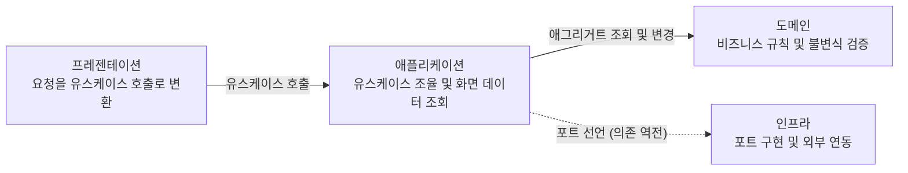
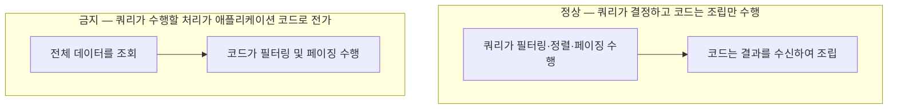

# 백엔드 03. 계층 구조와 요청 처리 흐름

요청이 계층을 거쳐 데이터베이스에 도달하고 응답으로 반환되기까지의 실행 흐름과 처리 메커니즘을 서술한다. 클래스의 패키지 배치 규격은 빌딩 블록 뷰가 정의하며, 검증 가능한 세부 코딩 규칙은 코드 스타일 가이드가 다룬다.

계층 분할 배경과 DDD 패턴 차용 범위는 [결정-0009](../decisions/0009-backend-layered-structure.md)에 기술되어 있다.

## 1. 계층과 의존 방향



실선은 직접 호출이며 점선은 의존성 역전(DIP)을 나타낸다. 애플리케이션 계층이 포트 인터페이스를 선언하고 인프라 계층이 이를 구현한다.

| 계층 | 역할 | 배제 대상 |
| :--- | :--- | :--- |
| **프레젠테이션** | 요청 검증, 유스케이스 호출, 응답 반환 | 비즈니스 판단 |
| **애플리케이션** | 유스케이스 조율, 화면 데이터 조회, 트랜잭션 경계 설정 | 도메인 규칙 직접 구현 |
| **도메인** | 비즈니스 규칙 및 불변식 검증 | 상위 계층 참조, 프레임워크 의존 |
| **인프라** | 포트 구현체 제공, 외부 시스템 연동 | 도메인 규칙 구현 |

컨트롤러와 서비스의 변경 생애주기가 일치하므로 프레젠테이션과 애플리케이션은 동일 패키지(`application`)에 함께 배치하며, 물리적 디렉터리가 아닌 클래스의 역할과 접미사로 구분한다.

## 2. 명령과 조회의 분리

동일한 서비스 내에서 명령(Command)과 조회(Query)가 서로 다른 포트를 사용한다.

| 구분 | 명령 (Command) | 조회 (Query) |
| :--- | :--- | :--- |
| **목적** | 상태 변경 및 불변식 검증 | 화면 요구에 맞춘 응답 구조 생성 |
| **진입 포트** | 저장소 (`Repository`) | 조회 포트 (`Query`) |
| **입출력 타입** | 도메인 타입 (애그리거트, 값 객체) | 화면 DTO |
| **애그리거트 경계** | 준수 | 제약 없음 |

**두 경로는 동일한 데이터 접근 도구(jOOQ)를 사용한다.** 도구를 이원화할 경우 발생하는 트랜잭션 내 미커밋 변경의 가시성 불일치, 반영 순서 충돌, 쿼리 조각 재사용 불가 등의 문제를 방지하기 위함이다.

## 3. 명령 처리 경로

```text
컨트롤러 ─▶ 서비스 ─▶ 저장소 ─▶ 애그리거트 ─▶ 저장소.save
              │                    │
              └ 트랜잭션 경계        └ 불변식 검증
```

서비스의 public 메서드에서 트랜잭션이 시작된다. 저장소가 애그리거트를 조회하여 복원하고, 애그리거트의 비즈니스 메서드가 상태를 변경하면서 불변식을 자체 검증하며, 변경된 애그리거트를 저장소에 전달하여 영속화한다.

```java
Task task = tasks.findById(id).orElseThrow(TASK_NOT_FOUND::raise);
task.complete(clock.instant());
tasks.save(task);                    // 명시적 save 호출 필수 (Dirty Checking 미지원)
```

**변경 감지(Dirty Checking) 메커니즘이 존재하지 않는다.** jOOQ는 조회된 도메인 객체의 상태 변화를 추적하지 않으므로 상태 변경 후 반드시 `save`를 명시적으로 호출해야 한다. `save` 메서드는 삽입(Insert)과 갱신(Update)을 단일 진입점으로 처리하여 호출부에서 데이터의 존재 여부를 분기하지 않도록 한다.

시각을 외부에서 제어할 수 있어야 만료 및 수명 관련 불변식을 테스트 환경에서 결정론적으로 검증할 수 있으므로, **주입된 `Clock`에서 시각을 생성하여 도메인 메서드의 인자로 전달한다.**

## 4. 조회 처리 경로

```text
컨트롤러 ─▶ 서비스 ─▶ 조회 포트 ─▶ (SQL) ─▶ 화면 DTO
```

조회 포트는 데이터베이스 레코드로부터 화면 DTO를 직접 프로젝션하여 생성한다. 애그리거트를 경유하지 않으므로 불필요한 중간 변환(레코드 → 도메인 → DTO) 비용을 제거하고 단일 매핑으로 처리한다.

**필터링, 정렬, 페이징은 쿼리 내부에서 처리한다.**



판정 기준은 데이터 결합 위치가 아니다. 복수 컬렉션을 다룰 때 부모 데이터를 조회한 후 연관 자식 데이터를 별도 쿼리로 조회하여 조합하는 방식은 표준적이며 정상적인 흐름이다. 핵심 기준은 **쿼리가 수행해야 할 필터링·정렬·페이징 처리가 애플리케이션 메모리 코드로 이동했는가**이다.

기한 경과 판정과 같은 규칙이 SQL과 Java 코드 양쪽에 중복 구현되면 동기화 불일치가 발생하므로, 조회 로직에서 도메인 규칙을 순수 함수 형태로 참조하는 것을 허용한다. 이때 **판정 로직만 도메인에서 차용하고, 데이터 로딩은 프로젝션 방식**을 유지한다.

## 5. 저장소와 조회 포트의 반환 타입 경계

저장소는 도메인 타입만 반환하며, 화면 표현 어휘의 타입이 요구되는 시점부터는 조회 포트를 사용한다. 조회의 사용 목적에 따른 주관적 해석 대신 반환 타입이라는 정적 컴파일 기준을 적용하여 ArchUnit 등으로 아키텍처 규칙을 기계적으로 일관되게 검증할 수 있도록 하기 위함이다.

단순 조회 유스케이스에서 저장소를 사용하는 것은 규칙 위반이 아니다. 애그리거트 원형을 그대로 반환하는 경우는 저장소를 활용하며, 표시용 명칭이나 집계값 등 도메인에 존재하지 않는 데이터가 필요한 시점에 조회 포트로 분기한다.

복수 애그리거트를 조합한 결과라 하더라도 반환 대상이 **도메인 어휘로 정의된 값 객체**라면 저장소에서 반환할 수 있다. 경계의 본질은 엔티티 여부가 아닌, 반환 타입이 도메인 어휘인가 화면 어휘인가에 있다([IDDD, ch.14](https://www.oreilly.com/library/view/implementing-domain-driven-design/9780133039900/ch14lev2sec6.html)).

## 6. 도메인 모델과 영속 모델의 분리 및 변환

도메인 엔티티는 특정 프레임워크나 영속성 라이브러리에 의존하지 않는 순수 Java 객체(POJO)이다. **저장소 구현체 내부의 private 메서드가 생성된 레코드와 도메인 엔티티 간의 변환을 전담한다.** 별도의 매퍼 클래스나 매퍼 패키지를 두지 않고, 레코드와 직접 상호작용하는 저장소 구현체 내부에서 변환 책임을 캡슐화한다.

ORM 환경에서는 영속 객체와 도메인 객체의 분리에 추가적인 매핑 비용이 수반되지만, **jOOQ 기반 환경에서는 생성 레코드와 도메인 엔티티가 물리적으로 분리되어 있으므로** 구조적 순수성을 자연스럽게 유지할 수 있다.

이러한 모델 분리가 유효하게 작동하기 위한 요건은 두 가지이다. 엔티티가 스스로 비즈니스 불변식을 완결성 있게 검증해야 하며, Spring 애플리케이션 컨텍스트 없이 순수 단위 테스트가 가능해야 한다. 비즈니스 검증이 애플리케이션 서비스로 분산되거나 도메인 단위 테스트에 프레임워크 기동이 필요해지면 모델 분리의 실효성이 상실된다.

## 7. 값 객체의 생성 및 영속성 재구성

유효성 검증 규칙이 요구되는 필드는 값 객체(Value Object)로 분리한다. 제약 상수, 검증, 정규화, 에러 메시지를 값 객체 내부에 응집하고 애그리거트는 이를 조립하여 구성한다.

```java
public record TaskTitle(String value) implements ValueObject {

    public static final int MAX = 200;
    public static final String REQUIRED = "제목을 입력해 주세요";

    /** 외부 입력값을 검증 및 정규화하여 생성한다. */
    public static TaskTitle of(String raw) { ... }
}
```

| 경로 | 사용처 | 유효성 검증 |
| :--- | :--- | :--- |
| `of(...)` | 외부 입력이 유입되는 모든 지점 | 수행 |
| 정규 생성자 | 저장소의 데이터 재구성 | **생략** |

**애플리케이션 데이터베이스는 신뢰 경계(Trust Boundary) 내부에 위치한다.** 이미 검증을 거쳐 영속화된 데이터이므로 조회 시점에 재검증을 수행하지 않는다. 재구성 시점에 검증을 강제하면 비즈니스 규칙이 변경(강화)되었을 때 과거 데이터를 정상적으로 조회하지 못하는 결함이 발생하기 때문이다(예: 제목 최대 길이 축소 시 기존 데이터 로딩 실패).

애그리거트 역시 동일한 원리로 생성 경로가 분리된다. 비즈니스 팩토리 메서드는 신규 생성 시 불변식을 검증하고, `restore` 메서드는 영속화된 상태를 그대로 복원한다. **애그리거트의 `restore`와 값 객체의 정규 생성자가 모두 검증을 우회해야** 과거 데이터의 복원 격리가 완성된다.

Java `record`의 정규 생성자는 레코드 자체의 가시성보다 좁은 접근 제어자를 지정할 수 없다. 따라서 `ValueObject` 마커 인터페이스를 부여하고 ArchUnit 아키텍처 검증을 통해 정규 생성자의 호출자를 `domain` 및 `infrastructure` 계층으로 제한한다.

## 8. 데이터베이스 스키마 기반 코드 생성

```text
db/migration/*.sql  ──(SQL 파서)──▶  build/generated-sources/jooq/  ──▶  compileJava
```

**버전 관리되는 마이그레이션 SQL 파일이 스키마의 단일 진실 공급원(SSOT)이며, jOOQ 코드는 이로부터 생성된다.** 소스 코드 엔티티로부터 데이터베이스 스키마를 역생성하거나 대조하는 방식을 사용하지 않는다.

코드 생성(`jooqCodegen`)은 **실행 중인 데이터베이스 인스턴스 없이** 마이그레이션 SQL 파싱을 통해 직접 수행된다. 빌드 프로세스가 외부 런타임 상태에 의존하지 않으므로 로컬 환경 차이로 인한 코드 생성 불일치가 발생하지 않으며, CI 파이프라인에서도 사전 컨테이너 기동 없이 컴파일을 완료할 수 있다.

**실제 데이터베이스 엔진이 아닌 SQL 파서를 기준으로 코드를 생성한다는 점이 기술적 제약이다.** DBMS 고유 구문 일부는 파서 수준에서 해석되지 않을 수 있으며, 파싱 성공이 런타임 DDL 실행 성공을 완전히 보장하지는 않는다. 실제 마이그레이션 구문의 동작 적합성은 Testcontainers를 활용하는 통합 테스트 단계에서 검증한다.

생성된 코드는 빌드 산출물 디렉터리(`build/`)에 생성되며 형상 관리(Git)에서 제외한다. 수동 커밋을 배제함으로써 스키마 변경 시 생성 코드의 불일치 커밋 위험을 근본적으로 차단한다.

## 9. 트랜잭션 경계와 적용 범위

트랜잭션의 경계는 **애플리케이션 서비스의 public 메서드**로 한정한다. 컨트롤러, 도메인 엔티티, 저장소는 트랜잭션 경계를 직접 관리하지 않는다.

**클래스 레벨의 `@Transactional` 선언을 금지하고 메서드 단위로 명시한다.** 단일 서비스 내에 명령과 조회 메서드가 공존하므로, 클래스 레벨 선언 시 조회 메서드에도 쓰기 트랜잭션이 적용되는 부작용을 방지하기 위함이다. 서비스의 public 메서드에 트랜잭션 선언이 누락되는 문제를 방지하기 위해 ArchUnit 테스트로 이를 빌드 시점에 강제 검증한다.

**단일 트랜잭션은 단일 애그리거트 경계 내에서 완결하는 것을 원칙으로 한다.** 복수 애그리거트의 상태를 단일 트랜잭션으로 묶으면 생애주기 결합도가 높아져 향후 모듈 분리가 어려워지기 때문이다.
