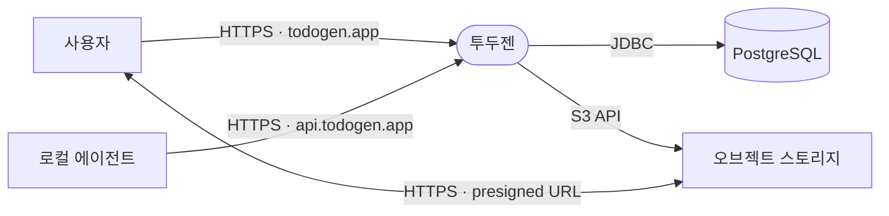

# 참조 아키텍처

본 문서는 [arc42](https://arc42.org/) 아키텍처 템플릿 구조를 따르는 투두젠(todogen)의 참조 아키텍처(Reference Architecture) 최상위 문서입니다. 전체 시스템의 목표, 핵심 품질 속성, 이해관계자 요구사항, 비즈니스 및 기술 컨텍스트를 정의하며, 세부 영역별 아키텍처 설계와 결정 사항은 하위 참조 문서 및 아키텍처 결정 기록(ADR)을 통해 관리합니다.

## 1. 서론과 목표 (Introduction and Goals)

### 1.1 요구사항 개요 (Requirements Overview)

투두젠(todogen)은 개인용 작업(Todo) 관리 서비스입니다. 사용자는 작업을 등록, 조회, 수정 및 완료 처리할 수 있으며, 모든 데이터는 사용자 계정에 귀속되어 기기 환경에 관계없이 동기화된 상태를 유지합니다.

- **기능 범위 기준점**: Microsoft To Do의 핵심 기능 범위를 벤치마크하여 요구사항을 정의합니다.
- **요구사항 원본 명세**: 유스케이스 6건(TK-001 ~ TK-006), 액터 정의 및 범위 외(Out of Scope) 사항에 대한 세부 명세는 [유스케이스 모델](../1.analysis/유스케이스-모델.md)을 따릅니다.

### 1.2 품질 목표 (Quality Goals)

ISO/IEC 25010 소프트웨어 품질 모델을 기반으로 시스템이 최우선으로 만족해야 하는 3대 품질 특성을 다음과 같이 정의합니다.

- **보안 (Security)**: 작업 및 첨부 파일 데이터는 사용자 계정 단위로 격리되며, 비인가 리소스 접근 시 정보 누출을 방지합니다.
  - *검증 기준*: 타 계정 소유의 작업 식별자로 조회·수정·삭제·파일 첨부를 요청할 경우, 존재하지 않는 리소스와 동일한 응답을 반환하여 리소스의 존재 여부를 은닉합니다.
- **상호작용 능력 (Interaction Capability)**: 데스크톱 및 모바일 등 다양한 뷰포트 환경에서 동일한 작업 흐름을 일관되게 완결할 수 있어야 합니다.
  - *검증 기준*: 작업 목록 열람부터 상세 수정(제목, 메모, 마감기한) 및 파일 첨부까지의 전체 흐름이 데스크톱과 모바일 뷰포트 모두에서 정상적으로 완결됩니다.
- **성능 효율성 (Performance Efficiency)**: 상태 변경이 UI에 반영되는 과정에서 기존 화면 상태를 보존하고 불필요한 전체 재렌더링을 방지합니다.
  - *검증 기준*: 특정 작업을 완료 처리할 때 작업 목록 전체를 재렌더링하지 않고, 기존 뷰 상태를 유지하며 해당 항목의 상태만 갱신합니다.

#### 품질 목표 선정 배경 및 제외 항목
- **선정 배경**: 개인 데이터를 안전하게 보관하고 관리하는 서비스로서, 계정 간 데이터 격리를 보장하는 보안성, 기기 환경에 제약 없는 상호작용성, 원활한 사용자 조작성을 보장하는 UI 성능 효율성을 핵심 가치로 설정합니다.
- **목표 제외 항목**: 단일 사용자 대상 및 1대 규모의 단일 서버 배포 환경을 전제로 하므로, 고가용성(High Availability) 및 대규모 처리량(High Throughput)은 주요 아키텍처 목표에서 제외합니다.

### 1.3 이해관계자 (Stakeholders)

시스템 아키텍처와 관련된 주요 이해관계자 및 기대사항은 다음과 같습니다.

- **사용자**: 등록한 데이터의 무손실 보존 및 계정 외부로 유출되지 않는 안정적인 데이터 격리.
- **개발자**: 일관된 아키텍처 규칙과 구조를 기반으로 코드 배치 및 설계에 대한 반복적 판단 비용 최소화.
- **코딩 에이전트**: 모호함 없는 명확한 규격 정의, 자동화 도구에 의한 강제 영역과 사람의 검토 영역이 분리된 명세.

#### 아키텍처 문서화 원칙
본 저장소의 구현 코드는 대부분 코딩 에이전트가 작성합니다. 이에 따라 아키텍처 문서는 주관적 서술을 배제하고 **판정 가능한 명세(Verifiable Specification)** 형태로 작성합니다. 각 규칙은 린터, 타입 검사기, 빌드 도구 등 기계적 강제 수단의 유무를 명시하고, 자동 강제가 불가능한 규칙은 명확한 검토 주체를 지정합니다.

## 2. 제약 조건 (Architecture Constraints)

시스템이 운영되는 외부 환경 및 기술적 제약 조건입니다. 아키텍처 설계는 아래 제약 조건을 전제로 수행됩니다.

- **서버 인프라**: 단일 서버 환경에서 도커(Docker) 컨테이너 기반으로 웹과 API를 구동하며, nginx를 리버스 프록시로 사용합니다. 수평 확장(Scale-out)과 무중단 배포는 전제하지 않습니다.
- **데이터베이스**: 호스트에 실행 중인 공용 PostgreSQL 인스턴스를 데이터베이스 단위로 분할하여 사용합니다. 인스턴스 수준의 설정 및 관리는 본 시스템의 범위에 포함되지 않습니다.
- **파일 스토리지**: 배포 환경은 Cloudflare R2, 로컬 개발 환경은 MinIO를 사용하며 S3 호환 API로만 접근합니다. 특정 스토리지 공급자 전용 기능은 사용하지 않습니다.
- **브라우저 환경**: 별도의 브라우저 지원 목록을 정의하지 않고 Angular 프레임워크의 기본 지원 대상(Chrome, Edge, Firefox, Safari, iOS Safari 및 주요 Android 브라우저 최신 버전)을 따릅니다.

## 3. 컨텍스트와 범위 (Context and Scope)

투두젠의 시스템 경계와 외부 통신 인터페이스를 정의합니다. 시스템 내부 구조는 [5. 빌딩 블록 뷰](#5-빌딩-블록-뷰-building-block-view)에서 다룹니다.

### 3.1 외부 인터페이스 및 통신 대상

- **사용자**: 웹 브라우저를 통해 작업 및 계정 관리 기능을 수행하며, 쿠키 세션 기반으로 인증합니다.
- **로컬 에이전트**: API 토큰을 사용하여 작업을 등록합니다. 현재 인증 인터페이스만 지원하며 세부 연동 구현은 예정 상태입니다.
- **PostgreSQL**: 작업 및 계정 데이터의 원본을 영속화합니다. 데이터베이스 스키마는 Flyway 마이그레이션을 통해 관리합니다.
  - *접점 코드*: `server/.../infrastructure`
- **오브젝트 스토리지**: 첨부 파일 및 프로필 이미지 바이너리를 보관합니다. 로컬 환경은 MinIO, 배포 환경은 Cloudflare R2를 사용하며 표준 S3 API만을 사용합니다.
  - *접점 코드*: `server/.../shared/storage`

### 3.2 통신 채널 및 프로토콜

- **`todogen.app`**: 서버 렌더링 HTML 및 작업·계정 JSON 데이터 전송. HttpOnly 쿠키 세션을 통해 인증합니다.
- **`api.todogen.app`**: 작업 JSON 데이터 전송. Bearer 토큰을 통해 인증합니다.
- **`S3 API`**: 파일 크기 조회, 메타데이터 관리, 삭제 및 Presigned URL 서명 발급. 스토리지 자격 증명을 통해 인증합니다.
- **`presigned URL`**: 첨부 파일 바이너리 스트림 전송. URL에 서명된 한시적 접근 권한을 사용합니다.

### 3.3 컨텍스트 원칙

- **대용량 파일 전송 분리 (Direct-to-Storage)**: 첨부 파일 바이너리는 투두젠 애플리케이션 서버를 경유하지 않습니다. 클라이언트와 오브젝트 스토리지가 Presigned URL을 통해 직접 데이터를 송수신하며, 투두젠 서버는 저장 경로 결정 및 한시적 접근 권한 서명만을 담당합니다.
- **출처 분리 기반 인증 구조**: 웹 화면(SSR)과 REST API가 동일한 출처(`todogen.app`)를 공유함으로써 브라우저의 세션 쿠키를 활용합니다. 출처를 공유할 수 없는 외부 독립 클라이언트(로컬 에이전트 등)는 전용 엔드포인트(`api.todogen.app`)와 Bearer 토큰 인증 체계로 격리합니다.

## 4. 솔루션 전략 (Solution Strategy)

본 문서는 솔루션 전략을 다루지 않습니다.

## 5. 빌딩 블록 뷰 (Building Block View)

시스템 구성 컴포넌트의 책임과 의존 관계를 정의합니다. 컴포넌트 내부의 세부 패키징 규칙은 각 영역별 `02-package-structure` 참조 문서에서 정의합니다.

### 5.1 레벨 1 — 전체 시스템 화이트박스

- **web** (`web/src`): 사용자 인터페이스 및 상호작용 처리. 서버 사이드 렌더링(SSR)으로 초기 HTML을 생성하고 브라우저 런타임 상태를 관리합니다.
- **server** (`server/src/main/java`): 비즈니스 규칙 처리 및 데이터 영속화. HTTP API를 통해 리소스를 제공하고 파일 저장 위치 및 권한을 관리합니다.

#### 컴포넌트 간 통신 원칙
- `web`과 `server` 컴포넌트는 컴파일 및 런타임 단계에서 상호 직접적인 코드 의존성을 갖지 않습니다.
- 두 컴포넌트의 유일한 연결점은 **빌드 시점의 정적 타입 생성**입니다. `server`의 OpenAPI 명세로부터 `web`의 인터페이스 타입을 생성하며, 런타임 데이터 통신은 브라우저의 HTTP 요청을 통해 이루어집니다.

### 5.2 레벨 2 — web

`web` 컴포넌트의 세부 아키텍처 및 내부 모듈 구조는 `frontend/` 참조 문서에서 다룹니다.

### 5.3 레벨 2 — server

`server` 컴포넌트의 세부 아키텍처 및 내부 계층 구조는 `backend/` 참조 문서에서 다룹니다.

## 6. 런타임 뷰 (Runtime View)

본 문서는 런타임 뷰를 다루지 않습니다.

## 7. 배포 뷰 (Deployment View)

배포 인프라 구성과 절차에 대한 세부 명세는 [deploy/README.md](../../deploy/README.md)에서 다룹니다.

## 8. 횡단 관심사 (Crosscutting Concepts)

## 9. 아키텍처 결정 (Architecture Decisions)

주요 아키텍처 설계 시점의 결정 사항과 대안 분석은 아키텍처 결정 기록(ADR)을 통해 관리합니다.

- [결정 기록 목차](decisions/index.md)

## 10. 품질 요구사항 (Quality Requirements)

## 11. 위험과 기술 부채 (Risks and Technical Debt)

## 12. 용어집 (Glossary)

용어의 정의는 해당 개념을 도입하는 각 참조 문서 하단의 `용어` 절에서 분산 관리하며, 별도의 독립된 용어집 문서는 유지하지 않습니다.
