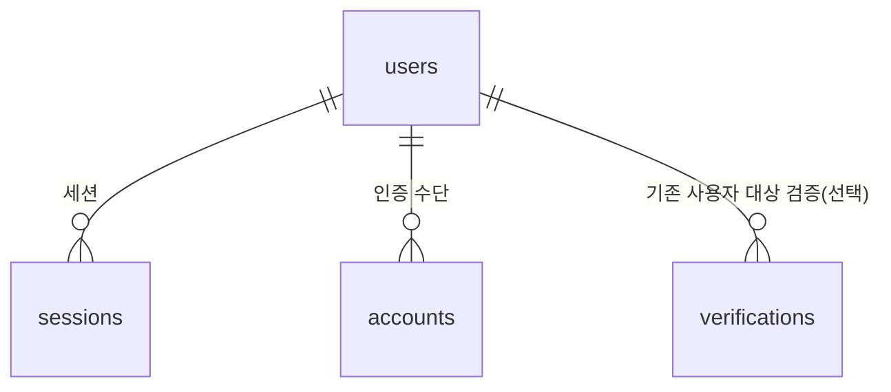

# 설계 — 데이터베이스

이 문서는 **스키마의 설계 의도**를 담는다. 스키마의 정본은 Flyway 마이그레이션
(`server/src/main/resources/db/migration/V*.sql`)이며(결정-0013), 이 문서는 그 마이그레이션이 왜
그렇게 생겼는지와 **각 제약이 어떤 불변식을 지키는지**를 기록한다.

컬럼 목록을 여기에 중복해 적는 이유는 하나뿐이다 — [결정-0015](../결정기록/결정-0015-이메일-소유-증명.md)의
불변식은 "구현자가 무심코 되살리기 쉬운" 종류라, 제약과 불변식의 대응이 사람이 읽는 형태로 남아
있어야 한다. 대응 표는 §6에 있다.

## 1. 공통 규약

### 1.1 명명

| 대상 | 규칙 | 예 |
|---|---|---|
| 테이블 | 소문자 스네이크, **복수형** | `users`, `sessions`, `accounts`, `verifications` |
| 컬럼 | 소문자 스네이크 | `email_normalized`, `expires_at` |
| 기본키 | `pk_<테이블>` | `pk_users` |
| 유니크 | `uq_<테이블>_<컬럼들>` | `uq_accounts_provider_account` |
| 외래키 | `fk_<테이블>_<대상>` | `fk_sessions_user` |
| 인덱스 | `ix_<테이블>_<컬럼들>` | `ix_sessions_expires_at` |
| 체크 | `ck_<테이블>_<의도>` | `ck_accounts_credential_password` |

**복수형을 쓰는 이유는 `user`가 예약어이기 때문이다.** PostgreSQL에서 `user`는 예약어여서 인용
부호 없이 테이블명으로 쓸 수 없고, jOOQ 코드생성이 경유하는 H2에서도 마찬가지다(§1.5). 넷 중
하나만 인용 부호를 붙이면 일관성이 깨지므로 전부 복수형으로 맞춘다.

[AUTH-06](../요구사항/인증.md)이 말하는 `user`/`session`/`account`/`verification`은 **개념 이름**이고,
물리 테이블명은 각각 그 복수형이다. 제약 이름도 이 규칙을 따른다.

### 1.2 기본키

**모든 기본키는 `uuid`이며 애플리케이션에서 생성한다.** DB 기본값(`gen_random_uuid()`)을 쓰지 않는다.

- 외부에 노출되는 식별자가 순차값이면 열거가 가능하다. 결제를 편입할 계획이 있어(결정-0015 §맥락)
  사용자·계정 식별자가 외부로 나갈 여지를 미리 닫는다
- DB 기본값을 피하는 이유는 두 가지다 — jOOQ 코드생성이 H2를 경유하므로 Postgres 고유 함수를
  기본값으로 두면 파싱 위험이 생기고(§1.5), 애플리케이션이 INSERT 전에 식별자를 알 수 있으면
  애그리거트 생성 코드가 단순해진다
- **버전은 v4**(`UUID.randomUUID()`)로 시작한다. v7(시간 정렬)이 인덱스 지역성에 유리하지만 Java
  표준에 없어 직접 생성 또는 의존성 추가가 필요하고, 현 단계에서 그 비용을 지불할 근거가 없다.
  삽입량이 늘어 인덱스 팽창이 **측정되면** v7로 전환한다 — 두 버전이 섞여도 무해하다

### 1.3 시각과 타입

- 모든 시각 컬럼은 `timestamp with time zone`이다. 로컬 타임존을 스키마에 들이지 않는다
- **`current_timestamp` 기본값을 쓰지 않는다.** 시각은 애플리케이션이 주입된 `Clock`으로 채운다
  ([서버.md](서버.md) §3의 전역 `Clock` 빈) — 테스트가 시각을 통제할 수 있어야 한다
- 문자열은 길이를 명시한 `varchar(n)`을 쓴다. 길이 자체가 문서 역할을 한다
- **소프트 삭제를 도입하지 않는다.** 삭제는 행 삭제다. 세션 무효화가 `DELETE`여야 즉시
  반영된다는 것이 [결정-0014](../결정기록/결정-0014-세션-방식.md)의 전제다

### 1.4 비밀은 원문으로 저장하지 않는다

| 값 | 저장 형태 | 이유 |
|---|---|---|
| 비밀번호 | bcrypt 해시 | 느린 해시가 필요하다 (오프라인 대입 방어) |
| 세션 토큰 | HMAC-SHA256 (앱 시크릿 키) | DB 유출이 **활성 세션을 그대로 넘기지 않게** 한다 |
| OTP 코드 | HMAC-SHA256 (앱 시크릿 키) | 6자리는 10⁶ 전수라 단순 해시로는 즉시 복원된다 (결정-0015 §결정 3) |

세션 토큰과 OTP에 bcrypt가 아니라 HMAC을 쓰는 이유는 **조회가 결정적이어야** 하기 때문이다 —
같은 입력이 같은 다이제스트를 내야 인덱스로 찾을 수 있다. 앱 시크릿이 키로 들어가므로 DB만으로는
복원할 수 없고, 요청당 비용은 마이크로초 단위다.

세션 토큰까지 해시하는 것은 결정-0014에 없던 보강이다. 불투명 토큰은 DB 조회로 검증되므로
평문 저장이 흔하지만, 그러면 DB 유출이 곧 전 사용자 세션 탈취가 된다. HMAC 한 번으로 막을 수 있어
막는다.

**용도가 다르면 다른 다이제스트가 나온다.** 세션 토큰·OTP·소셜 중간 표 서명이 모두 같은 앱
시크릿을 키로 쓰므로, 라벨이 없으면 셋은 **같은 함수의 출력**이다. 한 용도에서 얻은 값이 다른
용도에서 통하는 길이 열릴 수 있고, 표 서명은 이 시스템에서 **유일하게 클라이언트에게 노출되는
HMAC 출력**이라 특히 그렇다.

그래서 `TokenHasher.hmac()`은 용도를 **인자로 받는다**(`HmacPurpose`). 문자열을 앞에 붙이는
관례로 두면 호출부 하나가 잊는 순간 그 용도만 조용히 다른 용도와 같은 공간을 쓰게 되는데,
타입으로 강제하면 컴파일러가 막는다.

> **라벨을 바꾸면 저장된 다이제스트가 전부 어긋난다.** 배포 전에는 무비용이지만 운영 데이터가
> 생긴 뒤에는 살아 있는 세션과 대기 레코드를 모두 무효화하는 마이그레이션이 된다.

### 1.5 jOOQ 코드생성 제약 — H2를 경유한다

결정-0013에 따라 jOOQ는 마이그레이션 SQL을 **인메모리 H2**에 적용한 뒤 리버스 엔지니어링한다.
따라서 **테이블·컬럼 DDL은 H2에서도 파싱돼야 한다.** 실무적으로 이런 제약이 된다.

| 피할 것 | 대신 |
|---|---|
| `create type ... as enum` | `varchar` + 애플리케이션 enum (필요하면 `check`) |
| `gen_random_uuid()` 등 Postgres 고유 기본값 | 애플리케이션에서 값 생성 (§1.2) |
| 부분 인덱스 (`create index ... where ...`) | 전체 유니크 제약, 또는 아래 우회 |
| `citext` 등 확장 타입 | 정규화된 값을 **실 컬럼**으로 저장 (§2.1) |
| 함수 기반 인덱스 (`lower(email)`) | 같음 |

Postgres 고유 문법이 꼭 필요하면 `[jooq ignore start]` / `[jooq ignore stop]` 주석으로 감싼다 —
Flyway는 적용하고 jOOQ는 건너뛴다. **인덱스는 코드생성에 필요하지 않으므로** 이 우회의 좋은
대상이다. 반대로 테이블·컬럼 정의는 감쌀 수 없다 — 생성 코드가 그것을 필요로 한다.

이 제약은 키트의 편의(클론 직후 Docker 없이 빌드)와 맞바꾼 것이다. 스키마가 이 범위를 넘어서면
결정-0013의 재검토 조건(Testcontainers 기반 생성으로 전환)이 발동한다.

## 2. 테이블



`verifications`는 `users`와 **선택적으로만** 연결된다 — 가입 대기 레코드는 아직 사용자가 없다.
이것이 이 스키마의 가장 중요한 성질이다(§3).

### 2.1 users

| 컬럼 | 타입 | 제약 | 설명 |
|---|---|---|---|
| `id` | `uuid` | PK | |
| `email` | `varchar(320)` | not null | 사용자가 입력한 **원문** (표시·발송용) |
| `email_normalized` | `varchar(320)` | not null, **unique** | 소문자화 + 앞뒤 공백 제거. 동일성 판정의 기준 |
| `email_verified_at` | `timestamptz` | **not null** | 소유가 증명된 시각 |
| `nickname` | `varchar(30)` | null 허용 | PROF-01에서 정책 확정 |
| `created_at` | `timestamptz` | not null | |
| `updated_at` | `timestamptz` | not null | |

**`email_verified_at`이 NOT NULL인 것이 결정-0015의 스키마 수준 강제다.** 미검증 사용자를 표현할
방법이 아예 없으므로, 구현이 실수로 "검증 전 계정 생성"을 하면 INSERT가 실패한다. 검증 여부를
`boolean`이 아니라 시각으로 두는 이유는 감사 가치와, `false`를 담을 수 없게 만드는 것이다.

이메일을 두 컬럼으로 나누는 이유는 결정-0015 §결정 5다 — 유일성은 정규화된 값으로 판정하되
사용자가 입력한 형태를 잃지 않는다. 점 제거·플러스 태그 제거는 **하지 않는다**(제공자별로 의미가
다르므로 제거하면 남의 주소로 가입되는 사고가 난다).

`varchar(320)`은 RFC 상한(로컬파트 64 + `@` + 도메인 255)이다.

인덱스: `uq_users_email_normalized`.

### 2.2 sessions

| 컬럼 | 타입 | 제약 | 설명 |
|---|---|---|---|
| `id` | `uuid` | PK | |
| `user_id` | `uuid` | not null, FK → `users` (cascade) | |
| `token_hash` | `varchar(64)` | not null, **unique** | HMAC-SHA256 hex (§1.4) |
| `expires_at` | `timestamptz` | not null | |
| `last_used_at` | `timestamptz` | not null | 슬라이딩 만료의 기준 (결정-0014 §결정 4) |
| `ip_address` | `varchar(45)` | null 허용 | IPv6 최대 길이 |
| `user_agent` | `varchar(512)` | null 허용 | |
| `created_at` | `timestamptz` | not null | |

`ip_address`·`user_agent`는 기기 목록·개별 로그아웃의 표시 근거다(결정-0014 §결정 5, AUTH-06).
인증 판단에는 쓰지 않는다 — 둘 다 클라이언트가 통제하는 값이다.

세션 테이블은 **하나다.** 쿠키 경로와 Bearer 경로가 같은 행을 가리킨다([서버.md](서버.md) §1.5).

인덱스: `uq_sessions_token_hash`(검증 경로), `ix_sessions_user_id`(기기 목록·전체 무효화),
`ix_sessions_expires_at`(정리 §5).

### 2.3 accounts

인증 수단 하나가 한 행이다. **로컬 인증도 `credential`이라는 제공자로 다룬다**(AUTH-06).

| 컬럼 | 타입 | 제약 | 설명 |
|---|---|---|---|
| `id` | `uuid` | PK | |
| `user_id` | `uuid` | not null, FK → `users` (cascade) | |
| `provider` | `varchar(20)` | not null | `credential` \| `google` \| `kakao` \| `naver` |
| `provider_account_id` | `varchar(255)` | not null | 제공자의 subject id. `credential`은 `user_id`의 문자열 |
| `password_hash` | `varchar(100)` | null 허용 | bcrypt. `credential`에만 존재 |
| `created_at` | `timestamptz` | not null | |
| `updated_at` | `timestamptz` | not null | |

**제공자가 발급한 토큰을 담는 칸은 없다**(결정-0022). 그 토큰은 사용자를 대신해 제공자의 API를
부를 때만 쓸모가 있는데 이 키트에는 그 용도가 없고, 칸이 있으면 언젠가 평문으로 채워진다.
필요해지면 그때 마이그레이션과 함께 암호화 저장을 결정한다.

**`provider_account_id`는 제공자의 subject id다** — 구글 `sub`, 카카오 numeric id, 네이버 `id`.
**이메일을 제공자 식별 키로 쓰지 않는다**(결정-0015 §결정 7). 카카오 문서가 "이메일을 ID나 유일성
기준으로 쓰지 말 것"을 명시하는 이유는 사용자가 이메일을 바꿀 수 있기 때문이다.

제약 둘이 각각 다른 사고를 막는다.

- `uq_accounts_provider_account` = `(provider, provider_account_id)` — 한 제공자 신원이 두 사용자에
  붙는 것을 막는다. 이것이 없으면 계정 통합 로직의 버그가 곧 신원 공유가 된다
- `uq_accounts_user_provider` = `(user_id, provider)` — 한 사용자가 같은 제공자로 두 계정을 갖는 것을
  막는다. `credential`이 둘이면 비밀번호가 둘이 된다

`ck_accounts_credential_password`: `provider = 'credential'`이면 `password_hash`가 not null이고,
아니면 null이다. 비밀번호가 소셜 계정 행에 실리는 실수를 막는다. (파서가 막으면 §1.5의
`[jooq ignore]`로 감싸고 애플리케이션 불변식으로 강등한다.)

인덱스: 위 유니크 둘 + `ix_accounts_user_id`.

**`provider` 값에 `check` 제약을 두지 않는다.** 파생 프로젝트가 애플·깃허브 등을 추가하는 것이
키트의 전제이고, 그때마다 마이그레이션을 강요하고 싶지 않다. 값 집합은 애플리케이션 enum이
소유한다. `verifications.purpose`도 같은 이유로 제약하지 않는다(§2.4).

### 2.4 verifications

OTP 대기 레코드다. **네 용도가 한 테이블을 공유한다.**

| 컬럼 | 타입 | 제약 | 설명 |
|---|---|---|---|
| `id` | `uuid` | PK | **대기 레코드 식별자.** 클라이언트가 들고 다닌다 (§4) |
| `purpose` | `varchar(30)` | not null | 아래 목록 |
| `target_email` | `varchar(320)` | not null | **정규화된** 값. 판정의 기준 |
| `target_email_raw` | `varchar(320)` | not null | 사용자가 입력한 **원문**. 표시·발송용 |
| `code_hash` | `varchar(64)` | not null | HMAC-SHA256 hex (§1.4) |
| `attempts` | `integer` | not null, 기본 0 | 5 도달 시 폐기 |
| `expires_at` | `timestamptz` | not null | 발급 + 10분 |
| `consumed_at` | `timestamptz` | null 허용 | 1회용 강제 |
| `user_id` | `uuid` | null 허용, FK → `users` (cascade) | 기존 사용자 대상 용도에만 |
| `social_provider` | `varchar(20)` | null 허용 | 소셜 최초 로그인 대기용 |
| `social_provider_account_id` | `varchar(255)` | null 허용 | 같음 |
| `created_at` | `timestamptz` | not null | |

`purpose` 값: `EMAIL_SIGNUP` · `EMAIL_CHANGE` · `PASSWORD_RESET` · `ACCOUNT_RECOVERY`.
**조회는 항상 `purpose`로 필터한다**(AUTH-06). 한 용도로 발급된 코드가 다른 용도에 통과하면
그것만으로 계정 탈취다(결정-0015 §결정 8).

**이메일을 두 컬럼으로 나누는 것은 `users`와 같은 이유다**(결정-0015 §결정 5) — 대기 레코드가
원문을 잃으면 가입 완료 시 `users.email`에도 정규화된 값이 들어가, 원문 보존이 대기 단계에서
끊긴다. `target_email_raw`는 표시·발송에만 쓰이며 어떤 판정에도 쓰이지 않는다.

**`target_email`에 유일성 제약을 두지 않는다.** 이것이 결정-0015 §결정 4의 핵심 요구다 — 대기 시도가
이메일을 예약하면 공격자가 코드 발급만 반복해 남의 이메일을 선점할 수 있다. 같은 이메일에 여러 대기
레코드가 동시에 존재하며, 먼저 코드를 맞힌 쪽이 계정을 얻는다. 실제 메일함 주인만 맞힐 수 있으므로
안전하다.

**컬럼이 용도별로 희소한 것은 의도된 타협이다.** `EMAIL_SIGNUP`은 `user_id`가 null이고
(아직 사용자가 없다) `social_*`가 채워질 수 있다. `PASSWORD_RESET`·`EMAIL_CHANGE`·`ACCOUNT_RECOVERY`는
`user_id`가 not null이고 `social_*`는 null이다. 별도 `pending_registration` 테이블로 나누는 편이
정규화에는 맞지만 AUTH-06이 **4테이블**을 요구사항으로 고정했고, 용도별 필수 조건은 애플리케이션이
강제하는 쪽을 택했다. 요구사항이 바뀌면 이 판단을 다시 본다.

`consumed_at`을 두고 즉시 삭제하지 않는 이유: 같은 코드의 재사용 시도를 "만료"가 아니라 "이미 사용됨"
으로 구분해 감지하고 기록할 수 있다. 정리는 §5가 담당한다.

인덱스: `ix_verifications_email_purpose` = `(target_email, purpose)`,
`ix_verifications_expires_at`(정리).

## 3. 이 스키마가 표현할 수 없는 것

설계 의도를 뒤집어 말하는 편이 명확하다. 다음은 **삽입 자체가 불가능하다.**

- **미검증 사용자** — `users.email_verified_at`이 not null
- **이메일 없는 사용자** — `users.email_normalized`가 not null
- **같은 이메일의 사용자 둘** — `uq_users_email_normalized`
- **인증 수단 없이 존재하는 세션** — `sessions.user_id`가 not null + FK
- **두 사용자에 붙은 하나의 제공자 신원** — `uq_accounts_provider_account`
- **사용자 없는 계정** — `accounts.user_id`가 not null + FK

그리고 다음은 **표현할 수 있어야 하므로** 제약을 두지 않았다.

- **사용자 없는 대기 레코드** — 가입 대기가 그것이다. `verifications.user_id`가 null 허용인 유일한 이유
- **같은 이메일의 대기 레코드 여럿** — §2.4

## 4. 대기 레코드의 수명주기

```
[발급]  POST /auth/email/verification    { email }
        → verifications INSERT (purpose, target_email, code_hash, expires_at)
        → 응답: { verificationId }        ← 계정 존재 여부를 노출하지 않는다
        → 커밋 후 메일 발송 (결정-0016)

[검증]  POST /auth/email/verification/{verificationId}/confirm   { code }
        → verificationId로 행을 찾고, purpose·expires_at·consumed_at·attempts 확인
        → code_hash 비교 실패 시 attempts += 1
        → 성공 시 consumed_at 기록 + 용도별 후속 처리
           EMAIL_SIGNUP → users INSERT + accounts INSERT (+ social_* 있으면 그 제공자로)
                        → sessions INSERT (새 토큰)
```

**검증이 `verificationId`로 시작하는 것이 결정-0015 §결정 4의 요구다.** `(target_email, code)`로
찾으면 이런 공격이 성립한다 — 공격자가 피해자 이메일로 대기 레코드를 만들고(자기 소셜 신원이 붙어
있다), 피해자가 그 코드를 자기 화면에서 입력해 **공격자의 레코드를 완성**시킨다. `verificationId`를
시작한 클라이언트만 알고 있으면 이 경로가 닫힌다.

`verifications.id`를 그대로 핸들로 쓰는 이유: v4 UUID는 122비트 난수여서 추측할 수 없고, 이것을
안다고 코드를 아는 것도 아니다. 별도 핸들 컬럼을 두어도 성질이 같으므로 컬럼을 늘리지 않았다.

**대기 레코드 식별자는 자격증명이 아니다.** 세션으로 승격되지 않으며, 검증 통과 시 세션 토큰을
새로 발급한다([서버.md](서버.md) §1.6) — 승격시키면 세션 고정이 된다.

## 5. 정리(pruning)

만료된 행은 자동으로 사라지지 않는다.

| 테이블 | 대상 | 주기 |
|---|---|---|
| `sessions` | `expires_at < now()` | 일 1회 |
| `verifications` | `expires_at < now()` (사용 여부 무관) | 일 1회 |

두 테이블 모두 `expires_at`에 인덱스가 있다. 정리가 밀려도 정확성에는 영향이 없다 — 만료 판정은
조회 시점에 하고, 정리는 용량 관리다. 구현은 스케줄 작업으로 두고, 파생 프로젝트가 여러 인스턴스로
배포하면 중복 실행 방지가 필요해진다(그 시점의 설계 항목).

## 6. 불변식 → 제약 대응

[결정-0015](../결정기록/결정-0015-이메일-소유-증명.md)와 [AUTH-06](../요구사항/인증.md)의 항목이
스키마 어디에서 지켜지는지의 대응이다. 테스트는 이 표를 근거로 쓴다.

| 불변식 | 출처 | 지키는 곳 |
|---|---|---|
| 미검증 사용자가 존재할 수 없다 | 결정-0015 §4 | `users.email_verified_at` NOT NULL |
| 이메일은 계정 전체에서 유일 | AUTH-01 | `uq_users_email_normalized` |
| 유일성은 정규화된 값 기준 | 결정-0015 §5 | `users.email_normalized` 컬럼 + 위 유니크 |
| 대기 시도가 이메일을 예약하지 않는다 | 결정-0015 §4 | `verifications`에 유니크 **없음** |
| 검증은 대기 레코드 식별자로 조회 | 결정-0015 §4 | `verifications.id`를 핸들로 노출 (§4) |
| 코드 발급 단계에 `user` 행이 없다 | 결정-0015 §4 | `verifications.user_id` null 허용 |
| 한 제공자 신원 = 한 사용자 | 결정-0015 §7 | `uq_accounts_provider_account` |
| 사용자당 제공자별 계정 하나 | 파생 | `uq_accounts_user_provider` |
| 비밀번호는 `account`에 있다 | AUTH-06 | `accounts.password_hash` (`users`에 없음) |
| 비밀번호는 `credential`에만 | 파생 | `ck_accounts_credential_password` |
| 용도가 다른 코드는 통하지 않는다 | 결정-0015 §8 | `verifications.purpose` + 조회 필터(애플리케이션) |
| OTP는 만료·시도제한·1회용 | 결정-0015 §3 | `expires_at`·`attempts`·`consumed_at` |
| 시도 횟수가 동시 요청에 유실되지 않는다 | 결정-0015 §3 | 검증 경로의 행 잠금(`select ... for update`, 애플리케이션) |
| 세션은 즉시 무효화 가능 | 결정-0014 | 행 삭제 (소프트 삭제 없음) |
| 기기 목록·개별 로그아웃 | AUTH-06 | `sessions.ip_address`·`user_agent`·`ix_sessions_user_id` |

애플리케이션이 강제하는 항목(`purpose` 필터, 용도별 컬럼 필수 조건, 정규화 수행)은 스키마가
잡아주지 않는다. 이들은 통합 테스트로 방어한다.

## 7. 마이그레이션 정책

- `V2__auth_schema.sql`이 이 문서의 네 테이블을 만든다
- `V3__verification_target_email_raw.sql`이 `verifications.target_email_raw`를 추가한다 (§2.4)
- **`health_check` 테이블은 제거하지 않는다.** 도메인 테이블이 생겨 목적을 다했지만,
  `SchemaHealthIndicator`가 그것을 읽고 있고 프로브를 도메인 테이블로 옮기는 것은 별개 변경이다.
  V1의 주석이 예고한 제거는 후속 마이그레이션에서 인디케이터 변경과 함께 한다
- 적용된 마이그레이션은 수정하지 않는다. 변경은 새 버전 파일로 한다
- 마이그레이션이 바뀌면 jOOQ 생성 코드가 자동으로 따라온다(결정-0013). 생성 코드를 손으로 고치는
  경우는 없다
