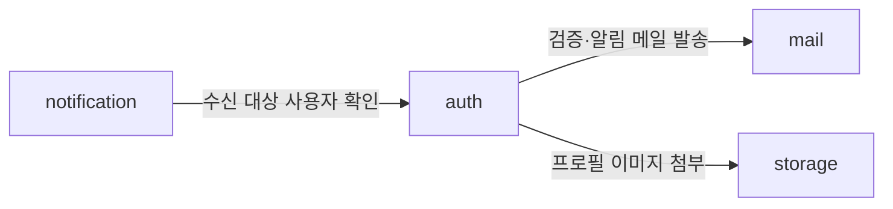

# 서버 애플리케이션 아키텍처 (Spring Boot · jOOQ)

`server/`가 **바깥에 제공하는 계약**(§1)과 **내부 구조 규칙**(§2~)을 다룬다.
시스템 전반의 구성·배포·외부 의존은 [인프라.md](인프라.md)에 있다.

API 계약을 이 문서가 소유하는 이유: 계약의 제공자가 서버이고, 계약을 바꾸는 것은 서버의 변경이기 때문이다.
web은 소비자로서 §1을 참조한다([웹.md](웹.md)).

코딩 표준(포맷·명명·정적분석)은 산문이 아니라 `config/checkstyle/checkstyle.xml`과 Spotless 설정이 정의한다.
브랜치·커밋·완료 기준은 `AGENTS.md`가 소유한다. 이 문서는 **린터가 잡을 수 없는 구조 규칙**만 다룬다.

## 1. 공개 계약 (API)

### 1.1 REST 준수 범위

지키는 것: HTTP 메서드 구분(GET/POST/PUT/PATCH/DELETE), `/리소스` 또는 `/리소스/{id}` 계층, 리소스명 복수형.

지키지 않는 것: HATEOAS — 응답에 링크를 담아 발견 가능하게 할 실익이 없다. web은 OpenAPI 문서로 이미 서버와 연결되어 있다.

### 1.2 경로와 버저닝

- 모든 API는 `/api/v1` 아래에 둔다. 파생 프로젝트가 키트 API를 유지한 채 자기 API를 얹을 수 있어야 하므로, 버전 세그먼트를 처음부터 둔다.
- 리소스명은 **영문 전체 단어의 복수형**을 쓴다: `/api/v1/sessions`, `/api/v1/users/{id}`, `/api/v1/attachments`.
- 하위 리소스는 상위 id 아래에 중첩한다: `/api/v1/users/{id}/social-accounts`.

### 1.3 에러 응답 — RFC 7807 단일 형식

에러는 전 구간 `application/problem+json`(Spring의 `ProblemDetail`) 하나로 응답한다. 성공 응답을 감싸는 공통 봉투(envelope)는 쓰지 않는다 — HTTP 상태 코드가 이미 그 역할을 한다.

```json
{
  "type": "about:blank",
  "title": "인증 정보가 올바르지 않습니다",
  "status": 401,
  "detail": "이메일 또는 비밀번호를 확인해 주세요",
  "instance": "/api/v1/sessions",
  "code": "AUTH_INVALID_CREDENTIALS",
  "traceId": "..."
}
```

- `code`: 클라이언트가 분기 판단에 쓰는 **안정적인 식별자**. 문구(`title`·`detail`)는 바뀔 수 있지만 `code`는 계약이다.
- `traceId`: 서버 로그와 대조하기 위한 추적 키. 응답 헤더 `X-Trace-Id`로도 함께 내보낸다.

### 1.4 에러 코드 명명 — 요구사항 ID와 구분한다

에러 코드는 `<모듈>_<사유>` 형태의 SCREAMING_SNAKE_CASE로 쓴다: `AUTH_INVALID_CREDENTIALS`, `FILE_UPLOAD_EXPIRED`.

요구사항 ID(`AUTH-01`)와 형태가 겹치면 추적성 검색(요구사항 ID로 전체 검색)이 오염되므로, **하이픈은 요구사항 ID, 언더스코어는 에러 코드**로 구분을 강제한다.

### 1.5 인증 계약

클라이언트가 인증을 어떻게 수행하는지는 **공개 계약의 일부**다 — 웹과 모바일이 서로 다른 경로를 쓰기 때문이다.
근거는 [결정-0014](../결정기록/결정-0014-세션-방식.md).

| 클라이언트 | 세션 토큰 전달 | 함께 필요한 것 |
|---|---|---|
| 웹 | `HttpOnly` `Secure` `SameSite` 쿠키 | CSRF 방어 |
| 모바일·외부 | `Authorization: Bearer <token>` | 없음 |

- 토큰은 **불투명한 난수**다. 자체 검증되는 JWT가 아니며 `session` 테이블 조회로 검증한다.
- **세션 테이블은 하나다.** 두 전달 경로가 같은 세션을 가리킨다.
- 무효화(로그아웃·비밀번호 변경·기기 정리)는 즉시 반영된다.
- 소셜 제공자가 발급한 액세스·리프레시 토큰은 `account` 테이블에 보관되며 **클라이언트로 나가지 않는다** — 그 제공자의 API를 호출하기 위한 것이다.

### 1.6 API 문서는 손으로 쓰지 않는다

서버 코드에서 springdoc-openapi가 OpenAPI 스펙을 생성하고, 그것이 API 문서의 정본이다. 엔드포인트 목록·요청·응답 스키마를 마크다운으로 옮겨 적지 않는다 — 코드와 어긋나는 순간 마이너스 문서가 된다(AGENTS.md 문서 원칙).

이 절이 담당하는 것은 **모든 엔드포인트가 따르는 규약**이고, 개별 엔드포인트의 계약은 OpenAPI가, 무엇을 만들 것인가는 요구사항 문서의 인수조건이 담당한다.

## 2. 모듈 경계

패키지 루트는 `dev.goraebap.devkit`이다. 파생 프로젝트는 부트스트랩 시 이 루트를 자기 것으로 치환한다.

- **모듈 = 루트의 직계 하위 패키지** (`auth`, `mail`, `storage`, `notification`). `module.` 같은 중간 겹은 두지 않는다 — 모든 것이 그 아래 있으면 구분 기능이 없고, Spring Modulith 규약과도 어긋난다.
- **모듈 루트에 직접 놓인 클래스 = 공개 API.** 다른 모듈이 import할 수 있다.
- **하위 패키지 전부 = internal.** 다른 모듈은 import할 수 없다.
- 모듈 루트는 거의 비어 있는 것이 정상이다. 공개가 필요해지는 순간 파일을 루트로 올린다 — **파일을 옮기는 물리적 행위 자체가 의도적인 공개 선언**이다.
- 공개 타입은 도메인 엔티티를 그대로 노출하지 않는다. 소비하는 쪽이 필요로 하는 만큼만 담은 전용 타입(record)을 정의한다.

Java 컴파일러는 이 경계를 강제하지 못하므로 ArchUnit이 강제한다(§10).

### 모듈 지도

모듈은 **애그리거트 소유**를 기준으로 나눈다. 키트의 초기 지도는 다음과 같다.

| 모듈 | 소유 애그리거트 | 담당 요구사항 |
|---|---|---|
| `auth` | user · account · session · verification | AUTH-*, PROF-* |
| `mail` | (없음 — 발송 능력만 제공) | MAIL-* |
| `storage` | blob · attachment | FILE-* |
| `notification` | subscription · preference | NOTI-* |

프로필(PROF-*)이 별도 모듈이 아닌 이유: 프로필은 `user` 애그리거트를 변경하는 유스케이스이고, 그 애그리거트의 소유자는 `auth`다. **모듈 경계를 요구사항 묶음이 아니라 애그리거트 소유로 긋는다**는 원칙의 적용 사례다.

키트에서 실제로 발생하는 모듈 간 참조는 셋뿐이다.



참조는 항상 대상 모듈의 공개 API를 통한다. 양방향 참조가 생기면 경계를 다시 논의한다.
`notification → auth`는 단방향이다 — auth가 알림을 보내야 한다면 auth가 notification을 호출하는 게 아니라, 이벤트 발행 등 역전 수단을 결정기록으로 남기고 도입한다.

## 3. 모듈 내부 구조

**승격 기준**: 애그리거트 2개 이상 **또는** 피쳐 3개 이상이면 계층을 도입한다. 그 전에는 모듈 아래 플랫하게 둔다.

```
auth/                      모듈 루트 = 공개 API 자리
├── application/           피쳐(요구사항 단위) 패키지
│   ├── registration/         controller · service · dto · 포트 · 흐름 예외를
│   ├── sociallogin/          피쳐 안에 플랫하게 둔다
│   ├── session/
│   ├── profile/
│   └── shared/            레이어 내 공유 (§4)
├── domain/                애그리거트 패키지
│   ├── user/                 엔티티 · 값 객체 · 저장소 인터페이스 · 불변식 위반 예외
│   ├── account/
│   ├── session/
│   └── verification/
└── infrastructure/        기술 세그먼트 패키지
    ├── repository/           애그리거트 저장소 구현
    ├── query/                조회 어댑터 (§5.1) — repository와 분리한다
    ├── oauth/  ├── security/  ├── mail/
    └── config/               빈 조립, @ConfigurationProperties
```

- `application`은 헥사고날의 응용 계층이 아니라 **피쳐 절단(vertical slice)** 이다. 컨트롤러가 여기 있는 이유: 다른 모듈이 컨트롤러를 import할 일이 없고(호출은 HTTP), 요구사항 하나를 고칠 때 폴더 하나만 열면 되는 응집을 우선했다.
- 저장소 **인터페이스는 `domain`의 애그리거트 패키지에**, 구현은 `infrastructure/repository`에 둔다.
- 저장소가 아닌 포트(`OAuthClient`, `MailSender`, 조회 포트 `XxxQueries` 등)는 **그것을 소유하는 피쳐 패키지에 선언**하고 구현은 `infrastructure`의 세그먼트에 둔다. 조회도 예외가 아니다(§5.1).
- 예외 배치: **불변식 위반은 `domain`에, 흐름·정책 실패는 해당 피쳐에.** (예: 이메일 형식 위반 → `domain/user`, 인증 시도 초과 → `application/session`)
- **전역 config vs 모듈 config**: "특정 모듈 없이도 의미가 있는 빈"만 전역 `dev.goraebap.devkit.config`에 둔다(예: `Clock`, OpenAPI 설정). 모듈의 internal을 import해 조립하는 설정은 그 모듈 안에 남긴다 — 전역에 두면 전역이 모듈 internal을 참조하게 되어 §2 경계에 구멍이 뚫린다. 인증 필터체인(`SecurityConfig`)은 앱 전체를 보호하지만 `auth`의 internal에 의존하므로 `auth/infrastructure/security`에 둔다. **인증·인가는 `auth` 모듈이 앱에 제공하는 능력**으로 본다.
- 두 모듈 이상이 실제로 쓰는 인프라가 생기면 그때 정식 모듈로 승격한다. 미리 만들지 않는다.

## 4. 의존 방향과 중복 처방

| 방향 | 규칙 |
|---|---|
| 피쳐 → domain | 항상 허용 — **공유의 정석 경로** |
| 피쳐 → 피쳐 | 허용, 단 순환 금지 |
| 피쳐 → 레이어 내 shared | 허용 (shared는 어떤 피쳐도 모른다) |
| 피쳐 → infrastructure | **금지** (포트로만) |
| domain → 그 외 전부 | **금지** (Spring·jakarta 포함) |
| infrastructure → 안쪽 | 허용 (포트·저장소 인터페이스 구현) |

**피쳐 간 중복의 4분류와 처방**

1. **도메인 규칙 중복** → `domain`으로 내린다 (1순위 탈출구)
2. **조율 공유** → 소유 피쳐를 정하고 단방향 의존 (예: 세션 발급은 `session` 피쳐가 소유하고, `registration`·`sociallogin`이 의존)
3. **피쳐 정체성 없는 공용** → `shared`로. 입장 조건은 **실제로 2개 이상 피쳐가 쓰고 있을 것** ("나중에 쓸 것 같아서"는 불가)
4. **DTO·HTTP 계약** → 원칙적으로 **복제 허용** (피쳐의 계약이므로). 3개 이상 피쳐가 정말 같은 개념으로 쓸 때만 승격

판단 리트머스: 두 코드가 **다른 이유로 변경**될 것 같으면 우연한 닮음이므로 합치지 않는다. **항상 같은 이유로 함께 변경**되면 진짜 중복이므로 1~3으로 올린다. 중복은 잘못된 추상화보다 싸다.

**shared의 위치**: 모듈 레벨 `auth/shared`를 만들지 않고 레이어 안(`application/shared`, 필요 시 `domain/shared`)에 둔다. 모듈 레벨 shared는 사실상 네 번째 레이어가 되어 별도 의존 규칙이 필요해지고, "어느 레이어 것인가"라는 방어 질문을 생략하게 만들어 쓰레기장이 된다.

## 5. 데이터 접근

DB 접근 경로는 **조회**와 **명령** 둘뿐이다(경량 CQRS). 두 경로 모두 **application은 기술을 모른다** —
조회 포트든 도메인 저장소든 인터페이스로 접근하고, jOOQ는 `infrastructure`에서만 등장한다.
근거는 [결정-0010](../결정기록/결정-0010-조회-경로-설계.md).

이 규칙 덕에 영속성 기술이 바뀌어도(MyBatis·JPA 등) `infrastructure`의 어댑터만 교체된다.
기술마다 형태가 다른 것(jOOQ는 DSL, MyBatis는 XML+Mapper)이 application 구조를 흔들지 않는다.

### 5.1 조회 — QueryService + 조회 포트 + 어댑터

| 자리 | 클래스 | 역할 |
|---|---|---|
| `application/<피쳐>/` | `XxxQueryService` | 조회 유스케이스. `@Transactional(readOnly = true)` |
| `application/<피쳐>/` | `XxxQueries` | 조회 포트(인터페이스). 피쳐가 소유한다 |
| `infrastructure/query/` | `JooqXxxQueries` | 어댑터. 여기서만 SQL이 보인다 |

- 포트 이름은 **제공하는 것으로** 짓는다(`MailSender`·`OAuthClient`와 같은 방식). `QueryRepository`는 쓰지 않는다 — DDD의 Repository(애그리거트 저장소)와 의미가 충돌한다.
- **포트는 조회 하나당이 아니라 피쳐당 하나**다. 그 피쳐의 조회 메서드를 한 인터페이스에 모으고, 어댑터도 하나로 둔다. 조회를 하나 더 붙이는 비용은 인터페이스 한 줄 + 구현 몇 줄이다.
- **기본은 포트가 화면 DTO를 직접 반환한다.** 도메인 보강이 필요한 조회에서만 중간 타입(`XxxRow`)을 둔다. 모든 조회에 두 겹을 강제하면 그게 새로운 형식이 된다.
- 조회는 **도메인 애그리거트를 조립하지 않는다.** 다만 도메인 규칙(만료 판정 등)을 순수 판정 함수로 **재사용**하는 것은 허용한다 — 규칙이 SQL에 복제되어 두 곳에 존재하는 것을 막기 위함이다. 원칙은 **판정 로직만 빌려오고 데이터 로딩은 프로젝션으로**. 애그리거트를 로드하기 시작하면 CQRS를 채택한 의미가 사라진다.
- 조회는 도메인 상태를 바꾸지 않으므로 **다른 모듈의 테이블을 직접 조인하는 것을 허용하고 권장한다.** 화면 데이터 하나를 만들자고 모듈 간 공개 API를 늘리고 애플리케이션에서 조인하는 것은 불필요한 복잡도다.
  - 대가: **읽기 경로에서는 모듈 경계가 스키마 수준에서 뚫린다.** 소유 모듈이 스키마를 바꾸면 다른 모듈의 조회가 깨질 수 있다. 의도적 타협이며, 방어는 통합 테스트가 CI에서 잡는 것이다.
- 조회 서비스는 단위 테스트 대상이 아니다(§9). **클래스 이름으로 판정한다** — 메서드 단위 예외를 두지 않는다.

### 5.2 화면 조회와 명령 중 조회의 구분

애그리거트 하나면 충분한 간단한 조회라도 **도메인 저장소로 화면 데이터를 만들지 않는다.** 이유는 셋이다.

1. 애그리거트는 화면의 모양이 아니다 — 자라면 화면이 쓰지 않는 것까지 로드하게 된다
2. **화면 요구가 도메인 모델을 끌어당긴다** — 화면에 필드 하나가 더 필요해 애그리거트에 게터를 추가하는 순간, 도메인이 화면 때문에 바뀐 것이다. 간단한 조회에서 문을 열면 그 문으로 다 들어온다
3. 도메인 객체가 API 밖으로 샌다

진짜 예외는 **명령 처리 중의 조회**다. 같은 질문도 목적이 다르면 경로가 갈린다.

| 상황 | 경로 | 이유 |
|---|---|---|
| 가입 명령 안에서 이메일 중복 검사 | `UserRepository.existsByEmail` (도메인 저장소) | 불변식 검증의 일부. 트랜잭션 안에서 정확해야 한다 |
| 가입 폼의 실시간 중복 안내 | `RegistrationQueries` (조회 포트) | UX 편의. 캐시·rate limit이 붙을 수 있다 |

둘은 **다른 이유로 진화하므로** 나눈다.

### 5.3 명령 — Service + 도메인 저장소

- 애그리거트를 저장소로 로드해 도메인 메서드로 변경하고, **명시적으로 저장한다.** jOOQ에는 JPA의 변경 감지(dirty checking)가 없다 — `repository.save(aggregate)` 호출을 빠뜨리면 조용히 아무 일도 일어나지 않는다. JPA에서 넘어올 때 가장 자주 나는 사고다.
- 명령 처리 중의 조회(존재 확인, 로드)는 도메인 저장소를 통한다. 상태를 바꾸거나 불변식을 검증할 근거가 되는 값은 반드시 애그리거트를 통해 얻는다.
- **명령 서비스는 조회 포트를 주입받지 않는다.** 허용하면 명령이 도메인을 우회해 상태를 판단하는 지름길이 열린다 — §10의 규칙 7이 강제한다.
- 다른 모듈의 도움이 필요하면 그 모듈의 공개 API를 포트 뒤에 두고 참조한다(§2).

### 5.4 명령 응답의 조립

명령의 응답에 화면용 데이터가 필요할 때는 두 가지를 먼저 가른다.

- **(a) 명령이 만들어낸 것** — 생성된 id, 부여된 상태, 처리 시각. 명령 서비스가 애그리거트에서 그대로 반환한다. 조회 경로가 필요 없으며 규칙 위반이 아니다.
- **(b) 다음 화면이 필요로 하는 것** — 연관 정보, 안내에 쓰이는 정책 값 등.

리트머스: **"이 명령을 하지 않았어도 GET으로 얻을 수 있는 데이터인가?"** 그렇다면 (b)다.

(b)의 조립은 **컨트롤러가** 한다. 명령 서비스와 조회 서비스를 순서대로 호출해 응답을 만든다.

```java
@PostMapping("/api/v1/users")
ResponseEntity<SignUpResponse> signUp(@Valid @RequestBody SignUpRequest req) {
    SignUpResult result = registrationService.signUp(req.toCommand());        // (a)
    PendingApprovalInfo info = registrationQueryService.findPendingApprovalInfo(result.tenantId()); // (b)
    return ResponseEntity.created(...).body(SignUpResponse.of(result, info));
}
```

- **금지**: 명령 서비스가 응답 DTO를 채우려고 조회 포트를 주입받는 것. 그 순간 명령 서비스가 화면 요구에 종속되어 화면이 바뀔 때마다 함께 바뀐다(§10 규칙 7).
- 부수 효과로 트랜잭션도 맞다 — 명령이 커밋된 뒤 조회가 별도 트랜잭션으로 돌므로 방금 쓴 데이터가 보인다.
- 트레이드오프: 명령 응답에 화면 데이터를 얹을수록 API가 화면에 종속된다. 그 화면에서만 쓰는 정보면 얹고, 여러 화면이 쓰거나 자주 바뀔 것 같으면 별도 GET으로 뺀다. 어느 쪽이든 조립은 컨트롤러에서 한다.

### 5.5 저장소

- 인터페이스는 도메인 언어로 선언한다(`UserRepository.findByEmail`). 구현 기술은 인터페이스에 드러나지 않는다.
- 구현은 `infrastructure/repository`에 두고, jOOQ 레코드를 도메인 엔티티로 변환한다.
- 트랜잭션 경계는 명령 서비스의 public 메서드다(`@Transactional`).

### 5.6 SQL 안전성

jOOQ DSL은 바인딩이 타입 세이프하므로 인젝션이 구조적으로 차단된다. plain SQL API(`DSL.field(String)` 등)를 쓸 때만 문자열 결합에 주의하고, 사용 시 사유를 주석으로 남긴다.

### 5.7 스키마와 코드 생성

마이그레이션은 **Flyway**(`src/main/resources/db/migration/V*.sql`)가, jOOQ 코드 생성은
**DDLDatabase**(마이그레이션 SQL에서 직접 생성, 실행 중 DB 불필요)가 담당한다 — [결정-0013](../결정기록/결정-0013-마이그레이션과-코드생성.md).

- 마이그레이션 파일이 **스키마의 단일 원본**이다. 생성 코드는 항상 그로부터 파생되며 커밋하지 않는다.
- 생성 코드는 코딩 표준의 대상이 아니다(Spotless·Checkstyle·SpotBugs에서 제외).
- `./gradlew build`는 Docker 없이 동작한다. Docker가 필요한 것은 통합 테스트(`test`)뿐이다.

## 6. 도메인 레이어

- 비즈니스 규칙과 불변식을 표현하고 **스스로 검증한다.** 생성자·정적 팩토리·비즈니스 메서드에서 위반 시 예외를 던진다.
- 애그리거트 단위로 패키징하고, 트랜잭션은 애그리거트 경계를 넘지 않는 것을 기본으로 한다.
- **도메인은 프레임워크를 모른다.** Spring·jakarta·jOOQ 생성 코드에 의존하지 않는 순수 Java다. jOOQ는 생성 레코드와 도메인 엔티티가 애초에 분리되므로, 이 규칙이 타협 없이 성립한다.
- 애그리거트를 가로지르는 순수 도메인 로직은 도메인 서비스로 뽑아 `domain` 바로 아래에 둔다. 특정 애그리거트 하위 패키지에 억지로 넣지 않는다.

## 7. 예외 · 에러 코드 · 로깅

- 비즈니스 오류는 항상 예외로 던지고(`BusinessException(ErrorCode)` 류), 컨트롤러에서 `ResponseEntity`를 직접 조립하지 않는다. 전역 예외 핸들러가 RFC 7807 응답으로 변환한다(§1.3).
- 에러 코드는 모듈별 enum으로 정의하고, 코드 문자열은 `<모듈>_<사유>` 형태를 따른다(§1.4).
- 요청 추적은 `traceId`(MDC) + 응답 헤더 `X-Trace-Id`로 한다.
- **비밀번호·토큰·개인정보 원문은 로그에 남기지 않는다.**

## 8. 보안

- 인가 원칙은 **기본 거부(deny-by-default)** 다. 보호가 필요한 리소스를 기본으로 막고 예외적으로 연다.
- 모든 요청 DTO는 컨트롤러 진입 시점에 Bean Validation으로 검증한다.
- 시크릿(DB 비밀번호, OAuth 클라이언트 시크릿, VAPID 키)은 소스·설정 파일에 평문으로 두지 않고 환경변수로 주입한다. 키트의 예시 설정에는 값이 아니라 **변수 이름만** 둔다.
- 업로드 파일은 서버가 생성한 식별자로만 접근하고, 파일명의 경로 조작 문자를 제거한다. 확장자·MIME 화이트리스트를 둔다.
- 보안 민감 기능(인증·세션·업로드·프로필)은 머지 전에 `security-reviewer` 페르소나 검토를 거친다.

## 9. 테스트

| 대상 | 방식 |
|---|---|
| 도메인 모델(엔티티·불변식) | 단위 테스트 — Spring 컨텍스트 없이 순수 객체로 |
| 명령 서비스 | 단위 테스트 — 저장소·포트를 가짜 구현으로 대체 |
| 조회 서비스, 저장소 구현 | **통합 테스트** — Testcontainers로 1회용 PostgreSQL |
| 컨트롤러 | 선택 |

단위 테스트는 복잡도와 도메인 중요도가 모두 높은 코드에 집중한다. 조회 서비스는 로직이 거의 없는 매핑 코드라 단위 테스트의 회귀 방지 효과가 낮고, 정작 검증해야 할 "SQL·스키마 정합성"은 가짜 객체로는 잡히지 않는다.

- 공유 개발 DB는 쓰지 않는다. 통합 테스트는 `IntegrationTestSupport`를 상속해 1회용 PostgreSQL 컨테이너를 공유한다.
- **테스트 메서드명은 한국어를 허용한다** — 테스트 이름은 "무엇을 검증하는가"를 사람이 읽는 문장이다. Checkstyle 명명 규칙은 `config/checkstyle/suppressions.xml`에서 테스트 소스에 한해 완화한다(프로덕션 코드는 그대로).
- 테스트 이름에는 요구사항 ID를 참조한다(AGENTS.md 완료 기준).

## 10. ArchUnit 강제

§2~§5의 규칙을 ArchUnit 테스트로 인코딩하고 CI 게이트에 포함한다. **규칙 위반은 빌드 실패다.**

1. 다른 모듈의 하위 패키지(internal) 참조 금지
2. `domain`은 `application`·`infrastructure`·Spring·jakarta 의존 금지
3. `application`은 `infrastructure` 의존 금지 (포트로만)
4. 피쳐 슬라이스 간 순환 금지
5. `shared`는 피쳐를 의존하지 않는다
6. 컨트롤러는 저장소·조회 포트를 직접 의존하지 않는다
7. 명령 서비스(`~Service`)는 조회 포트(`~Queries`)를 의존하지 않는다 (§5.3·§5.4)

규칙 3이 조회에도 그대로 적용되므로, 영속성 라이브러리를 application에서 허용하는 예외 규칙은 두지 않는다.

구조를 바꿔야 하면 이 문서와 결정기록을 먼저 고치고 테스트를 함께 고친다. 테스트만 느슨하게 만드는 변경은 허용하지 않는다.
