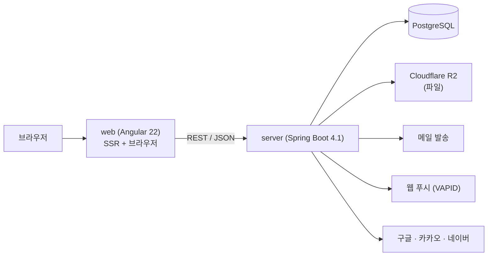
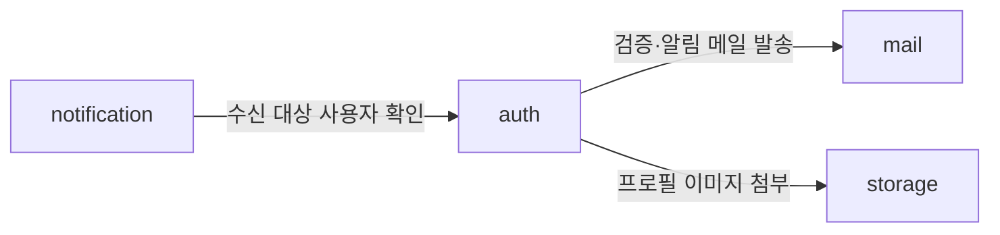

# 아키텍처

시스템 전체 조감과 web·server가 **양쪽 다 알아야 하는 것**(경계·계약·규약)을 다룬다.
각 파트 내부 구조는 [웹.md](웹.md)·[서버.md](서버.md)에 있다. 이 문서는 중복해서 쓰지 않는다.

바꾸기 비싼 규칙만 남긴다 — 소스코드가 바뀌었다고 이 문서가 바뀌어야 한다면, 그 내용은 여기 있을 것이 아니다.

## 1. 시스템 구성



- 배포 단위는 web·server 둘이지만 저장소는 하나다(모노레포). 태그 하나가 두 파트의 조합을 동결한다 — [결정-0005](../결정기록/결정-0005-단일-저장소-유지.md).
- 브라우저는 server를 직접 호출하지 않는다는 전제를 두지 않는다. 다만 **기본 배포 전제는 same-origin**(리버스 프록시 뒤에 web·server를 함께 둔다)이며, 개발 중에는 Angular dev-server 프록시로 같은 오리진을 흉내낸다. 별도 오리진 배포가 필요해지면 CORS 정책을 결정기록으로 남기고 도입한다.

## 2. API 규약

### 2.1 REST 준수 범위

지키는 것: HTTP 메서드 구분(GET/POST/PUT/PATCH/DELETE), `/리소스` 또는 `/리소스/{id}` 계층, 리소스명 복수형.

지키지 않는 것: HATEOAS — 응답에 링크를 담아 발견 가능하게 할 실익이 없다. web은 OpenAPI 문서로 이미 서버와 연결되어 있다.

### 2.2 경로와 버저닝

- 모든 API는 `/api/v1` 아래에 둔다. 파생 프로젝트가 키트 API를 유지한 채 자기 API를 얹을 수 있어야 하므로, 버전 세그먼트를 처음부터 둔다.
- 리소스명은 **영문 전체 단어의 복수형**을 쓴다: `/api/v1/sessions`, `/api/v1/users/{id}`, `/api/v1/attachments`.
- 하위 리소스는 상위 id 아래에 중첩한다: `/api/v1/users/{id}/social-accounts`.

### 2.3 에러 응답 — RFC 7807 단일 형식

에러는 전 구간 `application/problem+json`(Spring의 `ProblemDetail`) 하나로 응답한다. 성공 응답을 감싸는 공통 봉투(envelope)는 쓰지 않는다 — HTTP 상태 코드가 이미 그 역할을 한다.

```json
{
  "type": "about:blank",
  "title": "인증 정보가 올바르지 않습니다",
  "status": 401,
  "detail": "이메일 또는 비밀번호를 확인해 주세요",
  "instance": "/api/v1/sessions",
  "code": "AUTH_INVALID_CREDENTIALS",
  "traceId": "..."
}
```

- `code`: 클라이언트가 분기 판단에 쓰는 **안정적인 식별자**. 문구(`title`·`detail`)는 바뀔 수 있지만 `code`는 계약이다.
- `traceId`: 서버 로그와 대조하기 위한 추적 키. 응답 헤더 `X-Trace-Id`로도 함께 내보낸다.

### 2.4 에러 코드 명명 — 요구사항 ID와 구분한다

에러 코드는 `<모듈>_<사유>` 형태의 SCREAMING_SNAKE_CASE로 쓴다: `AUTH_INVALID_CREDENTIALS`, `FILE_UPLOAD_EXPIRED`.

요구사항 ID(`AUTH-01`)와 형태가 겹치면 추적성 검색(요구사항 ID로 전체 검색)이 오염되므로, **하이픈은 요구사항 ID, 언더스코어는 에러 코드**로 구분을 강제한다.

### 2.5 API 문서는 손으로 쓰지 않는다

서버 코드에서 springdoc-openapi가 OpenAPI 스펙을 생성하고, 그것이 API 문서의 정본이다. 엔드포인트 목록·요청·응답 스키마를 마크다운으로 옮겨 적지 않는다 — 코드와 어긋나는 순간 마이너스 문서가 된다(AGENTS.md 문서 원칙).

이 문서가 담당하는 것은 **모든 엔드포인트가 따르는 규약**(위 2.1~2.4)이고, 개별 엔드포인트의 계약은 OpenAPI가, 무엇을 만들 것인가는 요구사항 문서의 인수조건이 담당한다.

## 3. 모듈 지도와 참조 방향

server의 모듈은 **애그리거트 소유**를 기준으로 나눈다. 키트의 초기 지도는 다음과 같다.

| 모듈 | 소유 애그리거트 | 담당 요구사항 |
|---|---|---|
| `auth` | user · account · session · verification | AUTH-*, PROF-* |
| `mail` | (없음 — 발송 능력만 제공) | MAIL-* |
| `storage` | blob · attachment | FILE-* |
| `notification` | subscription · preference | NOTI-* |

프로필(PROF-*)이 별도 모듈이 아닌 이유: 프로필은 `user` 애그리거트를 변경하는 유스케이스이고, 그 애그리거트의 소유자는 `auth`다. 모듈 경계를 요구사항 묶음이 아니라 애그리거트 소유로 긋는다는 원칙의 적용 사례다.

키트에서 실제로 발생하는 모듈 간 참조는 셋뿐이다:



- 참조는 항상 **대상 모듈의 공개 API**를 통한다(서버.md §1). 양방향 참조가 생기면 경계를 다시 논의한다.
- `notification → auth`는 단방향이다. auth가 알림을 보내야 한다면 auth가 notification을 호출하는 게 아니라, 이벤트 발행 등 역전 수단을 결정기록으로 남기고 도입한다.

## 4. 인증 흐름 (개요)

세션 방식(쿠키 vs 토큰), 4테이블 구조의 상세, 소셜 통합 정책은 M1의 요구사항 확정·설계 단계에서 정하고 [데이터베이스.md](데이터베이스.md)와 결정기록에 남긴다. 이 절은 확정 시 흐름 다이어그램으로 채운다.

## 5. 프론트·백 어휘 대응

같은 단어가 양쪽에서 다른 것을 가리키면 대화 비용이 커진다. 대응 관계는 다음과 같되, **완전한 대칭은 아니다** — FSD의 계층 import 규칙과 서버의 모듈 경계 규칙은 서로 다른 축이다.

| 개념 | web (FSD) | server |
|---|---|---|
| 최상위 분할 | 레이어(app·pages·…·shared) | 모듈(auth·mail·…) |
| 기능 단위 | 슬라이스 | 피쳐(`application/<feature>`) |
| 기술 단위 | 세그먼트(ui·model·api·lib) | 레이어(application·domain·infrastructure) |
| 공개 경계 | 슬라이스의 `index.ts` | 모듈 루트 직계 클래스 |
| 강제 장치 | Steiger | ArchUnit |

양쪽 모두 "**공개 경계를 명시하고, 강제 장치로 지킨다**"는 같은 원칙 위에 있다. 강제 장치 없는 구조는 반드시 부패한다.

## 6. 관련 문서

- 내부 구조: [웹.md](웹.md) · [서버.md](서버.md)
- 스키마: [데이터베이스.md](데이터베이스.md) (M1에서 작성)
- 결정 근거: [../결정기록/](../결정기록/)
