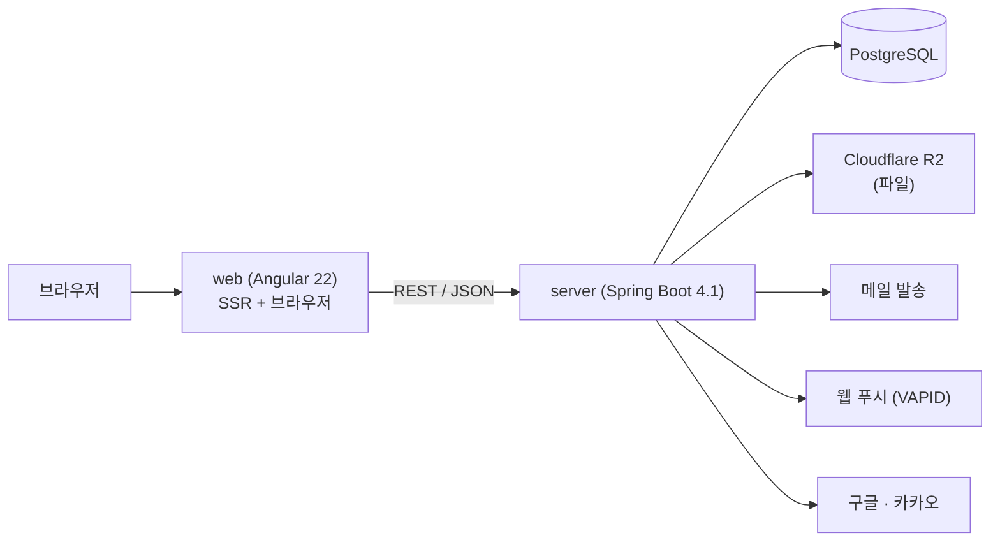

# 인프라 아키텍처

프로젝트 **전반**의 구성 — 무엇이 어디서 돌고, 무엇에 의존하며, 어떻게 배포되는가.

애플리케이션 내부 구조는 각 파트의 문서가 소유한다: [웹.md](웹.md) · [서버.md](서버.md).
web과 server가 주고받는 API 계약은 제공자인 서버가 소유한다([서버.md](서버.md) §1).
이 문서는 그 내용들을 중복해서 쓰지 않는다.

## 1. 시스템 구성

## 2. 배포 전제와 오리진

- **기본 전제는 same-origin** — 리버스 프록시 뒤에 web·server를 함께 두고 한 오리진으로 노출한다. 이 전제 덕분에 CORS 설정과 교차 오리진 쿠키 문제를 다루지 않는다.
- 개발 중에는 Angular dev-server 프록시(`web/proxy.conf.json`)로 같은 오리진을 흉내낸다.
  > **`changeOrigin`을 켜지 않는다.** 기본값(false)이라 Host 헤더가 `localhost:4200`으로
  > 유지되고, 서버의 Origin 검증(§2.1의 형제 방어)이 요청 자신의 출처를 그 Host에서 계산하므로
  > 브라우저가 보낸 `Origin`과 일치한다. 켜면 Host가 `localhost:8080`이 되어 **모든 상태 변경
  > 요청이 `AUTH_FORBIDDEN_ORIGIN`으로 거부된다.**
- 별도 오리진 배포가 필요해지면 CORS·쿠키 정책을 결정기록으로 남기고 도입한다. 전제를 바꾸는 일이므로 조용히 설정만 추가하지 않는다.

### 2.1 프록시가 지켜야 하는 것 — 클라이언트 IP는 보안 입력이다

server의 시도 제한(OTP 발급·확인, 로그인)은 클라이언트 IP를 키로 쓴다. **그 IP가 위조 가능하면
IP 축 제한이 통째로 무력화되고**, 로그인의 경우 IP와 이메일을 함께 회전시켜 bcrypt를 무제한
호출하는 CPU 고갈 경로가 열린다. 따라서 프록시 구성은 편의가 아니라 보안 요구다.

- server는 `server.forward-headers-strategy=NATIVE`(Tomcat `RemoteIpValve`)로 동작한다. 이 밸브는
  `X-Forwarded-For`를 **오른쪽에서 왼쪽으로** 훑으며 신뢰 프록시를 건너뛰므로, 클라이언트가 헤더
  앞부분에 심은 값에 속지 않는다.
- **`server.tomcat.remoteip.internal-proxies`에 실제 프록시 대역을 넣어야 한다.** 기본값은 사설
  대역이며, 프록시가 그 밖에 있으면 프록시 자신의 IP가 클라이언트 IP로 잡혀 모든 사용자가 한
  카운터를 공유하게 된다 — 공격자 한 명이 전체 서비스의 OTP 발급을 멈출 수 있다.
- Spring의 `FRAMEWORK` 전략은 쓰지 않는다. 그 필터는 `X-Forwarded-For`의 **첫** 항목을 채택하는데,
  nginx의 표준 레시피(`$proxy_add_x_forwarded_for`)는 클라이언트가 보낸 값을 앞에 두고 실제 IP를
  덧붙이므로 첫 항목이 곧 클라이언트 통제 값이 된다.
- 프록시는 요청 단계에서 들어온 `X-Forwarded-*`를 그대로 통과시키지 않는 편이 안전하다.

### 2.2 `/auth/` 아래의 라우팅 — 서버로 갈 것과 화면으로 갈 것이 섞여 있다

소셜 로그인 때문에 `/auth/` 접두사 하나에 두 종류의 경로가 산다. **프록시 규칙을 한 줄 잘못 쓰면
로그인이 깨지거나 사용자가 에러 JSON을 그대로 본다.**

아래 표를 `web/proxy.conf.json`이 그대로 구현한다. **접두사를 넓게 잡지 않는 것**이 요점이다 —
`/auth`를 통째로 넘기면 화면이 처리해야 할 경로가 서버에 도달해 사용자가 401 JSON을 보게 된다.

| 경로 | 가는 곳 | 이유 |
|---|---|---|
| `/auth/callback/*` | **서버** | 제공자가 인가 코드를 돌려주는 콜백이다. 제공자 콘솔에 등록된 주소도 이것이다 |
| `/oauth2/authorization/*` | **서버** | 제공자로 보내는 시작 경로 |
| `/auth/social/email`·`/auth/complete`·`/auth/error` | **화면(SPA)** | 서버에 도달하면 인증이 필요한 경로로 잡혀 401 JSON이 나간다 |

제공자 콘솔에 등록하는 리다이렉트 URI는 **프론트 오리진 기준**이다(`auth.oauth.redirect-base`).
same-origin 전제에서는 프록시가 `/auth/callback/*`만 서버로 넘기면 된다. **프론트와 서버를 다른
도메인에 두면 이 전제가 깨지므로 콘솔 등록 주소부터 다시 잡아야 한다.**

### 2.3 소셜 로그인 경로만 무상태가 아니다 — 수평 확장 시 주의

우리 로그인 세션은 DB에 있어 인스턴스를 늘려도 무관하다(결정-0014). **그러나 `oauth2Login`은
인가 요청의 `state`와 PKCE `code_verifier`를 서블릿 세션에 보관한다.** 인스턴스를 여러 대로 늘릴 때
**스티키 세션이 없으면 콜백이 시작 요청과 다른 인스턴스에 도착해 `state` 조회가 실패하고 소셜
로그인이 간헐적으로 깨진다.**

- 인스턴스가 하나이거나 스티키 세션이 있으면 그대로 동작한다.
- 스티키 없이 늘리려면 인가 요청 저장소를 공유 저장소나 쿠키 기반으로 바꿔야 한다 —
  전제를 바꾸는 일이므로 결정기록을 남긴다.
- 이 세션은 제공자 왕복 동안만 쓰이므로 수명을 짧게 두고(`server.servlet.session.timeout`),
  시작 경로에는 IP 단위 제한을 걸어 세션이 무한히 쌓이지 않게 한다(보안 검토 F3).

## 3. 외부 서비스 의존

| 대상 | 용도 | 필요한 자격증명 |
|---|---|---|
| PostgreSQL | 주 저장소 | 접속 URL · 계정 |
| Cloudflare R2 | 파일 저장 (presigned URL) | 계정 ID · 액세스 키 |
| 메일 발송 | 인증·알림 메일 | Gmail SMTP 계정 + 앱 비밀번호 ([결정-0016](../결정기록/결정-0016-메일-발송-인프라.md)) |
| 웹 푸시 | 브라우저 알림 | VAPID 키 쌍 |
| 구글 · 카카오 | 소셜 로그인 | 각 클라이언트 ID · 시크릿 |

외부 서비스는 장애·정책 변경의 원천이므로, 서버 내부에서 각각을 **포트 뒤에 두어** 교체·가짜 구현이 가능하게 한다([서버.md](서버.md) §3).

## 4. 환경과 시크릿

- 환경별 설정은 Spring 프로파일로 분리한다. 로컬 전용 값은 git에 추적되지 않는 파일에 둔다.
- **자격증명은 소스·설정 파일에 평문으로 두지 않고 환경변수로 주입한다.** 키트가 제공하는 예시 설정에는 값이 아니라 변수 이름만 둔다.
- 파생 프로젝트가 처음 채워야 할 환경변수 목록은 §3의 표가 기준이 된다.

## 5. 형상 단위

저장소는 하나이고(모노레포), **태그 하나가 web·server·문서의 조합을 동결한다** — [결정-0005](../결정기록/결정-0005-단일-저장소-유지.md). 배포 단위가 둘이라는 것과 형상 단위가 하나라는 것은 별개다.

배포 파이프라인·컨테이너 구성은 아직 정하지 않았다. 첫 배포가 필요해지는 시점에 결정기록과 함께 이 문서에 추가한다.

## 6. 프론트·백 어휘 대응

같은 단어가 양쪽에서 다른 것을 가리키면 대화 비용이 커진다. 대응 관계는 다음과 같되 **완전한 대칭은 아니다** — FSD의 계층 import 규칙과 서버의 모듈 경계 규칙은 서로 다른 축이다.

| 개념 | web (FSD) | server |
|---|---|---|
| 최상위 분할 | 레이어(app·pages·…·shared) | 모듈(auth·mail·…) |
| 기능 단위 | 슬라이스 | 피쳐(`application/<feature>`) |
| 기술 단위 | 세그먼트(ui·model·api·lib) | 레이어(application·domain·infrastructure) |
| 공개 경계 | 슬라이스의 `index.ts` | 모듈 루트 직계 클래스 |
| 강제 장치 | Steiger | ArchUnit |

양쪽 모두 "**공개 경계를 명시하고, 강제 장치로 지킨다**"는 같은 원칙 위에 있다. 강제 장치 없는 구조는 반드시 부패한다.

## 7. 관련 문서

- 애플리케이션 아키텍처: [웹.md](웹.md) · [서버.md](서버.md)
- 스키마: [데이터베이스.md](데이터베이스.md)
- 결정 근거: [../결정기록/](../결정기록/)
