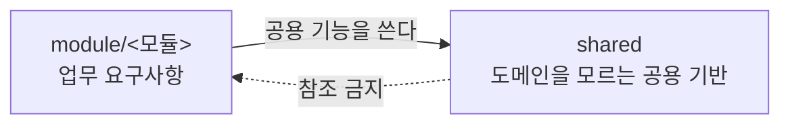

# 02. 패키지 배치와 참조 규칙

본 문서는 새로 작성하는 코드를 어느 모듈·계층에 둘 것인지, 그리고 각 위치에서 무엇을 참조할 수 있는지를 정의합니다.

**아키텍처 유지에서 가장 취약한 요소는 배치의 일의성입니다.** 동일한 성격의 코드를 배치할 수 있는 위치가 복수 존재하면 배치 기준이 파편화되고, 구조적 일관성이 훼손됩니다. 따라서 본 문서를 최우선 기준으로 확립하고 [ArchUnit](https://www.archunit.org/) 을 통해 빌드 단계에서 이를 강제합니다.

## 1. 최상위 구조

패키지 루트는 `dev.goraebap.refarch` 이며 그 아래를 업무 모듈과 공용 기반으로 나눕니다.

```text
dev.goraebap.refarch
├── ServerApplication.java
├── module/              업무 모듈
│   ├── task/
│   ├── user/
│   └── notification/
└── shared/              도메인을 모르는 공용 기반
    ├── config/
    ├── error/
    └── web/
```

**`module` 과 `shared` 를 그룹 패키지로 둡니다.** 루트 직계에 업무 모듈과 공용 기반을 나란히 두면 "이 패키지가 모듈인가"를 가리는 규칙이 따로 필요해지고, 모듈이 아닌 것(전역 설정, 관측 확장, 생성 코드)마다 제외 목록을 유지하게 됩니다. 그룹 패키지가 있으면 그 판정이 **경로 한 마디로 끝납니다.**

`ServerApplication` 은 프레임워크 진입점이며 어느 그룹에도 속하지 않습니다.

### 모듈의 정의

모듈은 **애그리거트 소유**를 기준으로 나눕니다. 요구사항 묶음이 기준이 아닙니다. 하나의 애그리거트를 변경하는 유스케이스가 여럿이면 그 유스케이스들은 모두 그 애그리거트를 소유한 모듈에 속합니다.

| 모듈 | 소유 애그리거트 |
| :--- | :--- |
| **`task`** | task |

`user` 와 `notification` 은 계획에 있으나 아직 코드가 없으므로 위 표에 넣지 않습니다. 예정을 현황으로 적으면 문서가 코드를 앞서고, 읽는 사람이 없는 것을 찾게 됩니다.

### 참조 방향



범례: 실선은 허용된 참조 방향이고 점선은 금지된 방향입니다.

**`shared` 는 어떤 모듈도 참조하지 않습니다.** 공용 기반에 도메인 지식이 유입되면 재사용성이 소실되고 도메인 변경이 공용 코드로 전파됩니다. 참조하는 순간 그것은 공용 기반이 아니라 또 하나의 모듈입니다.

모듈 간 참조는 단방향으로 유지합니다. 양방향이 필요해지면 경계를 다시 논의하며, 하류가 상류에 무언가를 요구해야 하면 상류가 하류를 호출하는 대신 이벤트 발행 같은 역전 수단을 결정 기록으로 남기고 도입합니다.

## 2. 모듈 내부 구조

```text
module/<모듈>/
├── contract/            다른 모듈이 참조하는 유일한 창구
├── application/         유스케이스
├── domain/              애그리거트와 값 객체
└── infrastructure/      포트 구현
```

| 패키지 | 담는 것 |
| :--- | :--- |
| **`contract`** | 다른 모듈에 공개하는 인터페이스와 그 반환 타입 |
| **`application`** | 컨트롤러, 서비스, 요청·응답 DTO, 조회 포트, 에러 코드 |
| **`domain`** | 애그리거트, 값 객체, 저장소 인터페이스 |
| **`infrastructure`** | 저장소 구현, 조회 어댑터, 타 모듈 ACL 어댑터, 빈 조립 |

**`contract` 에 놓인 것만 공개이고 나머지는 전부 모듈 내부입니다.** 공개가 필요해지면 파일을 `contract` 로 옮기며 **그 물리적 행위 자체가 의도적인 공개 선언**입니다. 공개할 것이 없는 모듈은 `contract` 패키지를 만들지 않습니다.

### 하위 패키지 승격

애그리거트가 하나뿐인 모듈은 각 계층 아래에 파일을 직접 배치하고 하위 패키지를 만들지 않습니다. **승격 기준은 애그리거트 2개 이상 또는 유스케이스 3개 이상**이며, 그 전에는 평면으로 둡니다.

승격하면 `application` 은 피쳐(유스케이스 단위)로, `domain` 은 애그리거트로 나눕니다. **두 계층의 분할 축이 다릅니다.** 하나의 유스케이스가 복수 애그리거트의 저장소를 참조하는 것이 정상이며, 애그리거트당 서비스 하나를 전제하지 않습니다.

### 배치가 갈리는 항목

| 항목 | 자리 | 근거 |
| :--- | :--- | :--- |
| **저장소 인터페이스** | `domain` | 애그리거트를 다루는 계약입니다 |
| **저장소 구현** | `infrastructure` | 기술이 드러나는 자리입니다 |
| **조회 포트** | `application` | 화면 요구가 소유자입니다. [05. 조회와 명령](05-query-command.md) |
| **값 객체** | `domain` | 불변식을 스스로 지킵니다. [04. 계층](04-layers.md) 3절 |
| **에러 코드** | `application` | HTTP 상태를 들고 있으므로 도메인에 둘 수 없습니다. [08. 예외 · 에러 코드](08-error-handling.md) |
| **불변식 위반 예외** | `shared/error` | 모든 모듈이 같은 타입을 던집니다 |
| **설정 타입** | 그 설정을 읽는 계층 곁 | `shared/config` 에 몰면 `application` 이 설정을 읽으려고 `infrastructure` 를 참조하게 됩니다 |

## 3. shared 세그먼트

`shared` 는 모듈을 갖지 않고 세그먼트로 직접 구성합니다.

| 세그먼트 | 담는 것 |
| :--- | :--- |
| **`config/`** | 특정 모듈 없이도 의미가 있는 전역 빈. `Clock` 이 그 예입니다 |
| **`error/`** | 에러 계약. `ErrorCode` · `BusinessException` · `DomainRuleViolation` · 공통 에러 코드 |
| **`web/`** | 에러 계약을 HTTP 로 옮기는 어댑터. 전역 예외 핸들러와 추적 식별자 필터 |

**입장 조건은 두 모듈 이상이 실제로 쓰고 있고, 도메인 개념이 아닐 것입니다.** 도메인 개념이면 그것을 소유할 모듈이 어딘가 있습니다. 편의 유틸리티의 집합소로 쓰지 않습니다.

**소비자가 하나일 때 미리 올리지 않습니다.** 그 시점에는 어느 부분이 공용이고 어느 부분이 그 모듈의 사정인지 구분할 근거가 없습니다. 두 번째 소비자가 생기는 시점이 승격 시점이며, 그전까지는 그 모듈 안에 둡니다.

에러 계약은 이 조건의 예외입니다. **모든 모듈이 `shared/error` 를 참조하는 것을 전제합니다.** 에러 계약이 모듈마다 다르면 [08. 예외 · 에러 코드](08-error-handling.md) 4절이 정하는 단일 응답 형식이 성립하지 않습니다.

## 4. 참조 규칙

| 참조 주체 | 참조 대상 | 허용 여부 | 근거 |
| :--- | :--- | :--- | :--- |
| **컨트롤러** | 서비스 | 허용 | 컨트롤러의 유일한 진입 경로입니다 |
| **컨트롤러** | 도메인 · 저장소 · 조회 포트 | **금지** | 유스케이스를 우회한 데이터 접근이 발생합니다 |
| **서비스** | 동일 모듈 도메인 | 허용 | 정상 경로입니다 |
| **서비스** | 조회 포트 · ACL 포트 | 허용 | 포트는 이를 사용하는 계층이 선언합니다 |
| **서비스** | 인프라 구현체 | **금지** | 포트를 선언하고 구현은 인프라에 배치합니다 |
| **서비스** | 타 모듈 `contract` | 허용 | 상류 계약이 안정적인 경우입니다 |
| **서비스** | 타 모듈의 `contract` 외 패키지 | **금지** | 경계가 이름만 남습니다 |
| **도메인** | application · infrastructure | **금지** | 도메인은 상위 계층을 참조하지 않습니다 |
| **도메인** | 프레임워크 · 영속성 라이브러리 | **금지** | [04. 계층](04-layers.md) 2절의 전제입니다 |
| **도메인** | `shared/error` | 허용 | 그 타입들은 HTTP 도 프레임워크도 알지 못합니다 |
| **인프라** | 동일 모듈 포트 · 도메인 | 허용 | 포트 구현이 존재 목적입니다 |
| **인프라** | 타 모듈 `contract` | 허용 | ACL 어댑터가 상류와 통신하는 지점입니다 |
| **`shared`** | 모듈 | **금지** | 1절의 방향입니다 |

**도메인이 프레임워크를 참조하지 않는다는 행이 이 표에서 가장 중요합니다.** 다른 규칙은 어기면 구조가 지저분해지지만, 이 규칙이 깨지면 도메인 단위 테스트가 애플리케이션 컨텍스트를 요구하게 되어 검증 속도와 범위가 함께 무너집니다.

### 애그리거트 간 참조

| 구분 | 준수 지침 (Do) | 금지 지침 (Don't) |
| :--- | :--- | :--- |
| **타 애그리거트 참조** | 식별자로만 참조합니다 | 애그리거트 패키지 간 임포트를 수행합니다 |
| **복수 애그리거트에 걸친 규칙** | 도메인 서비스로 추출해 `domain` 직하위에 둡니다 | 한쪽 엔티티에 넣습니다 |
| **복수 애그리거트에 걸친 조율과 트랜잭션** | 애플리케이션 서비스가 담당합니다 | 도메인 계층이 담당합니다 |

트랜잭션은 애그리거트 경계를 넘지 않는 것을 기본으로 합니다.

## 5. 강제 현황

| 규칙 | 강제 수단 |
| :--- | :--- |
| **모듈 간 참조는 `contract` 만** | ArchUnit |
| **`shared` 의 모듈 참조 금지** | ArchUnit |
| **도메인의 상위 계층 · 프레임워크 참조 금지** | ArchUnit |
| **컨트롤러의 도메인 · 포트 직접 참조 금지** | ArchUnit |
| **저장소 반환 타입은 도메인 타입** | ArchUnit. [05. 조회와 명령](05-query-command.md) 3절 |
| **서비스 public 메서드의 트랜잭션 선언** | ArchUnit. [04. 계층](04-layers.md) 1절 |
| **명령 메서드가 조회 포트를 쓰지 않을 것** | **없습니다.** 문서와 검토뿐입니다 |
| **애그리거트 간 식별자 참조** | **없습니다.** 문서와 검토뿐입니다 |

**강제 수단이 없는 규칙이 무엇인지를 함께 적는 것이 이 표의 목적입니다.** 강제되는 것과 그렇지 않은 것을 구분하지 않으면 전자만 지켜지고 후자는 지켜지는 것으로 오인됩니다.

구조를 바꿔야 하면 본 문서를 먼저 고치고 테스트를 함께 고칩니다. **테스트만 완화하는 변경은 허용하지 않습니다.**
