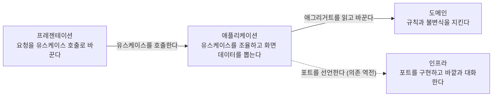

# 04. 계층

본 문서는 계층별 책임 범위와 의존 방향, 그리고 도메인 모델이 지켜야 하는 형태를 정의합니다.

의존성은 단방향으로 흐릅니다. 외부 자원에 접근해야 하면 포트를 선언해 방향을 역전시킵니다.



범례: 실선은 직접 호출 관계이며 점선은 의존 역전 관계입니다. 애플리케이션 계층이 인터페이스를 선언하고 인프라 계층이 그것을 구현합니다.

## 1. 계층별 책임

| 계층 | 책임 범위 | 수행하지 않는 것 |
| :--- | :--- | :--- |
| **프레젠테이션** | 요청 검증, 유스케이스 호출, 응답 반환 | 비즈니스 판단 |
| **애플리케이션** | 유스케이스 조율, 화면 데이터 조회, 트랜잭션 경계 | 도메인 규칙의 직접 구현 |
| **도메인** | 비즈니스 규칙과 불변식 검증 | 상위 계층 참조, 프레임워크 인지 |
| **인프라** | 포트 구현, 외부 시스템과의 기술 연동 | 도메인 규칙 구현 |

프레젠테이션과 애플리케이션은 같은 `application` 패키지에 있습니다. 계층이 다른데 패키지가 같은 이유는 컨트롤러와 그것이 호출하는 서비스가 항상 함께 변경되기 때문이며, 둘을 가르는 것은 폴더가 아니라 클래스의 역할입니다. 식별 규약은 [03. 명명 규칙](03-naming.md)이 소유합니다.

### 트랜잭션 경계

트랜잭션 경계는 **서비스의 public 메서드**입니다. 컨트롤러나 도메인이 경계를 소유하지 않습니다.

**클래스 레벨 `@Transactional` 을 쓰지 않고 메서드마다 선언합니다.** 하나의 서비스가 명령과 조회를 함께 갖기 때문이며([05. 조회와 명령](05-query-command.md) 2절), 클래스 레벨로 두면 조회 메서드에도 쓰기 트랜잭션이 걸립니다.

```java
@Transactional
public void complete(UUID taskId) { ... }

@Transactional(readOnly = true)
public TaskView detail(UUID taskId) { ... }
```

대가는 선언을 빠뜨릴 수 있다는 것이고, 그래서 **서비스의 public 메서드에 `@Transactional` 이 있는지를 ArchUnit 이 검사합니다.** 빠뜨리면 트랜잭션 없이 도는 쓰기가 생기는데, 그것은 실패했을 때만 드러납니다.

## 2. 도메인 모델과 영속 모델

**두 모델을 분리합니다.** 도메인 엔티티는 순수 Java 이며 프레임워크와 영속성 라이브러리를 알지 못합니다. 저장소 구현이 생성 레코드와 도메인 엔티티를 변환합니다.

ORM 을 쓰는 구성에서는 이 분리가 비용입니다. 엔티티가 곧 영속 객체이므로 분리하려면 매핑 계층을 따로 만들고 필드 하나를 추가할 때마다 세 곳을 고쳐야 합니다. **jOOQ 에서는 그 비용이 발생하지 않습니다.** 생성 레코드와 도메인 엔티티가 애초에 별개라 분리가 기본이고, 붙이려는 쪽이 오히려 작업입니다.

> [!IMPORTANT]
> **매핑 계층을 따로 만들지 않습니다**
>
> 변환은 저장소 구현 안의 비공개 메서드가 담당합니다. 매퍼 클래스나 매퍼 패키지를 두면 파일이 늘고 그 자체가 유지 대상이 됩니다. 저장소는 어차피 레코드를 다루므로 변환의 자연스러운 자리입니다.

분리가 값을 갖기 위한 조건이 둘입니다.

1. **엔티티가 스스로 불변식을 검증합니다.** 생성자와 정적 팩토리, 비즈니스 메서드에서 위반 시 예외를 던집니다. 검증이 서비스로 새어 나가면 분리한 이점이 소멸합니다.
2. **프레임워크 없이 단위 테스트가 가능합니다.** 도메인 테스트가 애플리케이션 컨텍스트를 요구하기 시작하면 분리가 이름만 남습니다.

## 3. 값 객체

**검증 규칙이 붙는 필드는 값 객체로 분리합니다.** 상수와 검증과 정규화와 문구가 그 값 옆 한 자리에 모이고, 애그리거트는 조립만 합니다.

```java
public record TaskTitle(String value) implements ValueObject {

    public static final int MAX = 200;
    public static final String REQUIRED = "제목을 입력해 주세요";

    /** 바깥에서 들어온 값을 검증하고 정규화해 만든다. */
    public static TaskTitle of(String raw) {
        if (raw == null || raw.isBlank()) {
            throw new DomainRuleViolation(REQUIRED);
        }
        String stripped = raw.strip();
        if (stripped.length() > MAX) {
            throw new DomainRuleViolation("제목은 " + MAX + "자를 넘을 수 없습니다");
        }
        return new TaskTitle(stripped);
    }
}
```

분리하지 않으면 애그리거트가 상수와 검증 메서드로 뒤덮입니다. 필드가 둘일 때는 티가 나지 않지만 다섯을 넘으면 도메인 로직이 그 사이에 파묻힙니다.

### 만드는 경로가 둘입니다

| 경로 | 쓰는 곳 | 검증 |
| :--- | :--- | :--- |
| **`of(...)`** | 바깥에서 값이 들어오는 모든 자리 | 합니다 |
| **정규 생성자** | 저장소의 재구성 | **하지 않습니다** |

**애플리케이션 데이터베이스는 신뢰 경계 안입니다.** 우리가 검증해서 넣은 값이므로 읽을 때 다시 검증할 이유가 없으며, 객체의 사설 필드를 읽을 때 검증하지 않는 것과 같은 논리입니다. ORM 을 쓰는 구성에서는 리플렉션이 생성자를 우회해 이것이 자동으로 성립하지만, 손으로 매핑하는 구성에서는 **경로를 직접 나눠야 합니다.**

다시 검증하면 **규칙을 강화한 날 옛 데이터를 읽지 못합니다.** 제목 상한을 줄이는 것만으로 그보다 긴 기존 행이 로드에서 실패하는데, 그것은 데이터가 잘못된 것이 아니라 규칙이 나중에 바뀐 것입니다.

`record` 의 정규 생성자는 record 자신보다 좁은 접근 제한을 가질 수 없어 **언어로는 막지 못합니다.** `ValueObject` 표식을 달고 ArchUnit 이 호출자를 `domain` 과 `infrastructure` 로 제한하는 것이 그 자리를 대신합니다.

### 만들지 않는 기준

> **표준 타입이 이미 보장하는 것에는 값 객체를 만들지 않습니다.**

전부 쪼개면 그것이 새로운 형식이 됩니다. 판정은 그 타입이 무엇을 지켜 주는지로 합니다.

| 필드의 성격 | 판정 | 예 |
| :--- | :--- | :--- |
| `String` 인데 필수·길이·정규화 규칙이 있다 | **값 객체** | 제목, 메모 |
| 날짜·시각이며 형식 검증이 곧 파싱이다 | **표준 타입** | `LocalDate` · `LocalDateTime` |
| 제약이 없다 | **표준 타입** | 플래그, 식별자 |

날짜와 시각을 문자열로 들고 다니지 않습니다. 형식 검증 코드를 직접 써야 하고, 그 코드가 값 객체 하나만큼의 무게를 가지면서 표준 타입이 이미 하는 일을 반복합니다.

값 객체가 정의한 상수는 요청 DTO 가 참조합니다. 검증 규칙이 두 곳에서 실행되더라도 **그 근거가 되는 값과 문구는 한 곳에만 존재합니다.**

```java
public record CreateTask(
        @NotBlank(message = TaskTitle.REQUIRED)
        @Size(max = TaskTitle.MAX) String title) {}
```

## 4. 생성과 재구성

도메인 엔티티는 생성 경로를 둘로 나눕니다.

| 경로 | 이름 | 쓰는 곳 | 하는 일 |
| :--- | :--- | :--- | :--- |
| **생성** | 업무 낱말 (`create` · `register`) | 애플리케이션 | 불변식을 검증하고 새 인스턴스를 만듭니다 |
| **재구성** | `restore` | 저장소 구현 | 저장된 값을 그대로 되살립니다 |

기본 생성자를 공개하지 않습니다. 공개하면 불변식을 통과하지 않은 인스턴스가 존재할 수 있게 되어 타입이 보장하는 것이 사라집니다. 애그리거트는 `@AllArgsConstructor(access = PRIVATE)` 로 비공개 생성자를 두고 두 정적 팩토리만 노출하며, 필수 필드의 null 검사는 `@NonNull` 이 생성합니다.

재구성 경로가 필요한 이유는 둘입니다.

1. **상태 필드를 직접 지정해야 합니다.** `create` 는 완료 시각을 비우고 만든 시각을 지금으로 정합니다. 저장된 값을 되살리려면 그 자리를 그대로 채울 수 있어야 합니다.
2. **이미 저장된 값이 현재 불변식을 통과하지 못할 수 있습니다.** 규칙이 강화된 뒤에도 옛 데이터는 읽혀야 합니다.

**두 번째가 성립하려면 값 객체도 함께 우회해야 합니다.** 애그리거트만 `restore` 를 두고 값 객체가 검증하면, 저장소가 `TaskTitle` 을 만드는 순간 그 검증이 돌아 아무것도 달라지지 않습니다. 3절의 두 경로가 그래서 필요합니다.

**재구성은 저장소만 호출하며 그 사실을 문서 주석으로 명시합니다.**

## 5. 시각의 출처

시각은 데이터베이스 기본값이 아니라 **주입된 시계에서 받습니다.**

만료와 수명에 관한 불변식은 시각을 통제할 수 있어야 검증됩니다. 데이터베이스가 시각을 채우면 테스트가 그것을 앞뒤로 옮길 수 없어 시각에 의존하는 규칙이 검증 대상에서 빠집니다.

`shared/config` 의 전역 `Clock` 빈을 서비스와 어댑터가 주입받고, 도메인은 시각을 인자로 받습니다. 테스트는 그 자리에 조작 가능한 구현을 넣습니다.
