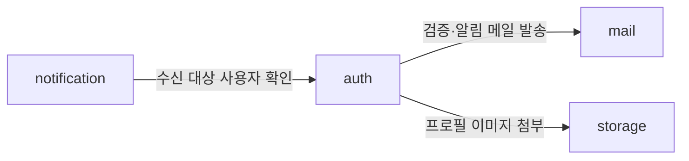

# 패키지 배치와 참조 규칙

본 문서는 모듈 경계, 모듈 내부 구조, 계층 간 의존 방향을 정의합니다.
규칙의 강제 수단은 ArchUnit이며 위반은 빌드 실패입니다([테스트](테스트.md) §4).

## 1. 모듈 경계

패키지 루트는 `dev.goraebap.devkit`입니다. 파생 프로젝트는 부트스트랩 시 이 루트를 자기 것으로
치환합니다.

- **모듈은 루트의 직계 하위 패키지**입니다(`auth`, `mail`, `storage`, `notification`).
  `module.` 같은 중간 겹은 두지 않습니다 — 모든 것이 그 아래 있으면 구분 기능이 없고,
  Spring Modulith 규약과도 어긋납니다.
- **모듈 루트에 직접 놓인 클래스가 공개 API입니다.** 다른 모듈이 import할 수 있습니다.
- **하위 패키지 전부는 internal입니다.** 다른 모듈은 import할 수 없습니다.
- 모듈 루트는 거의 비어 있는 것이 정상입니다. 공개가 필요해지는 순간 파일을 루트로 올립니다 —
  **파일을 옮기는 물리적 행위 자체가 의도적인 공개 선언**입니다.
- 공개 타입은 도메인 엔티티를 그대로 노출하지 않습니다. 소비하는 쪽이 필요로 하는 만큼만 담은
  전용 타입(record)을 정의합니다.

Java 컴파일러는 이 경계를 강제하지 못하므로 ArchUnit이 강제합니다.

### 모듈 지도

모듈은 **애그리거트 소유**를 기준으로 나눕니다. 키트의 초기 지도는 다음과 같습니다.

| 모듈 | 소유 애그리거트 | 담당 요구사항 |
|---|---|---|
| `auth` | user · account · session · verification | AUTH-*, PROF-* |
| `mail` | (없음 — 발송 능력만 제공) | MAIL-* |
| `storage` | blob · attachment | FILE-* |
| `notification` | subscription · preference | NOTI-* |

프로필(PROF-*)이 별도 모듈이 아닌 이유는 프로필이 `user` 애그리거트를 변경하는 유스케이스이고
그 애그리거트의 소유자가 `auth`이기 때문입니다. **모듈 경계를 요구사항 묶음이 아니라 애그리거트
소유로 긋는다**는 원칙의 적용 사례입니다.

키트에서 실제로 발생하는 모듈 간 참조는 셋뿐입니다.



범례: 화살표는 참조 방향이며 대상 모듈의 공개 API를 통합니다. 양방향 참조가 생기면 경계를 다시
논의합니다. `notification → auth`는 단방향입니다 — auth가 알림을 보내야 한다면 auth가 notification을
호출하는 것이 아니라, 이벤트 발행 등 역전 수단을 결정기록으로 남기고 도입합니다.

### `common` — 모듈이 아닌 횡단 계층

`dev.goraebap.devkit.common`은 위 표에 없습니다. **모듈이 아니라 모든 모듈이 딛는 바닥**이기
때문입니다. 여기 있는 것은 에러 계약(`ErrorCode`·`BusinessException`)과 그 계약을 HTTP로 옮기는
얇은 어댑터(`common/web`의 RFC 7807 핸들러·traceId 필터)뿐입니다.

- **모든 모듈 → `common` 참조는 허용합니다.** 에러 계약이 모듈마다 다르면
  [API 설계](API-설계.md) §3의 단일 형식이 성립하지 않습니다.
- **`common` → 어떤 모듈도 참조하지 않습니다.** 참조하는 순간 바닥이 아니라 또 하나의 모듈이 됩니다.
- 입장 조건은 `application/shared`보다 엄격합니다 — **모듈 두 개 이상이 쓰고, 도메인 개념이 아닐 것.**
  도메인 개념이면 그것을 소유할 모듈이 어딘가 있습니다. 편의 유틸리티의 집합소로 쓰지 않습니다.
- ArchUnit의 모듈 경계 규칙에서 `common`은 모듈 목록에서 제외합니다 — `jooq`·`config`와 같은
  취급입니다.

## 2. 모듈 내부 구조

**승격 기준**은 애그리거트 2개 이상 **또는** 피쳐 3개 이상입니다. 그 전에는 모듈 아래 플랫하게
둡니다.

```
auth/                      모듈 루트 = 공개 API 자리
├── application/           피쳐(요구사항 단위) 패키지
│   ├── registration/         controller · service · dto · 포트 · 흐름 예외를
│   ├── sociallogin/          피쳐 안에 플랫하게 둔다
│   ├── session/
│   ├── recovery/             비밀번호 재설정 · 이메일 복구 (AUTH-07·08)
│   ├── profile/
│   └── shared/            레이어 내 공유 (§3)
├── domain/                애그리거트 패키지
│   ├── user/                 엔티티 · 값 객체 · 저장소 인터페이스 · 불변식 위반 예외
│   ├── account/
│   ├── session/
│   └── verification/
└── infrastructure/        기술 세그먼트 패키지
    ├── repository/           애그리거트 저장소 구현
    ├── query/                조회 어댑터 — repository와 분리한다
    ├── oauth/  ├── security/  ├── mail/
    └── config/               빈 조립
```

- `application`은 헥사고날의 응용 계층이 아니라 **피쳐 절단(vertical slice)** 입니다. 컨트롤러가 여기
  있는 이유는 다른 모듈이 컨트롤러를 import할 일이 없고(호출은 HTTP), 요구사항 하나를 고칠 때 폴더
  하나만 열면 되는 응집을 우선했기 때문입니다.
- 저장소 **인터페이스는 `domain`의 애그리거트 패키지에**, 구현은 `infrastructure/repository`에 둡니다.
- 저장소가 아닌 포트(`OAuthClient`, `MailSender`, 조회 포트 `XxxQueries` 등)는 **그것을 소유하는 피쳐
  패키지에 선언**하고 구현은 `infrastructure`의 세그먼트에 둡니다. 조회도 예외가 아닙니다
  ([조회와 명령](조회와-명령.md)).
- 예외 배치는 **불변식 위반은 `domain`에, 흐름·정책 실패는 해당 피쳐에** 둡니다(예: 이메일 형식
  위반 → `domain/user`, 인증 시도 초과 → `application/session`).
- `@ConfigurationProperties` 타입은 `config/`가 아니라 **그 설정을 읽는 계층 곁에** 둡니다. 피쳐가
  읽는 값(세션 수명·시도 한도 등)은 `application/shared`에, 특정 어댑터만 쓰는 값(발신자 주소 등)은
  그 어댑터 옆에 둡니다 — application이 설정을 읽으려고 infrastructure를 참조하면 §3의 의존 방향이
  깨지기 때문입니다. `config/`는 빈 조립(`@Bean` 메서드)과 활성화 어노테이션만 담습니다.
- **전역 config와 모듈 config를 가릅니다.** "특정 모듈 없이도 의미가 있는 빈"만 전역
  `dev.goraebap.devkit.config`에 둡니다(예: `Clock`, OpenAPI 설정). 모듈의 internal을 import해 조립하는
  설정은 그 모듈 안에 남깁니다 — 전역에 두면 전역이 모듈 internal을 참조하게 되어 §1 경계에 구멍이
  뚫립니다. 인증 필터체인(`SecurityConfig`)은 앱 전체를 보호하지만 `auth`의 internal에 의존하므로
  `auth/infrastructure/security`에 둡니다. **인증·인가는 `auth` 모듈이 앱에 제공하는 능력**으로 봅니다.
- 두 모듈 이상이 실제로 쓰는 인프라가 생기면 그때 정식 모듈로 승격합니다. 미리 만들지 않습니다.

## 3. 의존 방향과 중복 처방

| 방향 | 규칙 |
|---|---|
| 피쳐 → domain | 항상 허용 — **공유의 정석 경로** |
| 피쳐 → 피쳐 | 허용, 단 순환 금지 |
| 피쳐 → 레이어 내 shared | 허용 (shared는 어떤 피쳐도 모른다) |
| 피쳐 → infrastructure | **금지** (포트로만) |
| domain → 그 외 전부 | **금지** (Spring·jakarta 포함) |
| infrastructure → 안쪽 | 허용 (포트·저장소 인터페이스 구현) |

**피쳐 간 중복은 네 가지로 분류하고 각각 처방이 다릅니다.**

1. **도메인 규칙 중복**은 `domain`으로 내립니다 (1순위 탈출구).
2. **조율 공유**는 소유 피쳐를 정하고 단방향으로 의존합니다 (예: 세션 발급은 `session` 피쳐가
   소유하고 `registration`·`sociallogin`이 의존).
3. **피쳐 정체성 없는 공용**은 `shared`로 보냅니다. 입장 조건은 **실제로 2개 이상 피쳐가 쓰고 있을
   것**이며 "나중에 쓸 것 같아서"는 불가합니다.
4. **DTO·HTTP 계약**은 원칙적으로 **복제를 허용합니다**(피쳐의 계약이므로). 3개 이상 피쳐가 정말
   같은 개념으로 쓸 때만 승격합니다.

판단 리트머스는 이렇습니다. 두 코드가 **다른 이유로 변경**될 것 같으면 우연한 닮음이므로 합치지
않습니다. **항상 같은 이유로 함께 변경**되면 진짜 중복이므로 1~3으로 올립니다. 중복은 잘못된
추상화보다 쌉니다.

**`shared`의 위치**는 레이어 안(`application/shared`, 필요 시 `domain/shared`)이며 모듈 레벨
`auth/shared`를 만들지 않습니다. 모듈 레벨 shared는 사실상 네 번째 레이어가 되어 별도 의존 규칙이
필요해지고, "어느 레이어 것인가"라는 방어 질문을 생략하게 만들어 쓰레기장이 됩니다.

## 4. 도메인 레이어

- 비즈니스 규칙과 불변식을 표현하고 **스스로 검증합니다.** 생성자·정적 팩토리·비즈니스 메서드에서
  위반 시 예외를 던집니다.
- 애그리거트 단위로 패키징하고, 트랜잭션은 애그리거트 경계를 넘지 않는 것을 기본으로 합니다.
- **도메인은 프레임워크를 모릅니다.** Spring·jakarta·jOOQ 생성 코드에 의존하지 않는 순수 Java입니다.
  jOOQ는 생성 레코드와 도메인 엔티티가 애초에 분리되므로 이 규칙이 타협 없이 성립합니다.
- 애그리거트를 가로지르는 순수 도메인 로직은 도메인 서비스로 뽑아 `domain` 바로 아래에 둡니다.
  특정 애그리거트 하위 패키지에 억지로 넣지 않습니다.

## 5. 규칙을 어길 때

구조를 바꿔야 하면 이 문서와 결정기록을 먼저 고치고 ArchUnit 테스트를 함께 고칩니다.
**테스트만 느슨하게 만드는 변경은 허용하지 않습니다.**

근거는 [결정-0007](../decisions/결정-0007-서버-모듈-구조.md)입니다.
