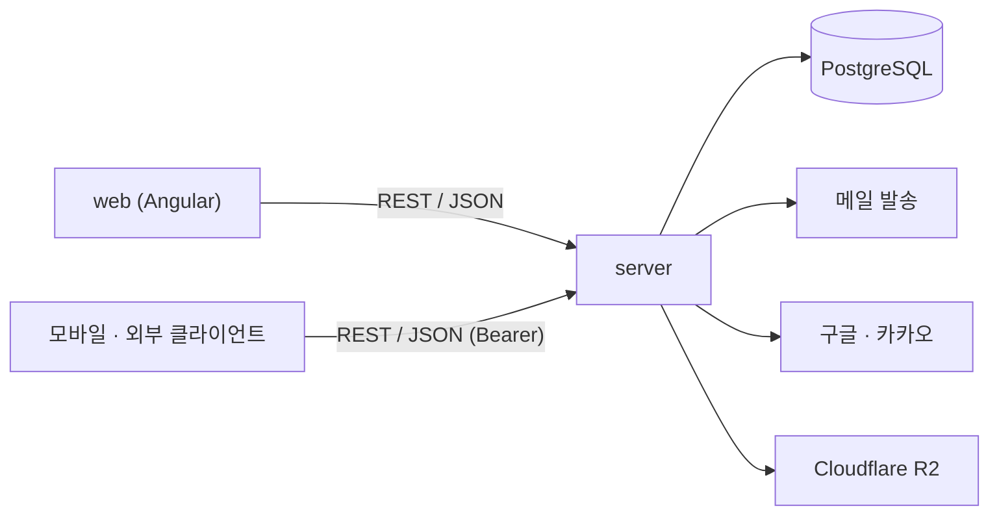
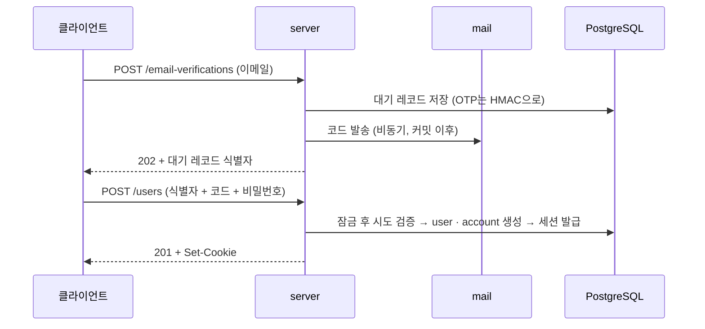

# 백엔드 아키텍처

본 문서는 `server`(Spring Boot · jOOQ) 애플리케이션의 아키텍처를 정의합니다.
시스템 전체의 구성과 배포는 [설계/아키텍처.md](../../docs/설계/아키텍처.md)가 소유하며, 본 문서는
그 안에서 백엔드가 차지하는 부분만 다룹니다.

세부 규칙은 본문에 직접 기재하지 않고 [references/](references/)의 개별 참조 문서가 원본으로
관리합니다. 본문은 **왜 그렇게 나누었는가**를 설명하고, 참조 문서는 **무엇을 지켜야 하는가**를
규정합니다.

| 주제 | 위치 |
|---|---|
| **API 계약 · 에러 형식 · 인증 계약** | §3 → [API 설계](references/API-설계.md) |
| **모듈 경계 · 패키지 배치 · 의존 방향** | §5 → [패키지 배치와 참조 규칙](references/패키지-배치와-참조-규칙.md) |
| **조회와 명령의 분리** | §4 → [조회와 명령](references/조회와-명령.md) |
| **저장소 · 스키마 · 코드 생성** | §8.2 → [DB · 데이터 접근](references/DB-데이터-접근.md) |
| **예외 · 에러 코드 · 로깅** | §8.3 → [예외 · 에러 코드 · 로깅](references/예외-에러코드-로깅.md) |
| **인가 · 시크릿 · CSRF · 시도 제한** | §8.4 → [보안](references/보안.md) |
| **테스트 전략 · ArchUnit 강제** | §8.5 → [테스트](references/테스트.md) |
| **빌드 · 정적 분석 · 로컬 실행** | §2 → [개발 환경](references/개발환경.md) |
| **아키텍처 결정 기록** | §9 → [decisions/](decisions/) |

## 1. 서론과 목표

### 시스템의 역할

`server`는 웹앱 개발키트의 백엔드입니다. 일반 웹앱이 공통으로 필요로 하는 기능 — 인증, 이메일
발송, 파일 업로드, 웹 푸시 알림, 프로필 관리 — 을 HTTP API로 제공합니다.

**이 저장소는 제품이 아니라 키트입니다.** 파생 프로젝트가 복제해 자기 기능을 얹는 것을 전제하므로,
"지금 필요한 최소"보다 "복제한 사람이 구조를 이어받을 수 있는가"를 우선합니다.

### 품질 목표

| 목표 | 이유 | 확인 수단 |
|---|---|---|
| **구조의 부패 저항** | 키트는 복제되어 오래 쓰이므로, 규칙이 문서에만 있으면 파생 프로젝트에서 먼저 무너진다 | ArchUnit 8규칙이 빌드 게이트 |
| **인증의 정확성** | 인증은 되돌리기 가장 비싼 결함 영역이다 | 도메인 단위 테스트 + Testcontainers 통합 테스트 |
| **교체 가능성** | 영속성·메일·소셜 제공자는 파생 프로젝트마다 다르다 | 포트 뒤에 두고 어댑터만 교체 |

### 이해관계자별 관심사

| 이해관계자 | 관심사 |
|---|---|
| 파생 프로젝트 개발자 | 어디에 무엇을 두어야 하는가, 무엇을 고쳐도 되는가 |
| 이 저장소의 유지자 | 구조가 규칙대로 유지되는가 |
| 보안 검토자 | 인증·세션·업로드 경로의 방어가 실제로 켜져 있는가 |

## 2. 제약 조건

| 제약 | 내용 |
|---|---|
| **기술 스택** | Spring Boot 4.1 · Java 21 · jOOQ · PostgreSQL. 스택 교체는 별도 프로젝트로 다룬다 |
| **배포 단위** | 단일 애플리케이션. 팀 규모 대비 서비스 분리 운영 부담을 지지 않는다 |
| **인스턴스 수** | 단일 인스턴스 전제. 시도 제한 카운터가 인메모리이므로 다중화 시 공유 저장소 어댑터로 교체한다 |
| **DB 스키마 소유권** | 서버가 단독으로 소유한다. 마이그레이션 파일이 스키마의 단일 원본이다 |
| **프런트 분리** | web은 별도 빌드·배포 단위이며 서버와 HTTP로만 대화한다 |
| **문서화 정책** | 코드에서 읽히는 것은 문서에 옮겨 적지 않는다. 린터 설정이 곧 코딩 표준이다 |

빌드·정적 분석·로컬 실행 절차는 [개발 환경](references/개발환경.md)에 있습니다.

## 3. 컨텍스트와 범위

서버가 바깥과 주고받는 것은 넷입니다.



범례: 화살표는 호출 방향입니다. 실선 하나가 하나의 통신 경계이며, 각 외부 의존은 서버 내부에서
포트 뒤에 놓여 교체·가짜 구현이 가능합니다.

**API 계약의 소유자는 서버입니다.** 계약을 바꾸는 것은 서버의 변경이며, web은 소비자로서 그것을
참조합니다. 계약의 규약은 [API 설계](references/API-설계.md)에 있습니다.

## 4. 아키텍처 전략

### 1) 모듈 = 애그리거트 소유

도메인을 모듈로 나누되 기준은 **요구사항 묶음이 아니라 애그리거트 소유**입니다. 프로필(PROF-*)이
별도 모듈이 아닌 이유가 이 기준의 사례입니다 — 프로필은 `user` 애그리거트를 변경하는
유스케이스이고, 그 애그리거트의 소유자는 `auth`입니다.

### 2) 피쳐 절단 (Vertical Slice)

모듈 내부의 1차 분류는 계층이 아니라 **피쳐**입니다. 컨트롤러·서비스·DTO·포트가 한 폴더에 모입니다.
계층으로 나누면 기능 하나를 고칠 때 네 폴더를 오가야 합니다. 대가는 폴더명만으로 계층을 알 수
없다는 것이고, 그래서 계층은 폴더 위치가 아니라 클래스의 역할로 식별합니다.

### 3) 경량 CQRS — 접근 경로의 분리

DB 접근 경로는 **조회**와 **명령** 둘뿐입니다. 화면 데이터를 도메인 저장소로 만들지 않고 조회 포트로
분리한 이유는, 그러지 않으면 **화면 요구가 도메인 모델을 끌어당기기** 때문입니다. 상세는
[조회와 명령](references/조회와-명령.md)에 있습니다.

## 5. 빌딩블록 뷰

```
dev.goraebap.devkit
├── auth/            user · account · session · verification 소유
├── mail/            발송 능력만 제공 (애그리거트 없음)
├── storage/         blob · attachment  (M3)
├── notification/    subscription · preference  (M4)
├── common/          모듈이 아닌 횡단 계층 — 에러 계약과 HTTP 어댑터
└── config/          특정 모듈 없이도 의미가 있는 빈만
```

**모듈 루트에 놓인 클래스만 공개 API이고 하위 패키지는 전부 internal입니다.** 공개가 필요해지면
파일을 루트로 올리며, **그 물리적 행위 자체가 의도적인 공개 선언**입니다. 배치 규칙 전체는
[패키지 배치와 참조 규칙](references/패키지-배치와-참조-규칙.md)에 있습니다.

## 6. 런타임 뷰

인증 흐름 하나가 이 시스템의 런타임 특성을 대표합니다 — 이메일 소유 증명이 계정 생성보다 **먼저**
일어납니다.



범례: 실선 화살표는 호출, 점선은 응답입니다. 두 번째 호출을 통과하기 전에는 `user` 행이 생기지
않습니다 — 미검증 계정이 존재할 수 없다는 것이 이 흐름의 목적입니다.

주목할 점 둘입니다. **메일 발송은 트랜잭션 커밋 이후에 비동기로** 일어나므로 발송 실패가
유스케이스를 중단시키지 않습니다. **대기 레코드는 잠금 후 읽습니다** — 잠금이 없으면 동시 요청이
서로의 시도 횟수 증가를 덮어써 5회 제한이 무력화됩니다.

## 7. 배포 뷰

단일 애플리케이션이 리버스 프록시 뒤에서 web과 같은 오리진으로 노출됩니다. 배포 구성의 상세는
[설계/아키텍처.md](../../docs/설계/아키텍처.md)가 소유합니다.

서버가 배포 환경에 거는 요구는 하나입니다. **클라이언트 IP가 위조 가능하면 IP 축 시도 제한이 통째로
무력화되므로**, 프록시 구성은 편의가 아니라 보안 요구입니다.

## 8. 횡단 개념

### 8.1 계층과 의존 방향

| 방향 | 규칙 |
|---|---|
| 피쳐 → domain | 항상 허용 — 공유의 정석 경로 |
| 피쳐 → infrastructure | **금지** (포트로만) |
| domain → 그 외 전부 | **금지** (Spring·jakarta 포함) |
| infrastructure → 안쪽 | 허용 |

전체 표와 중복 처방은 [패키지 배치와 참조 규칙](references/패키지-배치와-참조-규칙.md) §3에 있습니다.

### 8.2 데이터 접근

저장소 인터페이스는 `domain`에, 구현은 `infrastructure/repository`에 둡니다. 스키마의 단일 원본은
마이그레이션 파일이며 jOOQ 생성 코드는 항상 그로부터 파생됩니다 —
[DB · 데이터 접근](references/DB-데이터-접근.md).

### 8.3 예외와 로깅

비즈니스 오류는 예외로 던지고 전역 핸들러가 RFC 7807로 변환합니다. 컨트롤러가 `ResponseEntity`를
직접 조립하지 않습니다 — [예외 · 에러 코드 · 로깅](references/예외-에러코드-로깅.md).

### 8.4 보안

기본 거부 인가, 환경변수 시크릿 주입, Origin 검증 기반 CSRF 방어, 비대칭 시도 제한 —
[보안](references/보안.md).

### 8.5 테스트

도메인과 명령 서비스는 단위 테스트로, 조회와 저장소는 Testcontainers 통합 테스트로 검증합니다.
구조 규칙은 ArchUnit 8규칙이 빌드 게이트에서 강제합니다 — [테스트](references/테스트.md).

## 9. 아키텍처 결정 기록 (ADR)

### 대상 선정 기준

되돌리기 비싼 선택, 여러 곳의 구조를 동시에 좌우하는 선택, 나중에 "왜 이렇게 했지"가 반드시 나올
선택을 기록합니다. 라이브러리 버전 선택처럼 되돌리기 싼 것은 대상이 아닙니다.

### 관리 규칙

- **번호는 저장소 전역으로 채번합니다.** 서버·웹·프로세스 결정이 같은 번호 공간을 쓰므로 `결정-0007`
  하나로 어느 문서인지 특정됩니다.
- ADR은 불변입니다. 결정이 바뀌면 새 문서를 쓰고 기존 문서를 "대체됨"으로 표시합니다. 소규모 수정과
  완화는 새 번호를 따지 않고 원 ADR의 개정 절에 날짜와 함께 추기합니다.
- **서버 코드만 바꾸는 결정은 여기에, 시스템·프로세스·웹에 걸친 결정은
  [저장소 결정기록](../../docs/결정기록/)에 둡니다.**

### 등록 현황

| 번호 | 제목 | 상태 |
|---|---|---|
| [0004](decisions/결정-0004-server-정적분석-도구.md) | server 정적분석 도구 | 승인됨 |
| [0007](decisions/결정-0007-서버-모듈-구조.md) | 서버 모듈 구조 | 승인됨 |
| [0009](decisions/결정-0009-DTO-record-허용.md) | DTO record 허용 | 승인됨 |
| [0010](decisions/결정-0010-조회-경로-설계.md) | 조회 경로 설계 | 승인됨 |
| [0013](decisions/결정-0013-마이그레이션과-코드생성.md) | 마이그레이션과 코드 생성 | 승인됨 |
| [0016](decisions/결정-0016-메일-발송-인프라.md) | 메일 발송 인프라 | 승인됨 |
| [0022](decisions/결정-0022-소셜-제공자-토큰-미보관.md) | 소셜 제공자 토큰 미보관 | 승인됨 |
| [0023](decisions/결정-0023-lombok-사용-범위.md) | Lombok 사용 범위 | 승인됨 |

서버 동작에 직접 걸리지만 시스템 전체 결정이라 저장소 결정기록에 있는 것들:
[0014 세션 방식](../../docs/결정기록/결정-0014-세션-방식.md) ·
[0015 이메일 소유 증명](../../docs/결정기록/결정-0015-이메일-소유-증명.md) ·
[0021 남용 방지 계층](../../docs/결정기록/결정-0021-남용-방지-계층.md).

## 10. 품질 요구사항 검증

| 목표 | 검증 |
|---|---|
| 구조의 부패 저항 | ArchUnit 8규칙이 CI에서 실행되며 위반은 빌드 실패 |
| 인증의 정확성 | 도메인 불변식·서비스 단위·통합 테스트. 방어 장치는 **지웠을 때 실패하는지**까지 확인 |
| 교체 가능성 | 외부 의존이 전부 포트 뒤에 있고 통합 테스트가 가짜 구현으로 대체 가능 |

## 11. 리스크 및 기술 부채

| 항목 | 내용 | 해소 조건 |
|---|---|---|
| **인메모리 시도 제한** | 다중 인스턴스로 배포하면 카운터가 인스턴스마다 갈려 한도가 사실상 배수가 된다 | 다중화 시점에 공유 저장소 어댑터로 교체 |
| **소셜 로그인의 서블릿 세션** | `oauth2Login`이 `state`·PKCE를 서블릿 세션에 보관해 이 경로만 무상태가 아니다 | 스티키 세션 또는 공유 저장소 |
| **springdoc 미도입** | API 문서의 정본이 아직 코드와 요구사항 인수조건뿐이다 | springdoc 도입 |
| **남용 방지 1층·3층 미도입** | 표적 계정 잠금이 남아 있다 | 배포 시점([결정-0021](../../docs/결정기록/결정-0021-남용-방지-계층.md)) |

### 규칙 강제 수단 현황

| 규칙 | 강제 수단 |
|---|---|
| 모듈 경계·의존 방향 | ArchUnit (빌드 실패) |
| 코드 포맷·명명 | Spotless · Checkstyle (빌드 실패) |
| 버그 패턴 | SpotBugs (빌드 실패) |
| 그 외 배치 규칙 | 문서와 검토 — 강제 수단 없음 |

## 12. 용어집

| 용어 | 뜻 |
|---|---|
| **모듈** | 루트의 직계 하위 패키지. 애그리거트 소유 단위 |
| **피쳐** | `application` 아래의 요구사항 단위 폴더. 컨트롤러부터 포트까지 한자리에 모인다 |
| **포트** | application이 선언하고 infrastructure가 구현하는 인터페이스 |
| **조회 포트** | 피쳐당 하나인 `XxxQueries`. 화면 DTO를 직접 반환한다 |
| **대기 레코드** | `verification` 행. 아직 `user`가 아니며 인증 자격이 아니다 |
| **중간 표(ticket)** | 소셜 제공자 인증과 이메일 입력 사이를 잇는 서명 값. `HttpOnly` 쿠키로만 오간다 |
